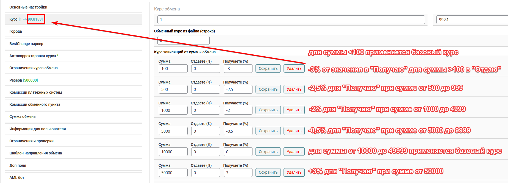

# Creating a New Exchange Direction

**Note:** Below is a description of all the options that can be presented in the exchange direction settings form. However, by default, some parameters may not be displayed. This is because certain modules responsible for displaying specific parameters in the form are inactive in the "**Modules**" → "**Modules**" section. The order of parameters in the exchange direction creation form on your site may differ from the order presented below.

After adding [new currencies](https://premium.gitbook.io/main/en/navigaciya/valyuty-i-napravleniya/dobavlenie-novoi-valyuty) and specifying [reserves for them](https://premium.gitbook.io/main/en/navigaciya/rezervy), create an exchange direction. To do this, go to the "**Exchange Directions**" section in the control panel. Click the "**Add**" button located above the list of already created exchanges.

On the opened page, fill in the necessary fields to create the exchange direction.

## Tab "**Basic Settings**"

<figure><figcaption></figcaption></figure>

**Direction** — specify the currency values for "**I Give**" and "**I Receive**".

**Technical Name** — the name of the exchange direction that will be displayed in the site control panel. Leave this field empty for automatic name generation.

**Permanent Link** — manually set the part of the link for the exchange direction: `https://your_domain/exchange-`**`LINK`**`.` This link will provide access to the created exchange direction on the site.


The permanent link is automatically generated based on the selected currencies for the exchange direction, but you can change it to your own.


**Status** — set the current status of the exchange direction.

## Tab "Rate"

<figure><figcaption></figcaption></figure>

**Exchange Rate** — specify the current exchange rate.

**Rate Depending on Exchange Amount** — if necessary, specify the exchange rate based on the user's exchange amount.

There is also a settings block for this option in the "**Modules**" ➔ "**Rate Depending on Exchange Amount**" section.

<figure><figcaption></figcaption></figure>

**Rate Formation Method:**\
• **Set Rate Directly** — display rates for different amounts considering the specified percentages.

<figure><figcaption></figcaption></figure>

• **Add Percentage to Rate** — display the percentage that will be applied to the base exchange rate for different amounts.

<figure><figcaption></figcaption></figure>

**Use in XML 2.0 File with Rates** — add tiered rates from the exchange direction settings to a new export XML file:\
• **Yes**\
• **No**

<figure><figcaption></figcaption></figure>

Example

For instance, you can create a tiered structure such that a user making a small transaction receives a lower amount per unit of currency than the standard rate — thus encouraging them to exchange larger amounts.

Setting a dependency for the "**I Receive**" side in the exchange rate (applicable when 1 in the "**I Give**" currency — for example, the BTC-USDT rate):

Similarly, you can set a dependency for the "**I Give**" side in the exchange rate (applicable when 1 in the "**I Receive**" currency — for example, the USDT-BTC rate).

<mark style="color:red;">It is not recommended to set a percentage for the rate side where 1 is used</mark> — <mark style="color:red;">this will lead to displaying a rate of 0.98 to XXX or 1.32 to XXX in the exchange form</mark>

**Rate Depending on Currency Reserve** — if necessary, specify the exchange rate based on the reserve of the "**I Receive**" currency.

There is also a settings block for this option in the "**Modules**" ➔ "**Rate Depending on Reserve**" section.

<figure><figcaption></figcaption></figure>

**Rate Formation Method:**\
• **Set Rate Directly** — display rates for different amounts considering the specified percentages.\
• **Add Percentage to Rate** — display the percentage that will be applied to the base exchange rate for different amounts.

**Update Rates:**\
• **During Currency Transactions** — rates will be updated when the currency reserve changes.\
• **On the Fly** — rates will be updated when calculating amounts for requests.

Example

For instance, you can create a tiered structure such that as the currency reserve decreases, the currency becomes increasingly expensive for users. The reserve is always set for the "**I Receive**" currency.

 (1).png>)

<mark style="color:red;">It is not recommended to set a percentage for the rate side where 1 is used</mark> — <mark style="color:red;">this will lead to displaying a rate of 0.98 to XXX or 1.32 to XXX in the exchange form</mark>


If you use the option "**Rate Dependency on Amount or Reserve**," the "**I Receive**" field in the exchange form will be unavailable for filling (technical limitations of the calculation calculator).



**Exchange Rate from File** — more detailed information can be found [here](https://premium.gitbook.io/main/en/navigaciya/kursy/kurs-iz-faila).

**Exchange Amount Multiplicity** — if this option is enabled, the value selected from the dropdown will be rounded:

<figure><figcaption></figcaption></figure>


For example, if the amount "You Give" is selected and the multiplicity is 100 — when the user enters the amount 12345 in the exchange form in the "You Give" field, the value will be rounded down to 12300.


**Profit** — specify the profit in percentage or a fixed amount that you receive when completing the exchange. The specified profit value is used to calculate partner rewards.

When working with monitors, the standard values are 30% of the profit or 1% of the exchange amount. In the script for each exchange direction, you can set only one principle of operation (based on amount or profit) for all partners.

If zero profit is set, the partner will not be able to receive a partner reward. If profit is set at 100%, the partner will effectively receive a reward based on the exchange amount. A detailed description of this option can be found in the article ["**Profit and Partner Percentage**"](https://premium.gitbook.io/main/en/navigaciya/partnerskaya-programma/pribyl-i-partnerskii-procent).


If the "**Profit**" block is not displayed on the tab — disable the "**Automatic Profit Calculation**" module in the "**Modules**" section.



## Tab "Cities"

To select a city for the exchange direction, you must first create a city with the correct code (according to [BestChange rules](https://www.bestchange.ru/wiki/rates.html)) in the "**Cities**" section:

<figure><figcaption></figcaption></figure>

Then, in the exchange direction settings, select the city in the "**Cities**" tab and, if necessary, specify additional parameters for the city:

<figure><figcaption></figcaption></figure>

* **Add to Rate (I Give/I Receive)** — specify the absolute value that will be added to or subtracted from the base rate set in the exchange direction.\
  To add a percentage, specify in the field, for example, `*0.9` (≈ -10%) to decrease the rate or `/0.9` (≈ +11%) to increase the rate relative to the base exchange rate.
* **Minimum/Maximum Amount** — specify the amounts that will limit the exchange of funds for the added city (minimum and maximum amounts are specified for the currency "I Give"). These limits apply to exchanges on the site and in the exported XML file.
* **Profit (from Amount I Give/I Receive)** — individual profit values that may differ from the overall profit values on the "**Rate**" tab.
* **Tags for param parameter** — specify parameters according to [BestChange requirements](https://www.bestchange.ru/wiki/rates.html).

<figure><figcaption></figcaption></figure>

## Tab "BestChange API Parser" and "BestChange Parser"

<figure><figcaption></figcaption></figure>

Detailed descriptions of the options can be found in the articles "[**BestChange API Parser**](https://premium.gitbook.io/main/en/basic-settings/kursy-valyut/bestchange-api-parser-new-nachinaya-s-v2.6)" and "[**BestChange Parser**](https://premium.gitbook.io/main/en/basic-settings/kursy-valyut/bestchange-parser-old)".

## Tab "Auto-Rate Adjustment"

<figure><figcaption></figcaption></figure>

**Auto-Rate Adjustment** — select the source and direction for automatic rate changes on the site.


To enable automatic currency updates, you need to configure a [cron job](https://premium.gitbook.io/main/en/basic-settings/kursy-valyut/parser-kursov-valyut-parsery-2.0) on your server. At the top of the "**Parsers 2.0**" section, you will find a link labeled "**Cron URL for updating exchange rates for the Central Bank and cryptocurrencies**," which should be added to the server's task scheduler. You can perform updates every minute. More detailed information can be found [here](https://premium.gitbook.io/main/en/basic-settings/kursy-valyut/parser-kursov-valyut-parsery-2.0).


**Adjusting the Rate** — This parameter allows you to modify the exchange rate obtained from the source to suit your needs. For the currency column you are giving, you should leave it as "**0**" (zero). In the column for the currency you are receiving, you need to specify a percentage or a numerical value (negative values are allowed). This value will be automatically added to the source rate and displayed on the website with the corresponding adjustment.

Please note that authorized users automatically participate in a loyalty program that rewards them with discounts based on the amount they have already exchanged with you. This commission will be automatically added to the specified rate. To configure the loyalty program, go to the "**User Discounts**" section. In the window that opens, you will see fields where you can modify the parameters of your loyalty program.

## "Exchange Rate Restrictions" Tab

<figure><figcaption></figcaption></figure>

**Min. Rate/Max. Rate** — If necessary, you can set a minimum/maximum rate within which the connected rate parser will operate. If the rate exceeds the minimum/maximum limit, it can be reset to the standard rate; otherwise, the last received value will be retained until the rate returns to the specified range.

**Standard Rate** — If necessary, specify the standard rate to which the reset will occur when the rate goes outside the specified range.

## "Reserve" Tab

<figure><figcaption></figcaption></figure>

**Reserve** — If needed, you can set a personal reserve value for the exchange direction. The selected option will take precedence over the reserve value set in the "**Receiving**" currency settings in the "**Currencies**" section. You can also set a [reserve from a file](https://premium.gitbook.io/main/en/navigaciya/rezervy/rezerv-iz-faila), connect an auto-reserve, or specify a reserve from the field located below.

**Reserve Field** — If necessary, for the "**Reserve**" option, select the value "**—From the field below—**," and for the "**Reserve Field**" parameter, specify the reserve value. The specified reserve value will be displayed on the website for the created exchange direction. This option is used only as a limiter for the current reserve value and will only work if a currency reserve is set in the "**Reserve Adjustment**" section. For example, if you set a reserve of 100,000 in the "**Reserve Adjustments**" section, but you need to limit this value to 50,000 for the created exchange direction, use the "**Reserve Field**" parameter to restrict the reserve value.

**Calculator** — If necessary, for the "**Reserve**" option, select the value "**—By formula—**," and for the "**Calculator**" parameter, specify the reserve formula. More detailed information can be found [here](https://premium.gitbook.io/main/en/basic-settings/rezervy-valyut/rezerv-ot-drugoi-valyuty/primery-nastroiki-slozhnogo-rezerva-s-ispolzovaniem-formul).

## "Payment System Fees" Tab

<figure><figcaption></figcaption></figure>

**Payment System Fees** — Specify the standard percentage or amount charged by the payment system for making a transfer. This amount will be taken into account when calculating exchanges for users.

**Payment System Fees (for verified accounts)** — Specify the standard percentage or amount charged by the payment system for making a transfer for verified wallets. This amount will also be considered when calculating exchanges for users.

**Exchange Service Pays the Fee** — Check this box if you cover the payment system fee instead of the client.

**Non-standard Fee** — Check this box if the payment system charges a fee for incoming payments from the exchange service when paid through a merchant (typically, this applies to Yandex.Money, Privat24, Liqpay, Qiwi). More detailed information can be found [here](https://premium.gitbook.io/main/en/navigaciya/faq/chto-takoe-nestandartnaya-komissiya-v-nastroikakh-merchanta-i-kak-ona-rabotaet).

**Min. Fee Amount** — Specify the minimum fee amount that the payment system can charge for transferring funds, if such an amount is provided by the payment system. If you enter "**0**" (zero), there will be no restrictions. If a limit is set, some fields in the application creation form will become inactive.

## "Exchange Point Fees" Tab

<figure><figcaption></figcaption></figure>

**Additional Fee from Sender** — Specify the additional fee (fromfee) that will be added to the payment amount if such a fee is provided by the exchange service's regulations. This value will be displayed in the XML file with rates for monitoring in the \<fromfee> parameter.

**Additional Fee from Recipient** — Specify the additional fee (tofee) that will be deducted from the received amount if such a fee is provided by the exchange service's regulations. This value will be displayed in the XML file with rates for monitoring in the \<tofee> parameter.

**Additional Fee Based on Exchange Amount** — Set the dependency of the fee charged to the client based on the exchange amount.


Please note that when using this option, the values specified below will apply — the data entered in the "**Additional Fee from Sender/Recipient**" fields will not be considered in the calculations.




If you use the "**Additional Fee Based on Exchange Amount**" option, the "**Receiving**" field in the exchange form will be unavailable for input (technical limitations of the calculation calculator).

!\[]\(<../../.gitbook/assets/image (398)\_eng.png)>


Example of Fee Calculation Setup

You can create an unlimited number of fee rules.

In the "**Amount**" field, specify the value of the currency "**Giving**," above which the fee will be applied. Fee values can be set in % or directly in exchange currencies:

Please note — after setting up the fee based on the exchange amount, specifying the exchange amount will only be possible in the "**Giving**" field:\
_eng.png>)

**Minimum Fee from Sender** — Specify the minimum additional fee for the sent amount.

**Minimum Fee from Recipient** — Specify the minimum additional fee for the received amount.

**Additional Fee Based on Exchange Amount** — If necessary, set an additional fee for the exchange point based on the amount "**Giving**."

**Deduct Fee from Payment Amount** — Check this box if you need to reduce the payment amount by the additional fee from the sender.

**Add Fee to Payout Amount** — Check this box if you need to increase the payout amount by the additional fee from the recipient.

## "Exchange Amount" Tab

<figure><figcaption></figcaption></figure>

**Min/Max Amounts** — Specify the limits for amounts for applications for the currencies in the exchange direction.

<figure><figcaption>
Setting the option in the admin panel
</figcaption></figure>

<figure><figcaption>
Displaying limits on the website
</figcaption></figure>


You can also specify min/max amounts for just one currency and enable recalculation of limits for another currency based on the exchange rate in the "Exchange Service Settings" ➔ "Basic Settings" section.\
 (1).png>)\
In this case, automatic limits will be set for the second currency.\
 (1).png>)



## "User Information" Tab

<figure><figcaption></figcaption></figure>


Use exchange direction templates to simplify the process of creating new exchange directions. You can add templates in the site management panel under "**Exchange Directions**" → "**Exchange Direction Templates**." For each parameter, add a template that will automatically populate the corresponding field when a new exchange direction is created.


**Exchange Description** — In this field, include SEO text that enhances your site's search engine rankings and describes the specific exchange. This information is not visible to users when they create an exchange request from the main page.

**Exchange Completion Time** — Specify the timeframe within which the exchange will be completed. This information will be displayed on the selected exchange page.

**Request Status "Pending Request"** — If you have allowed requests to be created without prior verification in the identity/account verification module settings, create a guide for users on how to verify their identity/account.

**Request Status "New Request"** — Provide your details for this exchange direction along with a brief instruction on the steps to follow during the exchange. These details will appear on the screen after the user creates an exchange request. After completing the specified actions, the user clicks the "I have paid for the request" button, and the exchange administrator receives a notification. If a payment merchant is used for the currency being exchanged, the necessary payment instructions will be provided in the relevant section (see the "[Merchant Settings](https://premium.gitbook.io/main/en/navigaciya/merchanty-i-vyplaty)" section).

You can fill in the following request statuses at your discretion, keeping in mind that the text will appear on the user's screen after they pass through the corresponding stages of the exchange:\
• **"User-Canceled Request"**\
• "**Request Not Created**"\
• "**Request Pending Verification**"\
• "**User-Canceled Request**"\
• **"Deleted Request"**\
• **"When User Navigates to Payment Page"**\
• **"User Marked Request as Paid"**\
• **"Waiting for Merchant Confirmation"**\
• "**Partially Paid**"\
• **"Paid Request"**\
• **"Request Under Review"**\
• "**Waiting for AML Check**"\
• "**AML Check Failed**"\
• "**Waiting for Merchant Details**"\
• "**Merchant Error**"\
• **"Error in Request"**\
• **"Auto-Payment Error"**\
• "**Auto-Payment Error (Payment System API)**"\
• **"Waiting for Confirmation from Auto-Payment Module"**\
• "**Partial Payment**"\
• **"Completed Request"**\
• **Notification of the Need for Identity Verification**\
• **Notification of the Need for Identity Verification (Based on Exchange Amount)**

## "Restrictions and Checks" Tab

<figure><figcaption></figcaption></figure>

**Visibility of Exchange Directions for Guests** — You can set privacy settings for exchange directions for users who are not registered on the site. Additional settings can also be found in the "**Exchange Settings**" → "**Exchange Filters**" section.

**Reserve Limit for Direction** — You can limit the available funds for exchange by specifying the required value.

**Language** — Choose the language of the site for which the exchange direction will be available. If you select only Russian, users who access the English version of the site will not see the exchange direction. Additional settings can also be found in the "**Exchange Settings**" → "**Exchange Filters**" section.

**User Discount** — Allow or disallow the accumulation of discounts.

**Maximum Discount for Users** — Set the maximum value for accumulated discounts for the direction. If a client has an active accumulated discount greater than the specified value, their discount will be limited to that value.

**Wallet Verification Check in Payment System** — You can check the status of the client's wallet based on the number entered by the client when filling out the exchange form. To ensure the check works correctly, payment systems must be enabled in the "**Merchants**" → "**Wallet Verification Checker**" section.

**Require Verified Wallet in Payment System** — You can require clients to have a verified wallet in the payment system.

**Prohibited Countries** — You can specify a list of countries from which users will be denied access to the exchange. The system will automatically determine the user's country based on their IP address and deny access to the exchange direction if there is a match. Access will be granted to other users. In the management panel, under the "**GEO IP**" section, you need to activate the list of countries to select them for the exchange direction. Additional settings can also be found in the "**Exchange Settings**" → "**Exchange Filters**" section.

**Allowed Countries** — You can specify a list of countries from which users will be allowed access to the exchange. The system will automatically determine the user's country based on their IP address and grant access to the exchange direction if there is a match. Access will be denied to other users. In the management panel, under the "**GEO IP**" section, you need to activate the list of countries to select them for the exchange direction. Additional settings can also be found in the "**Exchange Settings**" → "**Exchange Filters**" section.

**Email Verification** — You can send an email with a code to the user, which they must enter to display the "**Proceed to Payment**" button. The email with the code will be sent to the address specified in one of the fields: "**From Account**," "**To Account**," or "**Email**." To send the email, you need to activate the "**Email Verification**" module in the "**Modules**" → "**Modules**" section. Set the module settings in the "**Modules**" → "**Email Verification Settings**" section and [configure the corresponding email template](https://premium.gitbook.io/main/en/navigaciya/uvedomleniya/opovesheniya-po-e-mail).

**Show Field for Entering Money Transfer Number** — Select "**Yes**" if you want to display a field for entering the money transfer number before the client sees the "**I Paid**"/"**Proceed to Payment**" button. The entered number will be displayed in the management panel under the "**Requests**" section.

**Field Name for Entering Money Transfer Number** — You can set your own name for the field.

**SMS Code Verification** — You can send an SMS with a code to the user, which they must enter to display the "**Proceed to Payment**" button. The SMS with the code will be sent to the phone number specified in one of the fields: "**From Account**," "**To Account**," or "**Phone**." To send the SMS, you need to activate the "**SMS Verification**" module in the "**Modules**" → "**Modules**" section. Set the module settings in the "**Modules**" → "**SMS Code Verification Settings**" section and configure the [SMS gateway](https://premium.gitbook.io/main/en/navigaciya/uvedomleniya/opovesheniya-po-sms).

**Prohibited IP Addresses and Masks (one per line)** — You can specify IP addresses and masks for which access to the exchange direction will be denied. Each value must be entered on a new line.

<figure><figcaption></figcaption></figure>

**Max. Number of Exchange Requests from One IP per Day** — You can limit the number of requests that can be created from one IP address per day.

**Max. Number of Exchange Requests from One "Giving" Account per Day** — You can limit the number of requests that can be created from one "Giving" account per day.

**Max. Number of Exchange Requests from One "Receiving" Account per Day** — You can limit the number of requests that can be created from one "Receiving" account per day.

**Max. Number of Exchange Requests from One User per Day** — You can limit the number of requests that can be created by one user per day.

**Max. Number of Exchange Requests from One Email per Day** — You can limit the number of requests that can be created from one email per day.

Here’s a naturalistic English translation of the provided text:

***

**Maximum Number of Active Requests per User** — the highest number of open requests allowed for a single user.

**Prohibit Creating Requests with the Same Amount to Give** — a restriction on having open requests with the same amount from one user.

**H19** — For exchanges involving the Webmoney payment system, it is necessary to set the exchange type to perform the verification correctly. The Webmoney system requires this verification for exchanges. You can find more details about the H19 module settings in this [section](https://premium.gitbook.io/main/en/navigaciya/nastroiki/kh19).

**Max. Exchange Amount for Giving for New Users** — the maximum exchange amount for users who have not completed any exchanges.

## "Notification Settings" Tab

<figure><figcaption></figcaption></figure>


In version 2.7, the tab "**Exchange Direction Template**" has been renamed to "**Notification Settings**."


**Template** — a text template for sending via the shortcode `[dirtemp]` in emails regarding requests for a specific exchange direction.

<figure><figcaption></figcaption></figure>

**Administrator's E-mail/Phone/Telegram** — contact information for the administrator/operator for request emails (if one or more contact fields are filled out, data from the template above will be sent **only to the specified contacts**, ignoring the recipient list in the general template).

## "Additional Fields" Tab

<figure><figcaption></figcaption></figure>

Select the fields that the user must fill out when completing the exchange form. If you have enabled the "**Cash in Office ↔ WM**" check in H19, the "**Passport Number**" field is mandatory.

## "AML" Tab

<figure><figcaption></figcaption></figure>

AML settings for the exchange direction are described in a [separate guide](https://premium.gitbook.io/main/en/basic-settings/aml-verification/nastroika-v-v.2.7#nastroika-modulya-v-napravlenii-obmena).

## "Delete Unpaid Requests" Tab

<figure><figcaption></figcaption></figure>

**Delete Requests with Status** — if necessary, select the status(es) of requests that will be automatically deleted after a specified time. It is generally recommended to delete requests with the status "**New Request**."

**Individual Time for Deleting Unpaid Requests** — if needed, set an individual time for deleting unpaid requests. If no individual time is set, unpaid requests will be deleted according to the settings specified in the "**Exchange Directions → Automatic Deletion of Unpaid Requests**" section.

## "Verification" Tab

<figure><figcaption></figcaption></figure>

**Only for Verified Accounts on the Site** — the exchange direction can be made available only for verified accounts/wallets, meaning the user must complete a specific verification process on your site to access the direction. In the control panel, under "**User Accounts**" and in the "**Currencies**" section (when creating/editing a currency), you can make the appropriate [settings](https://premium.gitbook.io/main/en/navigaciya/verifikaciya/verifikaciya-scheta) for this option.

**Only for Verified Users on the Site** — the exchange direction can be made available only for verified users, meaning users must complete a specific verification process on your site to access the direction. In the control panel, under the "**Verification**" section, you can make the appropriate [settings](https://premium.gitbook.io/main/en/navigaciya/verifikaciya/verifikaciya-lichnosti) for this option. You can also require users to complete verification on the site if the exchange amount in "**Giving**" or "**Receiving**" exceeds a specified value. To do this, select the option "**If the exchange amount is greater than**" and specify the amount in the "**Exchange Amount for Giving/Receiving**" field.

Only for verified users on the site

Exchange amount for Giving

Verification of Giving Account

Only for verified accounts on the site

Exchange amount for Giving

Verification of Receiving Account

Only for verified accounts on the site

Exchange amount for Receiving

Verification via e-mail

Verification via SMS code

Show field for entering money transfer number

Field name for entering money transfer number

Verification of wallet in the payment system

Require a verified wallet in the payment system

## "Currency Accounts" Tab

<figure><figcaption></figcaption></figure>

Method:

* **Randomly** — accounts will be issued in order, with reuse allowed (this method is commonly used).
* **Once per direction per day** — each account will be issued only in one request daily.
* **Once per direction per month** — each account will be issued only in one request monthly.

Accounts — check the boxes for the accounts that will be used in this exchange direction.

## "TXT and XML Export Settings" Tab

<figure><figcaption></figcaption></figure>

**Show in File:**\
• **Yes** — include the exchange direction in XML and TXT files with rates\
• **No** — exclude the exchange direction from XML and TXT files with rates\
• **Scheduled** — include the exchange direction in XML and TXT files with rates according to a specified schedule (e.g., from 10:00 to 22:00).

**Show Exchange Direction According to Schedule** — the time period (hours and minutes) during which the exchange direction will be displayed in XML and TXT files with rates. During other hours, the exchange direction will be hidden in XML and TXT files with rates.

**City Where Cash Exchange is Available** — if the exchange direction involves cash, you must specify the city code where cash is accepted or issued for this direction. You can find city codes [here](https://www.bestchange.ru/wiki/rates.html).

**Tags for the param Parameter** — [additional tags](https://www.bestchange.ru/wiki/rates.html) that will be displayed in the field in the XML file with rates.

**Other Options:**

• **floating** — to set a [floating rate tag](https://www.bestchange.ru/wiki/labels.html#floating). Specify the time in minutes for which the exchange rate will be fixed. Use the value `0` if there is no fixation. You can also use the `%` sign to indicate that the exchange rate will be fixed until the market exchange rate changes by the specified percentage.\
• **delay** — to set a [delay tag](https://www.bestchange.ru/wiki/labels.html#delay) for the exchange. Specify the time in minutes for which the exchange will be delayed.\
• **Default Exchange Mode** — the exchange mode (automatic or manual) will be determined based on the settings of the auto payout module.\
• **Forced Auto Exchange Mode** — forcibly set that the exchange is conducted in automatic mode. A corresponding note will appear in the XML and TXT files with rates.\
• **Forced Manual Exchange Mode** — forcibly set that the exchange is conducted in manual mode. A corresponding note will appear in the XML and TXT files with rates.\
• **Transfer from Individual** — if transfers from the exchanger are made on behalf of an individual.\
• **Transfer from Legal Entity** — if transfers from the exchanger are made on behalf of a legal entity.

## "Payment Receipts" Tab

<figure><figcaption></figcaption></figure>

**Order Status for Enabling Upload** — check the statuses that will display the field for uploading receipts.

**Disable "I Paid" Button Until Receipt is Uploaded** — the client will be required to upload a receipt before clicking the "I Paid" button.

## "Request Recalculation" Tab

The Electrum module for receiving funds allows for canceling transactions and replacing them, which can lead to losses for the exchanger if the settings below are not configured in your exchanger. No such cases have been found for other merchants, but we recommend using the settings below for complete protection of your funds.

***

Feel free to ask if you need any further assistance!

When using merchants for accepting payments, it is **essential** to recalculate the application amount at least for the status "**Paid Application**" in the exchange direction settings (other statuses can be marked optionally at your discretion).

Alternatively, you can set up automatic transfer of applications to the status "**Under Review**" if the actual payment amount is less than the original amount (this option is found in the merchant module settings for accepting payments).

These options are used to recalculate the exchange amount if the exchange rate or the payment amount in the application has changed.

### **Recalculation Based on Payment Amount**

The Electrum service for receiving BTC allows for transaction cancellations and substitutions, which can lead to losses for the exchange if the settings mentioned below are not configured in your exchange and a fraudster takes advantage of this feature of Electrum. If you are using the [Electrum module](https://premium.gitbook.io/main/en/basic-settings/modul-electrum), it is **crucial** to perform the following configuration.

When using merchants for accepting payments, it is **mandatory** to recalculate the application amount at least for the status "**Paid Application**" in the exchange direction settings.

You need to select the conditions under which the payout amount will be recalculated in case of a change in the [payment amount](#user-content-fn-1)[^1].

**Recalculation of the application if the payment amount has changed** — conditions under which recalculation will occur:

Example:\
**A user created an application to exchange USD for DOGE:**\
• **rate 12.853 to 1**\
• **amount to pay 1000 USD**\
• **amount to receive 77.803 DOGE**

**The amounts to be paid and received were fixed at the time of application creation.**

If the option is enabled, the payout amount will be recalculated based on the condition:

• **No** — the option is disabled\
• **Yes, always** — recalculation will occur with any changes in the application\
• **Yes, if the payment amount has changed** — recalculation will occur with any change in the amount

_If the actual amount paid by the user has changed to 990 USD, and the rate has not changed_ — _the amount to receive will be 77.024 DOGE_\
\&#xNAN;_If the actual amount paid by the user has changed to 1010 USD, and the rate has not changed_ — _the amount to receive will be 78.58 DOGE_\
• **Yes, if the payment amount has increased** — recalculation will occur only if the rate increases\
\&#xNAN;_If the actual amount paid by the user has changed to 990 USD, and the rate has not changed_ — _the amount to receive will remain unchanged_\
\&#xNAN;_If the actual amount paid by the user has changed to 1010 USD, and the rate has not changed_ — _the amount to receive will be 78.58 DOGE_\
• **Yes, if the payment amount has decreased** — recalculation will occur only if the rate decreases\
\&#xNAN;_If the actual amount paid by the user has changed to 990 USD, and the rate has not changed_ — _the amount to receive will be 77.024 DOGE_\
\&#xNAN;_If the actual amount paid by the user has changed to 1010 USD, and the rate has not changed_ — _the amount to receive will remain unchanged_

### **Recalculation Based on Exchange Rate**

You can set up recalculation based on the exchange rate on a schedule using the option from the "**Exchange Settings**" -> "**Basic Settings**".

* **When the application status changes** — recalculation will occur similarly to recalculation based on the exchange amount — **only** when the application status changes
* **By cron** — set up a [cron job](https://premium.gitbook.io/main/en/basic-settings/faq/kak-sozdat-zadanie-cron-na-servere) to run recalculation on a schedule. The link for the cron job can be found in the "**Settings**" -> "**Cron**" section
* **Always** — recalculation will occur both when the cron job runs and when the application status changes

Select the conditions under which the exchange amount will be recalculated in case of a change in the exchange rate in the direction.

**Recalculation of the application if the rate has changed** — conditions under which recalculation will occur:

Example:\
**A user created an application to exchange USD for DOGE:**\
• **rate 12.853 to 1**\
• **amount to pay 1000 USD**\
• **amount to receive 77.803 DOGE**

**The amounts to be paid and received were fixed at the time of application creation.**

The exchange rate constantly changes — if the option is enabled, the rate will be recalculated based on the condition:

• **No** — the option is disabled\
• **Yes, always** — recalculation will occur with any changes in the application\
• **Yes, if the rate has changed** — recalculation will occur with any change in the rate

_If the rate changes from 12.853 to 12.85, the amount to pay will change_ — _the amount to receive will be 77.821 DOGE_\
\&#xNAN;_If the rate changes from 12.853 to 12.9, the amount to pay will change_ — _the amount to receive will be 77.519 DOGE_\
• **Yes, if the rate increases** — recalculation will occur only if the rate increases\
\&#xNAN;_If the rate changes from 12.853:1 to 12.8:1, the amounts to pay and receive will remain unchanged_\
\&#xNAN;_If the rate changes from 12.853:1 to 12.9:1, the amount to pay will change_ — _the amount to receive will be 77.519 DOGE_\
• **Yes, if the rate decreases** — recalculation will occur only if the rate decreases

_If the rate changes from 12.853:1 to 12.8:1, the amount to pay will change_ — _the amount to receive will be 78.125 DOGE_\
\&#xNAN;_If the rate changes from 12.853:1 to 12.9:1, the amounts to pay and receive will remain unchanged_

In the admin panel, click on the line "**Time for Rate Recalculation**".

All changes in the rate and amounts for the selected application will be displayed on a separate page.

**Application Status for Recalculation** — select the status(es) of applications for which the exchange amount will be recalculated. Recalculation will occur only if the transition is to a status highlighted in the list.

**Perform Recalculation After** — the time after the application is created, after which recalculation will occur (delay).

For example, if set to 5 minutes, there will be no recalculation during this time after the application is created, even if the conditions for recalculation are met.

## SEO Tab

**Exchange Name (H1)** — the title for the direction on the exchange page.

**Title, keywords, description** — meta-tags (title, keywords, description) for the direction.

**OGP title, OGP description** — title and description for the direction for social media when sharing a link to the direction.

## Merchants and Payouts Tab

**Merchant** — if you want the payment for the application to be processed through a merchant, select the corresponding merchant for accepting payment from the client. The merchant allows you to accept payments through the payment system's website. If no merchant is selected, the client will need to make the payment manually according to the instructions they will see after creating the application. Read more about [merchant settings](https://premium.gitbook.io/main/en/en/basic-settings/merchants-and-auto-payments/merchants/general-merchant-settings).

**Daily Limit for Merchant** — the daily limit for accepting funds for the merchant. The merchant will not be able to accept payments exceeding the specified limit.

**Monthly Limit for Merchant** — the monthly limit for accepting funds for the merchant. The merchant will not be able to accept payments exceeding the specified limit.

**Maximum Payment Amount for a Single Request** — This is the highest payment amount allowed for a single request. The merchant will not be able to accept payments exceeding this limit.

**Auto Payments** — If you want the system to automatically pay out money to the client for a request, select the name of the relevant payment system through which the auto payment will be processed. If you do not make a selection, payments for requests will need to be processed manually by the administrator/operator of the exchange point. Read more about [auto payment settings](https://premium.gitbook.io/main/en/basic-settings/merchants-and-auto-payments/auto-payments/obshie-nastroiki-avtovyplat).

**Auto Payment for Requests with "Paid Request" Status:**\
• **Yes** — Auto payment will be processed automatically without operator involvement when the request has the status "Paid Request."\
• **No** — Manual confirmation of the auto payment for the request is required.\
• **Default** — This option will default to the settings specified in the corresponding auto payment module.

**Auto Payment for Requests with "Under Review" Status:**\
• **Yes** — Auto payment will be processed automatically without operator involvement when the request has the status "Under Review."\
• **No** — Manual confirmation of the auto payment for the request is required.\
• **Default** — This option will default to the settings specified in the corresponding auto payment module.

**Daily Limit for Auto Payments** — This is the daily limit for fund withdrawals for the module. Auto payments cannot exceed this specified limit.

**Monthly Limit for Auto Payments** — This is the monthly limit for fund withdrawals for the module. Auto payments cannot exceed this specified limit.

**Minimum Auto Payment Amount for a Request** — This is the minimum amount for automatic payments for a single request. If the payment amount for the request is equal to or less than this set value, the automatic payment will not occur. The request can only be processed manually.

**Maximum Auto Payment Amount for a Request** — This is the maximum amount for automatic payments for a single request. If the payment amount for the request is equal to or exceeds this set value, the automatic payment will not occur. The request can only be processed manually.

**Delay for Auto Payments in Hours** — This is the number of hours that the auto payment will be delayed. After the specified time has passed, the auto payment will occur. Additional configuration of the [task scheduler (cron)](https://premium.gitbook.io/main/en/basic-settings/faq/kak-sozdat-zadanie-cron-na-servere) on the server is required to check the timing of the auto payment. The script can be run every minute.

**Who the Delay Applies To:**\
• "**For everyone**," "**for unregistered users**," or "**for unverified users on the site**" — Delay auto payments for all users or only for unregistered users on the site, respectively.\
• "**For newcomers**" — Delay auto payments only for users who are exchanging for the first time. The system identifies "newcomers" based on the settings specified in the "**Exchange Settings" → "Exchange Settings" → "Newcomer Check"** section.

## Affiliate Program Tab

<figure><figcaption></figcaption></figure>

**Affiliate Commissions** — Enable or disable commissions for the affiliate program for the selected exchange direction.

**Fixed Payment Amount to the Partner** — This is a fixed amount that the partner will receive from the exchange, regardless of the exchange's profit.

**Minimum Payment Amount to the Partner** — This is the minimum amount that the partner can request for withdrawal.

**Maximum Payment Amount to the Partner** — This is the maximum amount that the partner can request for withdrawal.

**Individual Affiliate Program Percentage** — This is the individual affiliate percentage for the direction. This percentage will override the standard affiliate percentage settings. You can configure standard affiliate percentages in the control panel under "**Affiliate Program" → "Commissions."**

**Maximum Affiliate Percentage** — This is the maximum affiliate percentage set in the "**Affiliate Program" → "Commissions"** section.

[^1]: The user paid less or more than the original amount.
