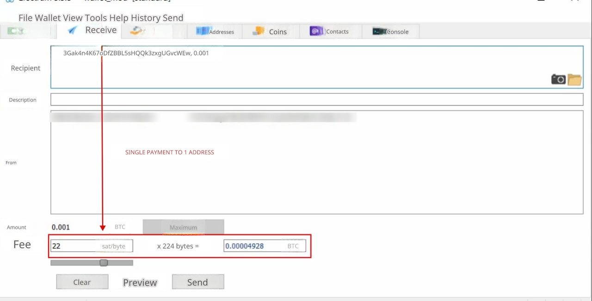

# Electrum Module

## Module Overview

When a cryptocurrency exchange processes Bitcoin payouts to clients, it incurs network transaction fees. If payouts are handled on a one-to-one basis (i.e., one payout request equals one transaction), the exchange faces significant losses due to high network fees.

To reduce these costs, exchanges can process batch payouts—combining multiple client payout requests into a single transaction. The more addresses included in a single transaction, the lower the overall fee per payout, which increases the exchange's profitability. This is the same principle used by cryptocurrency exchanges when disbursing funds to their clients.

**Merchant and Electrum Payouts**

We have developed paid modules for merchant services and automated payouts using [Electrum](https://electrum.org/) for BTC, which also support batch Bitcoin payouts. To enable payouts, the library must be installed on your server.

**With these Electrum wallet modules, you can set up a complete system for receiving and disbursing BTC with minimal fees.**

The Electrum wallet can be used both on a computer and on a website. Network fees for payouts are automatically determined using the [Mempool](https://mempool.space/api/v1/fees/recommended) service.

**How Much Can You Save with Batch Payouts?**

Batch payouts are cost-effective when the exchange receives at least two Bitcoin payout requests within a 10–15 minute window.

As of December 5, 2023, the recommended fee for sending Bitcoin is 60 sat/byte. See the Electrum wallet fee screenshots below for reference.

For a single payout to one address, the transaction fee is 0.00004928 BTC. If you process 8 individual transactions per hour, the daily fee would amount to 0.00004928 BTC × 8 × 24 = 0.00946176 BTC. Over a month, this adds up to 0.2838528 BTC, which is approximately $8,455 at the current exchange rate (as of May 25, 2022).

<figure><figcaption></figcaption></figure>

For a batch payout to two addresses, the transaction fee is 0.00005632 BTC. If you process batch payouts to at least two addresses every 15 minutes over 24 hours, the daily fee would be 0.00005632 BTC × 4 × 24 = 0.00540672 BTC. Over a month, this totals 0.1622016 BTC, which is approximately $4,820 at the current exchange rate (as of May 25, 2022).

**In summary: $8,455 - $4,820 = $3,635 — the monthly savings on network fees for the exchange when using the batch payout module.**

**Pricing**

The cost of the ready-to-use modules (merchant and payout) is $1,490 for all your licenses. The modules are provided immediately after payment.

For purchases or any questions, please [contact](https://premiumexchanger.com/podderzhka/) our technical support team.
