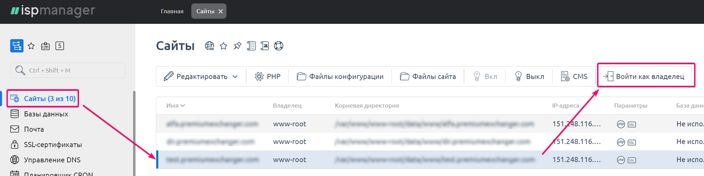
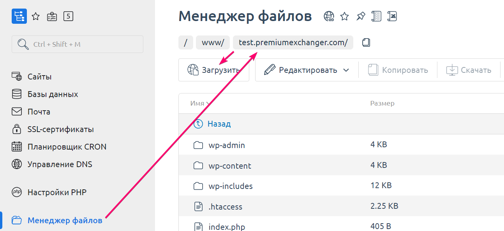

# How to Find the Root Directory of a Website on a Server

1. Log in to your server in ISP Manager as the root user. Navigate to the "**Sites**" section, select the desired website, and click the "**Log in as owner**" button.

<figure><figcaption></figcaption></figure>

2. In the "**File Manager**" section, open the directory of your website. The folder corresponding to `https://`_`your_domain_name/`_ is the root directory of your website.  

<figure><figcaption></figcaption></figure>