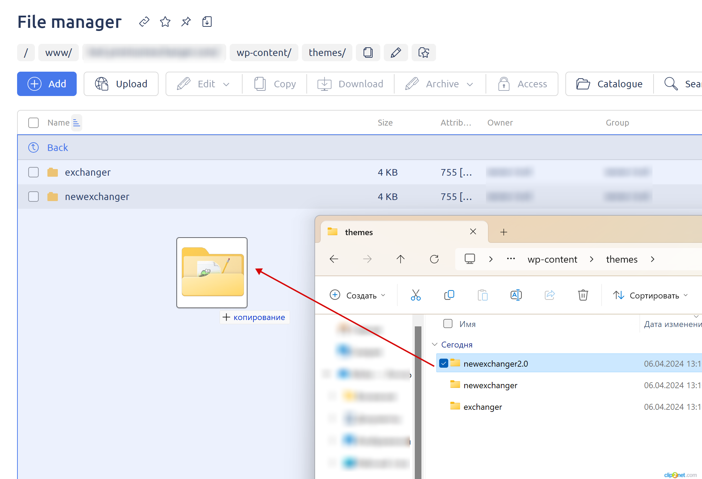
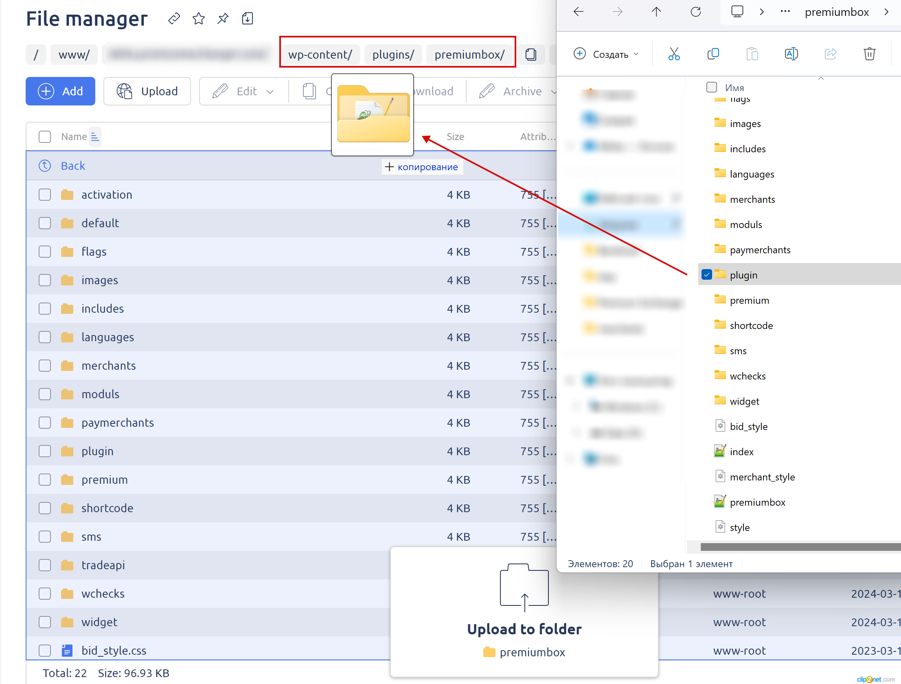

# How to Update Files on the Server?

From time to time, it’s necessary to replace module files on the server due to the release of a new module version, bug fixes in the current module, or other reasons.


Before making any changes to the files on the server, we strongly recommend creating a backup of the root folder on your computer:

\
All file operations should be performed via the ISP Manager panel under the <mark style="color:green;">**user account created for the website**</mark> (**not** <mark style="color:red;">**root**</mark>).



To locate the path to the root folder of your website on the server, refer to this [guide](https://premium.gitbook.io/main/en/basic-settings/faq/kak-naiti-kornevuyu-papku-saita-na-servere).



Please note that modules are not compatible across different script versions. For example, if you are using script version 2.7, all modules must also be version 2.7.\*.

Installing an incompatible module will result in an error (the website will not load), and you will need to upload compatible modules again.


***

## Script Modules

1. Download the **update archive** for your script version from the [**"Your Scripts"**](https://premiumexchanger.com/uscripts/) page. Choose the appropriate PHP version and your script version, then extract the archive on your computer.

<figure><figcaption></figcaption></figure>

2. **Make sure** to deactivate the modules you plan to update in the "**Modules**" section.

<figure><figcaption></figcaption></figure>

3. Navigate to the directory path shown in the screenshot: `/wp-content/plugins/premiumbox/moduls/`

<figure><figcaption></figcaption></figure>

4. Select **one or more required modules** and drag them into the ISP Manager window, placing them in the corresponding directory on the server.

<figure><figcaption></figcaption></figure>

5. At the bottom of the page, a window will appear showing the destination folder (the "**moduls**" folder).

<figure><figcaption></figcaption></figure>

6. If a file conflict window appears, overwrite the files by clicking "**Replace**."

<figure><figcaption></figcaption></figure>

7. Reactivate the updated modules in the "**Modules**" section.

After completing these steps, the modules will be updated, and no further actions are required.

***

## Merchant and Auto-Payout Modules


Ensure that you download the module specifically for the script version installed on your server. The script version can be found, for example, on the "**Requests**" page.





In your account, go to the **"Your Scripts"** section and download the merchant module for the required payment system from the "**Additional Modules**" block.

<figure><figcaption></figcaption></figure>

Upload the contents of the module archive to the server in the `/wp-content/plugins/premiumbox/merchants` directory (for payment acceptance) or `/wp-content/plugins/premiumbox/paymerchants` directory (for auto-payouts), and extract the files. If a file conflict window appears, overwrite the files.



Download the updated module distribution (any archive compatible with **your script version**) from the ["**Your Scripts**"](https://premiumexchanger.com/uscripts/) section in your account.

<figure><figcaption></figcaption></figure>

Extract the downloaded archive on your computer and locate the folder containing the required merchant module:

<figure><figcaption></figcaption></figure>

or auto-payout module:

<figure><figcaption></figcaption></figure>

Upload the contents of the module archive to the server in the `/wp-content/plugins/premiumbox/merchants` directory (for payment acceptance) or `/wp-content/plugins/premiumbox/paymerchants` directory (for auto-payouts). If a file conflict window appears, overwrite the files.



***

## Default Script Design Files

1. Download the **update archive** for your script version from the [**"Your Scripts"**](https://premiumexchanger.com/uscripts/) page. Choose the appropriate PHP version and your script version, then extract the archive on your computer.

<figure><figcaption></figcaption></figure>

2. Navigate to the directory path shown in the screenshot: `/wp-content/themes/`

<figure><figcaption></figcaption></figure>

4. Select the required design folder (`newexchanger2.0` — the new standard design for 2024) and drag it into the ISP Manager window, placing it in the corresponding directory.

<figure><figcaption></figcaption></figure>

5. If a file conflict window appears, overwrite the files by clicking "**Replace**."

<figure><figcaption></figcaption></figure>

7. Activate the uploaded design in the website control panel under "**Appearance -> Themes**."

<figure><figcaption></figcaption></figure>

8. Additional appearance settings may be required if you activate a new design on the site. The main design settings can be found in the "**Appearance**" section.

***

## Script Files

1. Download the **update archive** for your script version from the [**"Your Scripts"**](https://premiumexchanger.com/uscripts/) page. Choose the appropriate PHP version and your script version, then extract the archive on your computer.

<figure><figcaption></figcaption></figure>

2. Navigate to the directory path shown in the screenshot: `/wp-content/plugins/premiumbox/`

<figure><figcaption></figcaption></figure>

3. Select **one or more required directories** and drag them into the ISP Manager window, placing them in the corresponding directory.

<figure><figcaption></figcaption></figure>

4. If a file conflict window appears, overwrite the files by clicking "**Replace**."

<figure><figcaption></figcaption></figure>
