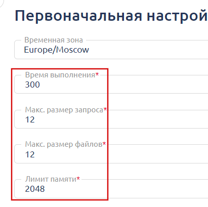
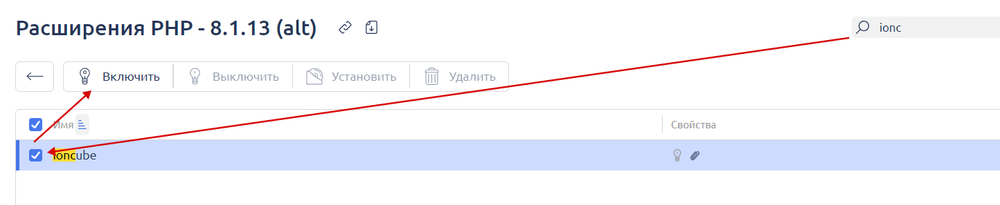
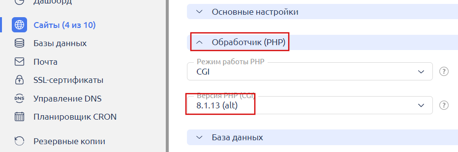

# How to Update ionCube Loader

1. Install PHP 8.1 on your server via the ISP Manager control panel under the **root user** in the "**Settings -> Software Configuration**" section.

<figure><figcaption></figcaption></figure>

2. Download the latest version of [ionCube Loader](https://www.ioncube.com/loaders.php) to your computer and extract the archive.

<figure><figcaption></figcaption></figure>

3. Log in to the ISP Manager control panel as the **root user** and open the file manager.

<figure><figcaption></figcaption></figure>

4. Using the file manager, navigate to the directory `/opt/php81/lib/php/modules/` (the path on your server may differ — if it does, contact your hosting provider's support team to confirm the correct path). Upload the **ioncube\_loader\_lin\_8.1.so** file from the extracted archive to the server, replacing the existing file.

<figure><figcaption></figcaption></figure>

5. Go to the "**Settings -> PHP Settings**" section and open "**PHP Core Settings**" for version 8.1.

<figure><figcaption></figcaption></figure>

6. Configure the settings as shown in the screenshot below and save them.

<figure><figcaption></figcaption></figure>

7. Open the "**Extension Management**" section for PHP 8.1.

<figure><figcaption></figcaption></figure>

8. Make sure to disable and then re-enable the ionCube module to properly activate the new version.

<figure><figcaption></figcaption></figure>

9. In the "**Sites**" section, activate PHP 8.1 for your website.

<figure><figcaption></figcaption></figure>

<figure><figcaption></figcaption></figure>
