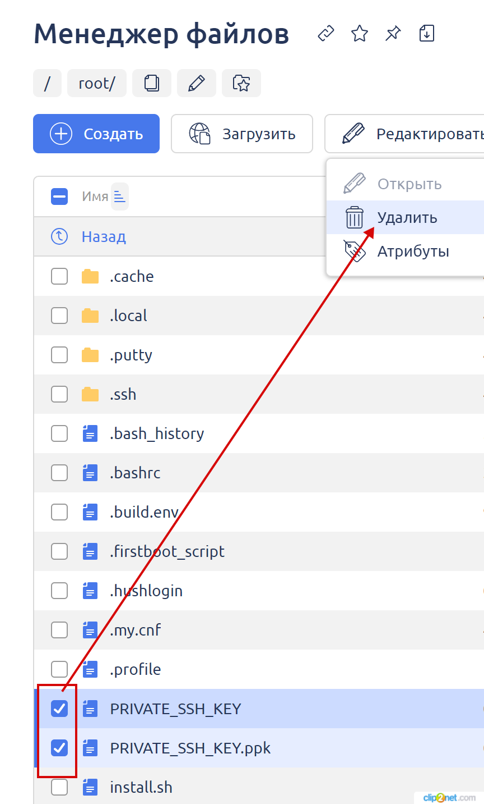

# Replacing SSH Authorization Keys on the Server

The commands in this guide are executed via the ISP Manager control panel under the root user. By following these instructions, you can replace the SSH keys used for authentication on the server via SSH/SFTP.

---

### Steps:

1. Log in to the ISP Manager server control panel as the root user.
2. Navigate to the **"Administration" -> "Shell Client"** section.

<figure><figcaption></figcaption></figure>

3. Right-click on the blank screen and select **"Paste from browser"** from the context menu.

<figure><figcaption></figcaption></figure>

4. Enter the command in the window that opens and click **"OK"**. Then press **Enter** to execute the command.
5. Execute the commands listed below one by one, repeating steps 3 and 4 for each command.
6. List of commands to execute (hover over a command to use the copy icon on the right):

```bash
rm ~/.ssh/authorized_keys
```

```bash
ssh-keygen -m PEM -t rsa -b 2048 -f ~/PRIVATE_SSH_KEY -q -N ""
```

```bash
puttygen ~/PRIVATE_SSH_KEY -o ~/PRIVATE_SSH_KEY.ppk -O private
```

```bash
touch ~/.ssh/authorized_keys
```

```bash
cat ~/PRIVATE_SSH_KEY.pub >> ~/.ssh/authorized_keys
```

```bash
rm ~/PRIVATE_SSH_KEY.pub -f
```

---

7. In the **"File Manager"** section, navigate to the **"root"** folder.

<figure><figcaption></figcaption></figure>

8. Download the two SSH keys to your computer:

   - `PRIVATE_SSH_KEY` — Use this for macOS/Linux.  
   - `PRIVATE_SSH_KEY.ppk` — Use this for Windows.

<figure><figcaption></figcaption></figure>

9. Delete the generated keys from the server after downloading them.

<figure><figcaption></figcaption></figure>

10. Perform a test connection via SSH/SFTP using the new keys.

--- 

By following these steps, you will successfully replace the SSH keys used for server authentication.