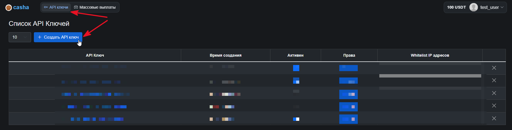

# Casha.pro


Before setting up auto payouts, please read the [risk warning!](https://premium.gitbook.io/main/en/basic-settings/merchants-and-auto-payments/auto-payments/risk-warning)



If you need to update the module on the server, please refer to the [instructions](https://premium.gitbook.io/main/en/en/basic-settings/faq/updating-script-files-on-the-server/how-to-update-files-on-the-server#merchant-and-auto-payout-modules).


### Settings in the merchant's personal account


To discuss terms and connect, contact the service representative.

**Disclaimer**: when connecting your site to any service, please independently assess the possible risks of cooperation.


Contact the service representative to connect and obtain your account credentials.

Using the credentials provided, [log in to the service's personal account](https://casha.pro/).

In the **"API Keys"** section, generate the keys required to connect the module.

<figure><figcaption></figcaption></figure>

You will receive an **API key** and a **secret key**. Save them in a separate text file.


The merchant uses a shared USDT balance for payouts and converts the payout amount at the internal exchange rate.

Please confirm with the service representative whether automatic conversion is enabled for your account.


### Module settings

In the admin panel, create a new merchant in the **"Merchants"** → **"Add payout"** section.

Select **Casha** from the dropdown list in the **"Module"** field, enter a name for the module and click **"Save"**.

<figure><figcaption></figcaption></figure>

Fill in the authorization fields in the module settings.

<figure><figcaption></figcaption></figure>

**Domain** — leave this field empty.

**API Key** — the API key generated on the Casha side.

**Secret Key** — the secret key generated on the Casha side.

### Special fields

<figure><figcaption></figcaption></figure>

**Currency code:**

* **Extra fields (Order)** — use the currency code from the order (select **\[Receive] Currency code**)
* **Extra fields (Currencies)** — use the [currency extra field](https://premium.gitbook.io/main/osnovnye-nastroiki/valyuty-i-napravleniya-obmena/dopolnitelnye-polya#dopolnitelnye-polya-dlya-valyuty) **"Receive"**
* **Extra fields (Directions)** — use the [exchange direction extra field](https://premium.gitbook.io/main/osnovnye-nastroiki/valyuty-i-napravleniya-obmena/dopolnitelnye-polya#dopolnitelnye-polya-dlya-napravleniya-obmena)
* **Currency code** — manually select the payout currency explicitly.

<figure><figcaption></figcaption></figure>

**Account** — select the field where the client enters their payout account details.


**If you are using the standard "Receive account" field, select the value \[Receive] Account in the option.**


<figure><figcaption></figcaption></figure>

**Payment method** — explicitly specify the desired payout method for this module instance.


The payment method must match the details you request from the client for the payout: for the **Card** method, a card number must be requested; for **SBP** or **Mobile** — a phone number.


<figure><figcaption></figcaption></figure>

**Bank** — you can select the payout bank explicitly or set it to automatic.&#x20;

In automatic mode, the bank will be determined based on the provided details, if possible.


For example, the bank can be determined from a card number, but not from a phone number.


**Cron file —** [create a task](https://premium.gitbook.io/main/osnovnye-nastroiki/faq/kak-sozdat-zadanie-cron-na-servere) with this link on the server.

## Continuing the Setup

Additional module settings are performed according to the [general setup instructions](https://premium.gitbook.io/main/en/basic-settings/merchants-and-auto-payments/merchants/general-merchant-settings).
