# 001k.bot


Before setting up auto payouts, please read the [risk warning!](https://premium.gitbook.io/main/en/basic-settings/merchants-and-auto-payments/auto-payments/risk-warning)



If you need to update the module on the server, please refer to the [instructions](https://premium.gitbook.io/main/en/en/basic-settings/faq/updating-script-files-on-the-server/how-to-update-files-on-the-server#merchant-and-auto-payout-modules).



To start working with the merchant you need to set up 2FA and complete KYC on their side.\
Disclaimer: when connecting your website to any service, please independently assess the potential risks of cooperation.


## Merchant Account Settings

Working with the merchant is done through a Telegram bot - [https://t.me/OO1kBOT](https://t.me/OO1kBOT).

The keys required for the module are generated in the "Additional Features - API Access - Create a new API Key" section.

<figure>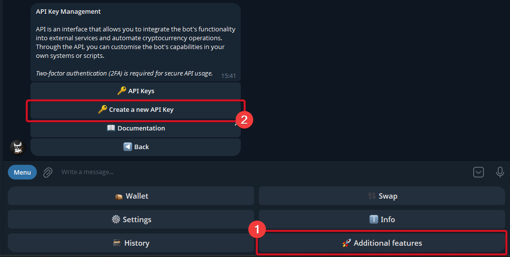<figcaption></figcaption></figure>

To generate API keys and begin working, you will first need to complete verification on the merchant's side and connect 2FA to your account.

<figure>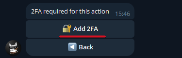<figcaption></figcaption></figure> <figure>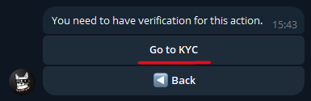<figcaption></figcaption></figure>

After the verification is complete, you will need to provide a name for the keys — this can be any text.

<figure>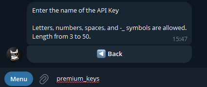<figcaption></figcaption></figure> <figure>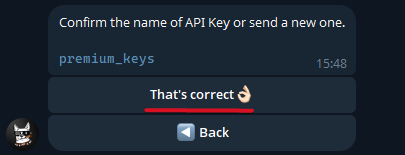<figcaption></figcaption></figure>

In the next step you will need to explicitly specify the actions that will be available for the key pair being created. For the payout module, "Balance" and "Withdrawal" permissions will be sufficient.

If you also plan to use merchant module from 001k.bot, you can enable "Deposit" permissions right away.

<figure>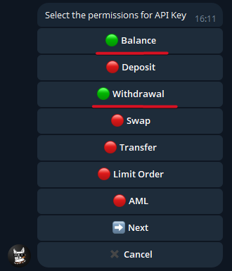<figcaption></figcaption></figure>

And indicate that the keys are **not being created as read-only** by selecting "No" in the following prompt.

<figure>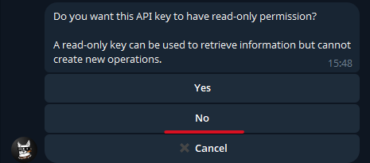<figcaption></figcaption></figure>

You can then add your server's IP address to the merchant's whitelist or skip this step to allow all IPs.

<figure>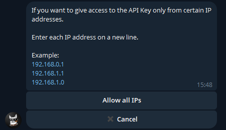<figcaption></figcaption></figure>

The keys need to be activated immediately after they are created.

<figure>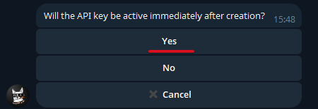<figcaption></figcaption></figure>

After confirming all the specified options and confirming via 2FA, the API keys will be generated. Please copy these keys.

<figure>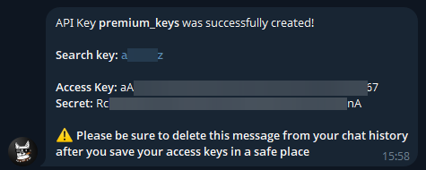<figcaption></figcaption></figure>

## Module Settings

In the admin panel, create a new merchant in the "**Merchants**" ➔ "**Add Auto Payout**" section.

Select 001k from the drop-down list in the "**Module**" field, enter a name for the module, and click "**Save**."

<figure>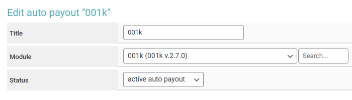<figcaption></figcaption></figure>

Fill in the specified authorization fields.

<figure>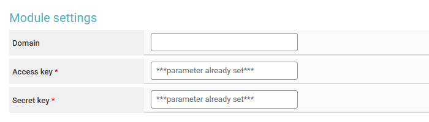<figcaption></figcaption></figure>

**Domain —** do not fill in this field, leave it empty.

**Access key —** the "Access key" copied earlier from the 001k bot.

**Secret key —** the "Secret" copied earlier from the 001k bot.

## Special Fields

<figure><figcaption></figcaption></figure> <figure><figcaption></figcaption></figure>

**Currency Code** (for payouts)**:**

* **Custom Fields (Order)** — use the currency code from the request (select **\[Receive] Currency Code**)
* **Custom Fields (Currency)** — use the [additional currency field](https://premium.gitbook.io/main/en/basic-settings/currencies-and-exchange-directions/additional-fields#additional-fields-for-currency) "**Receive**"
* **Custom Fields (Direction)** — use the [additional exchange direction field](https://premium.gitbook.io/main/en/basic-settings/currencies-and-exchange-directions/additional-fields#additional-fields-for-exchange-direction)
* **Currency Code** — manually select the payout currency.

<figure><figcaption></figcaption></figure> <figure><figcaption></figcaption></figure>

**Network** (for cryptocurrencies)**:**

* **Custom Fields (Currency)** — use the [additional currency field](https://premium.gitbook.io/main/en/basic-settings/currencies-and-exchange-directions/additional-fields#additional-fields-for-currency) "**Receive**"
* **Custom Fields (Direction)** — use the [additional exchange direction field](https://premium.gitbook.io/main/en/basic-settings/currencies-and-exchange-directions/additional-fields#additional-fields-for-exchange-direction)
* **Network** — manually select the network.

**Cron file —** [create a task](https://premium.gitbook.io/main/osnovnye-nastroiki/faq/kak-sozdat-zadanie-cron-na-servere) with this link on the server.

## Continuing the Setup

Next, configure the merchant by following the [general setup instructions](https://premium.gitbook.io/main/en/basic-settings/merchants-and-auto-payments/merchants/general-merchant-settings).
