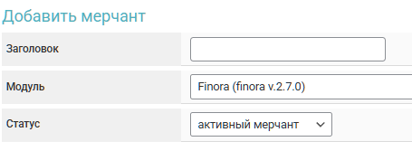

# Alfabit Fiat


<mark style="color:red;">Before setting up auto payouts, please read the</mark> [<mark style="color:blue;">risk warning!</mark>](https://premium.gitbook.io/main/en/basic-settings/merchants-and-auto-payments/auto-payments/risk-warning)



If you need to update the module on the server, please refer to the [instructions](https://premium.gitbook.io/main/en/en/basic-settings/faq/updating-script-files-on-the-server/how-to-update-files-on-the-server#merchant-and-auto-payout-modules)


## Merchant Account Settings 


To discuss terms and connection, please contact a [service representative](https://t.me/Alfabit_Sale_manager_Irina).

**Disclaimer**: When connecting your website to any service, please assess the potential risks of collaboration on your own.


Register and verify your account with [Alfabit](https://pay.alfabit.org/). Go to the "**Merchants**" section and click the "**Create Merchant**" button.

<figure><figcaption></figcaption></figure>

Fill in the required fields and click the "**Create Project**" button.

<figure><figcaption></figcaption></figure> <figure><figcaption></figcaption></figure> <figure><figcaption></figcaption></figure>

Go to the merchant settings, select the "**API Keys**" tab, and click the "**Add**" button.

<figure><figcaption></figcaption></figure>

Fill in the required fields and click the "**Save**" button.

<figure><figcaption></figcaption></figure>


Select one or both options for "**Receiving Funds/Withdrawing Funds**" depending on your intended use of the merchant.

It's advisable to add your server's IP address under "**Trusted IPs**."


<figure><figcaption></figcaption></figure>

Save the generated key in a text file and click the "**Done**" button.

## Module Settings 

In the admin panel, create a new merchant in the "**Auto Payouts**" ➔ "**Add Auto Payout**" section.

Select Alfabit Fiat from the dropdown list in the "**Module**" field, enter a name for the module, and click "**Save**."

<figure><figcaption></figcaption></figure>

Fill in the required authorization fields.

<figure><figcaption></figcaption></figure>

**API Key** — the public key previously generated in your Alfabit account.

## Special Fields

<figure><figcaption></figcaption></figure>

**Payment Method** — select the necessary method for payouts (the list of methods will only be displayed after entering the correct API key for module authorization).

**Add** — add your own payment method (please consult with an Alfabit representative before adding a method).


For each payment method used, a separate copy of the auto payout module must be created, selecting the corresponding method, and then this copy should be connected in the "**Merchants and Payouts**" tab in the exchange direction settings, where the currency in "**Receiving**" will be the appropriate currency.


### Additional Parameters

When using methods that require the parameters `first_name` and `last_name`, you need to add [additional fields for the currency](https://premium.gitbook.io/main/en/basic-settings/valyuty-i-napravleniya-obmena/dopolnitelnye-polya#dopolnitelnye-polya-dlya-valyuty) for payouts (on the "**Receiving**" side). In the "**Unique ID**" field in the currency settings, make sure to specify this parameter and activate the additional field for the selected currency.

<figure><figcaption></figcaption></figure>

<figure><figcaption></figcaption></figure>

## Continuing the Setup

Next, proceed with the merchant setup by following the [general setup instructions](https://premium.gitbook.io/main/en/basic-settings/merchants-and-auto-payments/auto-payments/obshie-nastroiki-merchantov-avtovyplat).