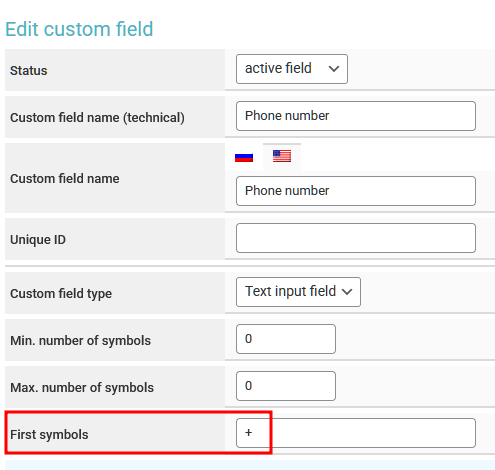

# APX


Before setting up auto payouts, please read the [risk warning!](https://premium.gitbook.io/main/osnovnye-nastroiki/merchanty-i-avtovyplaty/avtovyplaty/preduprezhdenie-o-riskakh)



If you need to update the module on the server, please refer to the [instructions](https://premium.gitbook.io/main/osnovnye-nastroiki/faq/obnovlenie-failov-skripta-na-servere/kak-obnovit-faily-na-servere#moduli-merchantov-i-avtovyplat).



For discussions regarding terms and connections, please contact a [service representative](https://t.me/apxarchi).

**Disclaimer**: When connecting your website to any service, please assess the potential risks of collaboration on your own.


Register on the [APX service](https://www.apx.archi/auth/signup) and log in to your personal account. Create a new API key.

<figure><figcaption></figcaption></figure>

Copy the generated key to your clipboard or a text file.

<figure><figcaption></figcaption></figure>

## Module Settings

In the admin panel, create a new merchant in the "**Merchants**" ➔ "**Add Auto Payout**" section.

<figure><figcaption></figcaption></figure>

Select APX from the dropdown menu in the "**Module**" field, enter a name for the module, and click "**Save**."

Fill in the required authorization fields.

<figure><figcaption></figcaption></figure>

**Domain** — leave this field empty.

**API Key** — the key you copied from your APX account.

## Special Fields


#### Additional Fields for the Application 

When processing payouts using APX auto payouts, it is **necessary** to add additional fields to the exchange form for the client to fill out when creating an application.

To do this, create and add [additional fields](https://premium.gitbook.io/rukovodstvo-polzovatelya/osnovnye-nastroiki/valyuty-i-napravleniya/dobavlenie-novoi-valyuty#vkladka-dop.-polya) **to the corresponding currencies** on the "**Receiving**" side for payouts through APX.

Make sure to specify a variable in the "**Unique ID**" field (use lowercase letters) and make the field mandatory.

1. **Field for Bank Name** <mark style="color:red;">**(required)**</mark>

* **Unique ID**: `get_bankname`

*   **Processing Priority (any option can be selected)**:

    1. Additional field for currency with ID `get_bankname`
    2. Automatic value: currency code for "**Receiving**" (must contain "**RUB**" in the name)

    <figure><figcaption></figcaption></figure>

2. **Field for Card Number** <mark style="color:red;">**(required)**</mark>

* **Unique ID**: `get_account`
*   **Processing Priority (any option can be selected)**:

    1. Additional field for currency with ID `get_account`
    2. Automatic value: standard field "**To Account**" for currency "**Receiving**"

    <figure><figcaption></figcaption></figure>

3. **Field for Cardholder Name** <mark style="color:yellow;">**(optional)**</mark>

* **Unique ID**: `get_cardholder`/`cardholder`
* **Processing Priority (any option can be selected)**:
  1. Additional field for currency with ID `get_cardholder`
  2. Automatic generation from the client's full name (`last_name + first_name + second_name`) — standard fields "**Last Name**", "**First Name**", "**Middle Name**" for **exchange direction (not currency!)**

4. **Field for Phone Number** <mark style="color:yellow;">**(optional)**</mark>

* **Unique ID**: `get_phone`
*   **Processing Priority (any option can be selected)**:

    1. Additional field for currency with ID `get_phone`
    2. Standard additional field "**Phone**" **for exchange direction (not currency!)** with + as the first character in the input form

    <figure><figcaption></figcaption></figure>

After this, the fields will be displayed in the exchange form and will be mandatory for the client to fill out when creating an application.


## Continue Configuration 

Next, proceed to configure the merchant by following the [general setup instructions](https://premium.gitbook.io/rukovodstvo-polzovatelya/osnovnye-nastroiki/merchanty-i-avtovyplaty/avtovyplaty/obshie-nastroiki-merchantov-avtovyplat).
