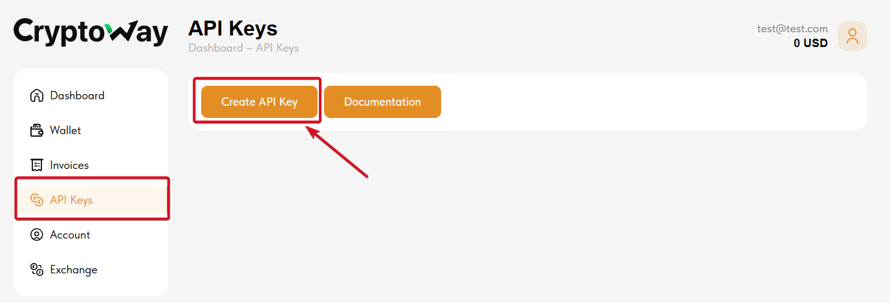
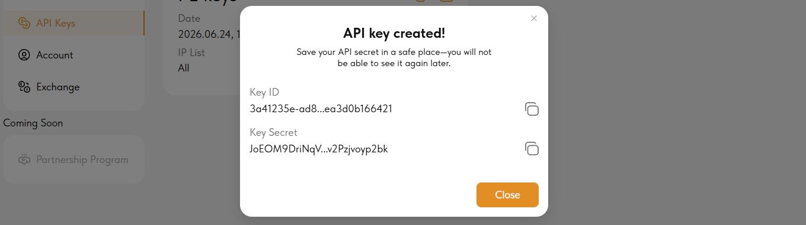
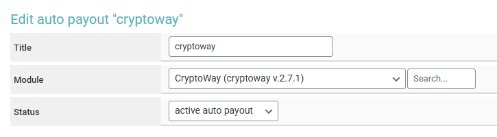
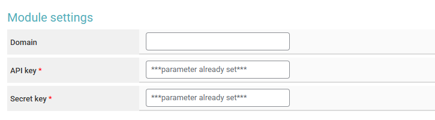
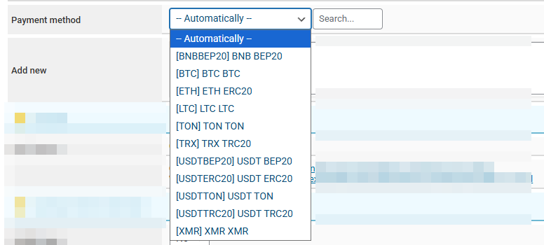

# CryptoWay


<mark style="color:red;">Before setting up auto payouts, please read the</mark> [<mark style="color:blue;">risk warning!</mark>](https://premium.gitbook.io/main/en/basic-settings/merchants-and-auto-payments/auto-payments/risk-warning)



If you need to update the module on the server, please refer to the [instructions](https://premium.gitbook.io/main/en/en/basic-settings/faq/updating-script-files-on-the-server/how-to-update-files-on-the-server#merchant-and-auto-payout-modules).


## Merchant Account Settings


**Disclaimer**: When connecting your website to any service, please assess the potential risks of collaboration on your own.


Register on the [CryptoWay service](https://cryptoway.com/en) and log into your account.

Go to the API keys section. Generate a set of keys by clicking "Create API Key".

<figure><figcaption></figcaption></figure>

Enter an arbitrary name for this set of keys and your server IP (optional) in the corresponding fields.

#### Check the permission boxes for the key pair being created:

**Withdrawal —** for the auto payout module. Permission to withdraw funds.

**Deposits —** for the merchant module. Permission to accept funds.

<figure><figcaption></figcaption></figure>

Confirm the key creation by entering the code sent to your registration email.

Copy the obtained Key ID and Key Secret to your clipboard or a text file.

<figure><figcaption></figcaption></figure>

The keys are only available for viewing at the time of creation — they cannot be copied or viewed again. You will need to create a new key pair.

## Module settings

In the admin panel, create a new merchant in the "**Merchants**" ➔ "**Add Auto Payout**" section.

Select **CryptoWay** from the dropdown menu in the "**Module**" field, enter a name for the module, and click "**Save**."

<figure><figcaption></figcaption></figure>

Fill in the required authorization fields.

<figure><figcaption></figcaption></figure>

**Domain —** do not fill in this field, leave it empty.

**API key —** Key ID copied earlier from your CryptoWay account.

**Secret key —** Key Secret copied earlier from your CryptoWay account.

## Special Fields

**Payment method** — select the currency for issuing the wallet address (selecting "**Automatically**" will use the XML currency code of the "**Receiving**" currency).

* **Add** **new** — to add your own currency code.

<figure><figcaption></figcaption></figure>

**Cron file —** [create a task](https://premium.gitbook.io/main/osnovnye-nastroiki/faq/kak-sozdat-zadanie-cron-na-servere) with this link on the server.

## Continuing the Setup

Additional module settings are performed according to the [general setup instructions](https://premium.gitbook.io/main/en/basic-settings/merchants-and-auto-payments/merchants/general-merchant-settings).
