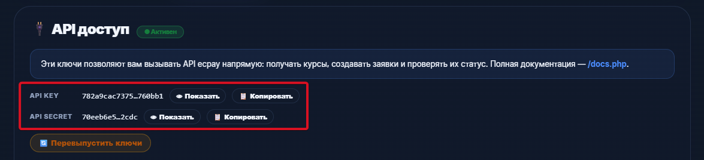
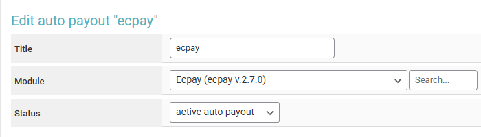
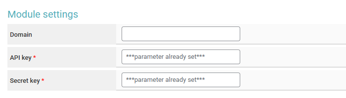
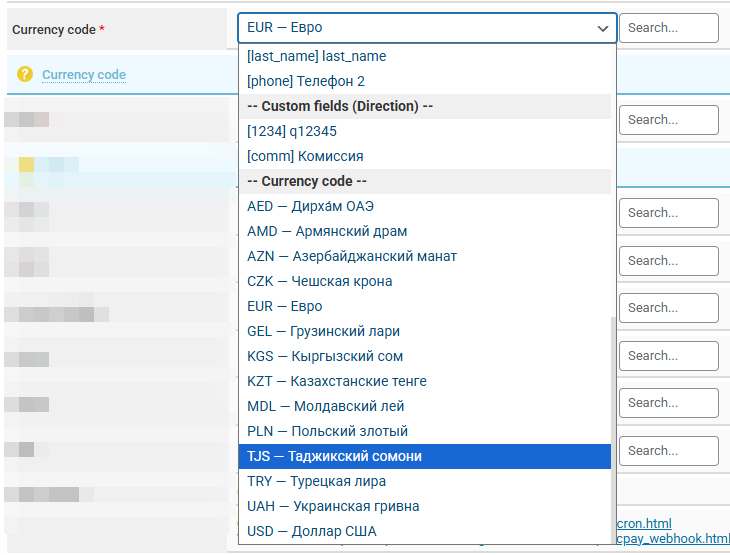
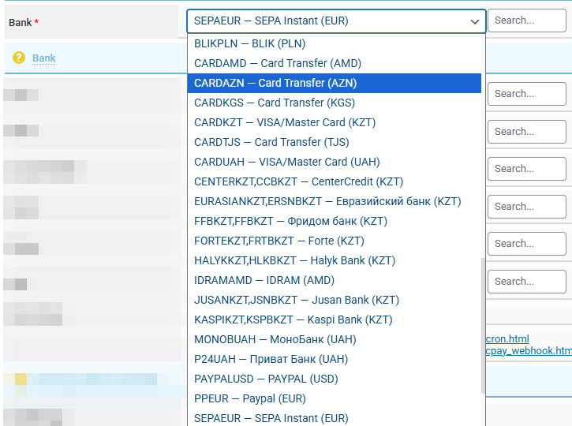
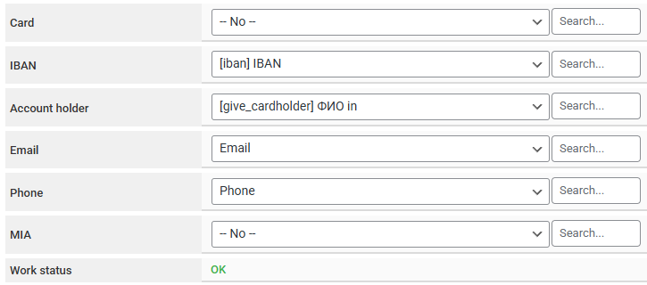

# Ecpay.System


<mark style="color:red;">Before setting up auto payouts, please read the</mark> [<mark style="color:blue;">risk warning!</mark>](https://premium.gitbook.io/main/en/basic-settings/merchants-and-auto-payments/auto-payments/risk-warning)



If you need to update the module on the server, please refer to the [instructions](https://premium.gitbook.io/main/en/en/basic-settings/faq/updating-script-files-on-the-server/how-to-update-files-on-the-server#merchant-and-auto-payout-modules).



To discuss terms and connect, contact the service representative - [https://t.me/ECPAYSystem](https://t.me/ECPAYSystem)

Disclaimer: when connecting your website to any service, please independently assess the potential risks of cooperation.


Complete the connection process and log in at [https://ecpay.systems](https://ecpay.systems).\
\
Generate API keys in your account settings.

<figure><figcaption></figcaption></figure>

Copy the obtained key pair to enter in the module settings in the system.

<figure><figcaption></figcaption></figure>

## Module Settings

In the admin panel, create a new merchant in the **"Merchants" section ➔ "Add auto payout".**

<figure><figcaption></figcaption></figure>

Select Ecpay from the dropdown list in the **"Module"** field, enter a name for the module and click **"Save"**.

Fill in the specified authorization fields.

<figure><figcaption></figcaption></figure>

**Domain —** do not fill in this field, leave it empty.

**API key —** API key from the Ecpay service.

**Secret key —** API secret from the Ecpay service.

## Special Fields

<figure><figcaption></figcaption></figure>

**Currency code —** select the appropriate currency or specify the field from which the currency designation will be used.

<figure><figcaption></figcaption></figure>

**Bank —** select the appropriate bank for the currency from the list or specify the field from which the bank designation will be used.


**Additional order fields**

When paying out funds using Ecpay.System auto payout, it is often necessary to add additional fields to the exchange form for the client to fill in when creating an order.

To do this, create and add additional fields to the corresponding currencies for paying out funds through Ecpay.System.

In the module settings, fields for specific parameters can be specified explicitly. In cases where such a field is required for working with a currency, the specified settings will be used. 


<figure><figcaption></figcaption></figure>

**Card —** the standard "To account" field is usually used, but another can be selected if necessary.

**IBAN —** an additional currency field to be created.

**Account holder —** an additional currency field to be created requesting cardholder information.

**Email —** usually the standard system "Email" field.

**Phone —** usually the standard system "Phone" field.

**MIA —** an additional currency field to be created.

<figure><figcaption></figcaption></figure>

**Cron file —** [create a task](https://premium.gitbook.io/main/osnovnye-nastroiki/faq/kak-sozdat-zadanie-cron-na-servere) with this link on the server.

## Continuing the Setup

Additional module settings are performed according to the [general setup instructions](https://premium.gitbook.io/main/en/basic-settings/merchants-and-auto-payments/merchants/general-merchant-settings).

