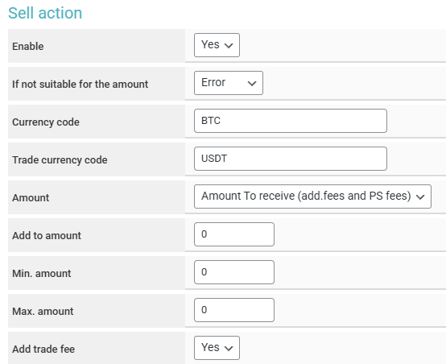

# Optimoney


Before setting up automatic payouts, please read the [risk warning!](https://premium.gitbook.io/main/osnovnye-nastroiki/merchanty-i-avtovyplaty/avtovyplaty/preduprezhdenie-o-riskakh)



If you need to update the module on the server, please refer to the [instructions](https://premium.gitbook.io/main/osnovnye-nastroiki/faq/obnovlenie-failov-skripta-na-servere/kak-obnovit-faily-na-servere#moduli-merchantov-i-avtovyplat)


## Merchant Account Settings


To discuss the terms of service, please contact a service representative.

**Disclaimer**: When connecting your website to any service, please assess the potential risks of collaboration on your own.


Register on the [Optimoney](https://client.optimoney.com/register) service. Log into your account and create a new USD wallet (name the wallet as you see fit).

<figure><figcaption></figcaption></figure>

<figure><figcaption></figcaption></figure>

## Module Settings

In the admin panel, create a new merchant in the "**Merchants**" section ➔ "**Add Automatic Payout**."

Select Optimoney from the dropdown list in the "**Module**" field, provide a name for the module, and click "**Save**."

<figure><figcaption></figcaption></figure>

Fill in the required authorization fields.

<figure><figcaption></figcaption></figure>

**Domain** — leave this field empty.

**API Key** — the API key provided to you by the Optimoney representative.

**Secret Key** — the secret key provided to you by the Optimoney representative.

## Special Fields

<figure><figcaption></figcaption></figure>

**Payment Method** — select the wallet you created earlier, from which payouts to clients will be made.

## Continuing the Setup

Next, proceed to configure the merchant by following the [general setup instructions](https://premium.gitbook.io/rukovodstvo-polzovatelya/osnovnye-nastroiki/merchanty-i-avtovyplaty/merchanty/obshie-nastroiki-merchantov).