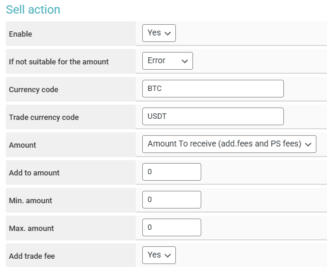

# Paycore


Before setting up automatic payouts, please read the [risk warning!](https://premium.gitbook.io/main/osnovnye-nastroiki/merchanty-i-avtovyplaty/avtovyplaty/preduprezhdenie-o-riskakh)



If you need to update the module on the server, please refer to the [instructions](https://premium.gitbook.io/main/osnovnye-nastroiki/faq/obnovlenie-failov-skripta-na-servere/kak-obnovit-faily-na-servere#moduli-merchantov-i-avtovyplat).


## Merchant Account Settings


To discuss terms and connection, please contact a [service representative](https://t.me/Paycore_pw).

**Disclaimer**: When connecting your website to any service, please assess the potential risks of collaboration on your own.


After receiving your login credentials from a [service representative](https://t.me/Paycore_pw), log in to the [PayCore Dashboard](https://paycore.pw/admin) and complete the verification process. After verification, request an API key from the service representative for integration.

## Module Settings

In the admin panel, create a new merchant in the "**Merchants**" section ➔ "**Add Automatic Payout**."

Select Paycore from the dropdown menu in the "**Module**" field, enter a name for the module, and click "**Save**."

<figure><figcaption></figcaption></figure>

Fill in the required authorization fields.

<figure><figcaption></figcaption></figure>

**Domain** — leave this field empty.

**API Key** — enter the API key provided to you by the Paycore representative.

## Special Fields

In the automatic payout module instructions, be sure to add the shortcode "**Payment Link**" — this is necessary for displaying the link in the request, which the client will use to choose their method of receiving funds and the bank on the service's payment page.

<figure><figcaption></figcaption></figure>

Next, insert the following block of text into the field:

```html
<h2>Text</h2>
<br>
<div style="text-align: center;">
<a href="{tx_url}" target="_blank" class="btn-new">Proceed to confirmation</a>
</div>
[else]
<h2>Text</h2>
```

Then adjust the text using the first shortcode so that the final format looks like this:

```html
[if_url_xxxxxxxxxxxxxxxxxxxxxxxxxxxxx]
<h2>Your text</h2>
<br>
<div style="text-align: center;">
<a href="{tx_url}" target="_blank" class="btn-new">Proceed to confirmation</a>
</div>
[else]
<h2>Text</h2>
[/if_url_xxxxxxxxxxxxxxxxxxxxxxxxxxxxx]
```

<figure><figcaption><p>Display of the above template on the request page</p></figcaption></figure>

Also, make sure to check the status "**Awaiting confirmation from the automatic payout module**" in the "**Exchange Settings**" ➔ "**Status Settings**" section — this is necessary for the proper functioning of the automatic payout module (if this section does not appear in the sidebar, activate the "**Professional Status Settings**" module in the "**Modules**" section, and then perform the specified configuration).

<figure><figcaption></figcaption></figure>

## Continuing the Setup

Next, configure the merchant by following the [general setup instructions](https://premium.gitbook.io/rukovodstvo-polzovatelya/osnovnye-nastroiki/merchanty-i-avtovyplaty/merchanty/obshie-nastroiki-merchantov).<br>