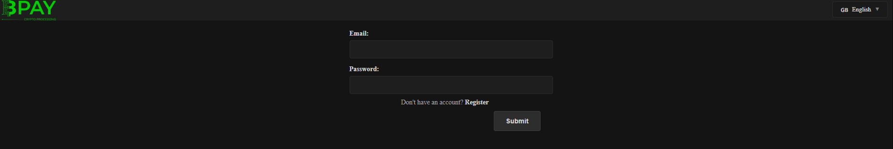
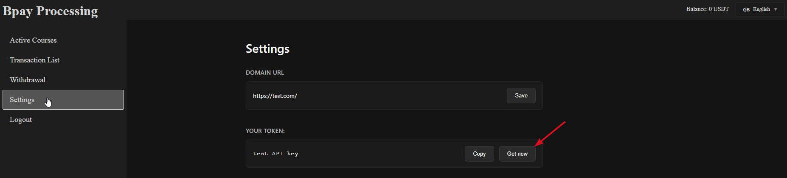
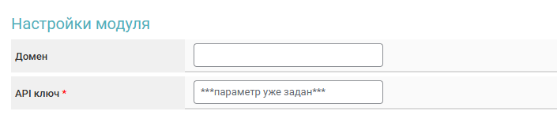
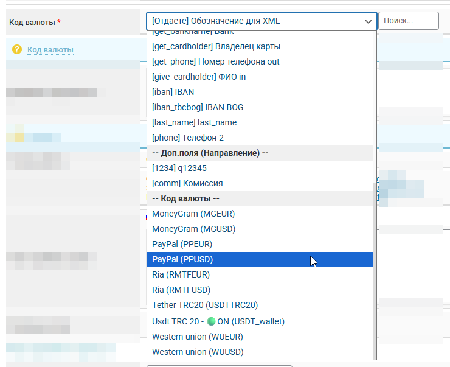

# Bplay


If you need to update the module on the server — [use the instruction.](https://premium.gitbook.io/main/en/basic-settings/faq/updating-script-files-on-the-server/how-to-update-files-on-the-server#merchant-and-auto-payout-modules)



To discuss terms and connect, contact the [service representative](https://t.me/bpay_processing).

Disclaimer: when connecting your website to any service, please independently assess the potential risks of cooperation.


## Merchant Account Settings

After receiving the login credentials from the [service representative](https://t.me/bpay_processing), log into your account on the [Bpay website](https://bpay-processing.com/auth/login).

<figure><figcaption></figcaption></figure>

Go to the "Settings" section and generate a token in the "Your token" block.

<figure><figcaption></figcaption></figure>

Save the obtained data to a text file.

## Module Settings

In the admin panel, create a new merchant in the "**Merchants**" section -> "**Add merchant**".

Select Bpay from the dropdown list in the "**Module**" field, enter a name for the module and click "**Save**".

<figure><figcaption></figcaption></figure>

Fill in the specified authorization fields.

<figure><figcaption></figcaption></figure>

**Domain** — do not fill in this field, leave it empty.

**API key** — **Your token** generated in the merchant account.

## Special fields

<figure><figcaption></figcaption></figure>

**Currency code** — Select the currency for acceptance in the module or the field for the currency designation in the system.

Cron file — [create a cron job](../../faq/how-to-create-a-cron-job-on-a-server.md) with this link on the server.

## Further setup

Additional module settings are performed according to the [general setup instructions](https://premium.gitbook.io/rukovodstvo-polzovatelya/osnovnye-nastroiki/merchanty-i-avtovyplaty/merchanty/obshie-nastroiki-merchantov).

