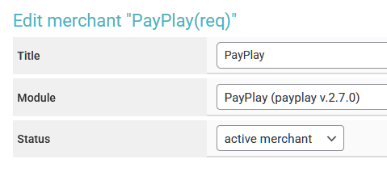

# Finora


If you need to update the module on the server, please refer to the [instructions](https://premium.gitbook.io/main/en/basic-settings/faq/updating-script-files-on-the-server/how-to-update-files-on-the-server#merchant-and-auto-payout-modules).

<mark style="color:red;">Please note that when updating the module, you need to reconfigure it according to the instructions below, because after updating the files, all fields and settings of the module will be reset to the default state.</mark>



For discussions regarding terms and connections, please contact a [service representative](https://t.me/Exe_PMx).

**Disclaimer**: When connecting your website to any service, please assess the potential risks of collaboration on your own.



Please note that when using the Finora payment module, the actual payout amount is always rounded to four decimal places on the service's side.


## Module Settings

In the admin panel, create a new merchant in the "**Merchants**" section ➔ "**Add Merchant**."

Select Finora from the dropdown list in the "**Module**" field, provide a name for the module, and click "**Save**."

<figure><figcaption></figcaption></figure>

Fill in the required authorization fields.

<figure><figcaption></figcaption></figure>

**API Key** — This is the key provided to you by your Finora manager for a specific payment method (please confirm this information with your manager).

## Special Fields

<figure><figcaption></figcaption></figure>

**Merchant Type** (the selected option is fixed to the module and cannot be changed later):

* **Payment Link** — returns a link for payment via QR code in the request; this option works with the selected payment method.
* **Requisites** — returns a card or phone number for transferring funds directly in the request using the shortcode \[to\_account].

<figure><figcaption></figcaption></figure>

**Payment Method** — select the appropriate method from the list or manually enter your option in the "**Add**" field (please confirm acceptable options with your Finora manager).

<figure><figcaption></figcaption></figure>

**Bank** — select the appropriate bank from the list or manually enter your option in the "**Add**" field (please confirm acceptable options with your Finora manager).

<figure><figcaption></figcaption></figure>


Choose a specific bank only if you previously selected the **Payment Link** format; if you are using the **Requisites** format, leave the default option (no bank selected).



Please note that if you select a specific bank in the module settings, your client will need to make payments using a card from that bank (payments made with cards from other banks may not be credited, including through appeals).



Please be aware that a separate copy of the merchant module must be created for each payment method.


To operate the module for receiving funds without using a [cron job](https://premium.gitbook.io/main/en/basic-settings/faq/how-to-create-a-cron-job-on-a-server), enter the link from the module settings

<figure><figcaption></figcaption></figure>

in the Finora personal account in the **PayIn Webhook** field:

<figure><figcaption></figcaption></figure>

## Continuing the Setup

Next, configure the merchant by following the [general setup instructions](../../../). 
