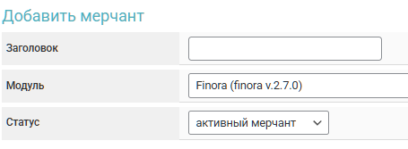

# GoatX


If you need to update a module on the server, please refer to the [instructions](https://premium.gitbook.io/main/osnovnye-nastroiki/faq/obnovlenie-failov-skripta-na-servere/kak-obnovit-faily-na-servere#moduli-merchantov-i-avtovyplat).



To discuss the terms of service, please contact a [service representative](https://t.me/polx_tokyo).

**Disclaimer**: When connecting your website to any service, please assess the potential risks of collaboration on your own.


## Merchant Account Settings

Register on the GoatX service with the help of a [service representative](https://t.me/polx_tokyo) and request API keys to connect to the Premium Exchanger.

Log in to your [personal account](https://goatx.me/) and navigate to the "**Merchant Contracts**" section, then copy the provided ID to your clipboard or a text file.

<figure><figcaption></figcaption></figure>

## Module Settings

In the admin panel, create a new merchant in the "**Merchants**" ➔ "**Add Merchant**" section.

Select GoatX from the dropdown menu in the "**Module**" field, enter a name for the module, and click "**Save**."

<figure><figcaption></figcaption></figure>

Fill in the required authorization fields.

<figure><figcaption></figcaption></figure>

**Domain** — leave this field empty.

**Login** — the identifier provided to you earlier by the GoatX representative.

**API Key** — the API key provided to you earlier by the GoatX representative.

**Contract ID** — the ID you copied earlier from your GoatX account.

## Special Fields

<figure><figcaption></figcaption></figure>

**Payment Method** — select the appropriate method for receiving funds from the client:

**Card** — provide bank card details.

**Phone** — provide a phone number for receiving funds via the SBP.

## Continuing the Setup

Next, proceed with the merchant setup by following the [general setup instructions](https://premium.gitbook.io/rukovodstvo-polzovatelya/osnovnye-nastroiki/merchanty-i-avtovyplaty/merchanty/obshie-nastroiki-merchantov).