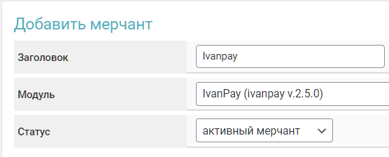

# Ivanpay


If you need to update the module on the server, please refer to the [instructions](https://premium.gitbook.io/main/en/en/basic-settings/faq/updating-script-files-on-the-server/how-to-update-files-on-the-server#merchant-and-auto-payout-modules).


## Merchant Account Settings


To discuss terms and connection, please contact a [service representative](https://t.me/IvanPay_pro).

**Disclaimer**: When connecting your website to any service, please assess the potential risks of collaboration on your own.


Register on the [IvanPay](https://ivanpay.com/) service.

<figure><figcaption></figcaption></figure>

In your merchant account, copy the information from the "**Your API Address**" field, as well as the API key provided to you by the service representative.

<figure><figcaption></figcaption></figure>

## Module Settings

In the admin panel, create a new merchant in the "**Merchants**" section by clicking "**Add Merchant**."

Select Ivanpay from the dropdown menu in the "**Module**" field, enter a name for the module, and click "**Save**."

<figure><figcaption></figcaption></figure>

Fill in the required authorization fields.

<figure><figcaption></figcaption></figure>

**Domain** — the merchant's domain, previously copied from the merchant account in the "**Your API Address**" field.

**API Key** — the **API Key** provided to you by your Ivanpay manager.

## Special Fields

<figure><figcaption></figcaption></figure>

**Payment Method** — select the appropriate method for receiving funds.


Please note the unique feature of the Ivanpay service — a card from the bank you selected in the module settings will be issued **if possible**. However, if cards from the chosen bank are unavailable, a card from another bank that is currently available on the service will be issued (the method remains unchanged and stays as CARD or SBP).



When receiving funds using the Ivanpay merchant, it is **necessary** to add an additional field to the exchange form for the client to fill out when creating a request.

To do this, create and add an [additional field](https://premium.gitbook.io/main/en/basic-settings/valyuty-i-napravleniya/dobavlenie-novoi-valyuty#vkladka-dop.-polya) to the relevant currencies for receiving funds through Ivanpay. Be sure to specify in the "**Unique ID**" field — **`give_cardholder`** (use lowercase) and make the field mandatory.

_eng.png>)

After this, the field will appear in the exchange form and will be required for clients to fill out when creating a request.

_eng.png>)


## Continuing the Setup

Next, proceed to configure the merchant by following the [general setup instructions](https://premium.gitbook.io/main/en/en/basic-settings/merchants-and-auto-payments/merchants/general-merchant-settings).