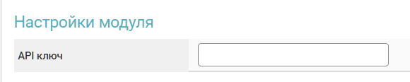

# Luckypay


If you need to update the module on the server, please refer to the [instructions](https://premium.gitbook.io/main/en/en/basic-settings/faq/updating-script-files-on-the-server/how-to-update-files-on-the-server#merchant-and-auto-payout-modules).


## Settings in Your Personal Account

Register for the [Luckypay](https://luckypay.io/) service. Log into your personal account, go to the "**Terminals**" section, select an existing terminal or create a new one, and copy the API key provided in its settings.

<figure><figcaption></figcaption></figure>

## Merchant Account Settings


To discuss terms and setup, please contact a [service representative](https://t.me/luckypay_accounting).

**Disclaimer**: When connecting your website to any service, please assess the potential risks of collaboration on your own.


Log into your merchant account and make sure to enter the URL from the merchant module settings (Callback URL) in the "**Order Status**" field in the "**Terminals**" section.

<figure><figcaption></figcaption></figure>

<figure><figcaption></figcaption></figure>

## Module Settings

In the admin panel, create a new merchant in the "**Merchants**" -> "**Add Merchant**" section.

Select Luckypay from the dropdown menu in the "**Module**" field, enter a name for the module, and click "**Save**."

<figure><figcaption></figcaption></figure>

Fill in the required authorization fields.

<figure><figcaption></figcaption></figure>

**API Key** — the key you previously copied from your Luckypay personal account.

## Special Fields

<figure><figcaption></figcaption></figure> <figure><figcaption></figcaption></figure>

**Payment Method** — select the appropriate method for receiving funds from the customer (the options in your settings may differ from those mentioned above).

## Continuing the Setup

Next, configure the merchant by following the [general setup instructions](https://premium.gitbook.io/main/en/en/basic-settings/merchants-and-auto-payments/merchants/general-merchant-settings).
