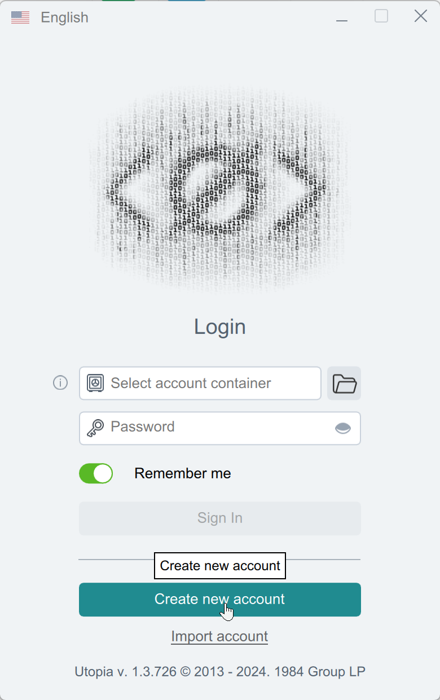
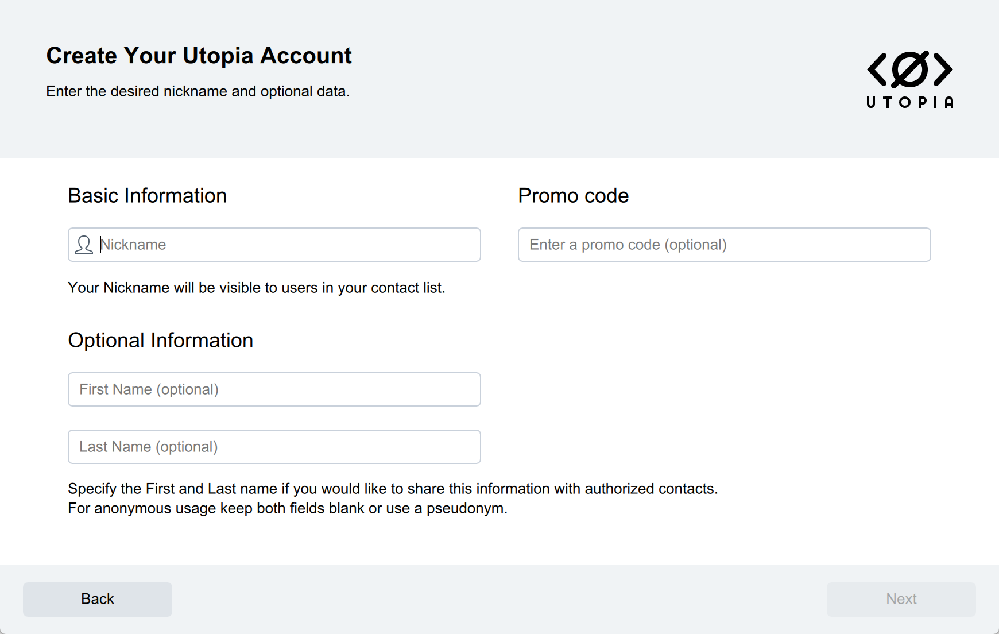
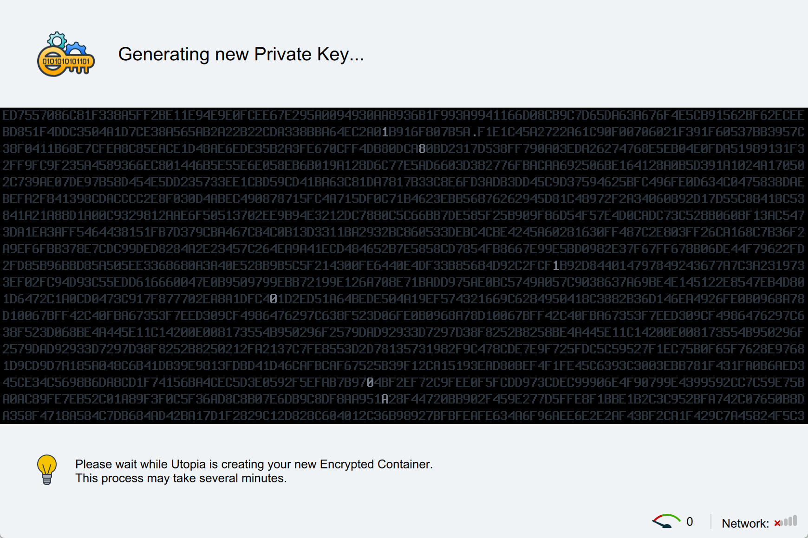
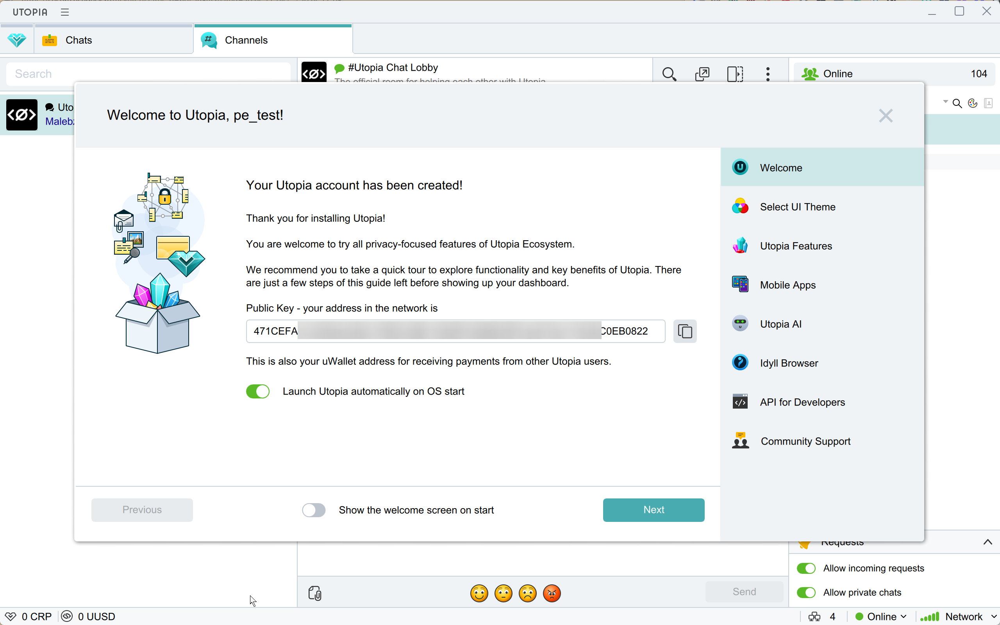

# Utopia


If you need to update a module on the server, please refer to the [instructions](https://premium.gitbook.io/main/en/en/basic-settings/faq/updating-script-files-on-the-server/how-to-update-files-on-the-server#merchant-and-auto-payout-modules).


## Merchant-Side Settings


For initial setup of the service on your server, you can get assistance from the merchant's technical support:

* Utopia Messenger: UNKNOWN1\
  _eng.png>)
* Telegram: [@utp1984](https://t.me/utp1984)
* Email: [1984@u.is](mailto:1984@u.is)


Download the [Utopia application](https://u.is/en/download.html) for your operating system and install it. Go through the registration process and create a new wallet.

<figure><figcaption>
Creating an Account
</figcaption></figure>

<figure><figcaption>
Fill in the required fields
</figcaption></figure>

<figure><figcaption>
Specify the path to the folder where the private key will be stored and create a password for your wallet
</figcaption></figure>

<figure><figcaption>
Generating the Private Key
</figcaption></figure>

<figure><figcaption>
The public key is your wallet address
</figcaption></figure>

<figure><figcaption>
Main Page of the Application
</figcaption></figure>

<figure><figcaption>
Available Currencies
</figcaption></figure>

## Module Settings

In the admin panel, create a new merchant in the "**Merchants**" section by selecting "**Add Merchant**."

Choose Utopia from the dropdown menu in the "**Module**" field, enter a name for the module, and click "**Save**."

<figure><figcaption></figcaption></figure>

Fill in the required authorization fields.

<figure><figcaption></figcaption></figure>

**Domain** — URL for connection (IP address of your server + port assigned to the application during initial setup)

**Token** — public key (your wallet address obtained during registration with the service)


To ensure proper processing of the details, the currency code in "Give" must be selected as USD, UUSD, or CRP (Crypton token).

_eng.png>)


## Utopia Voucher Module

To accept Utopia vouchers as payment, set up a separate module.

### Module Settings

In the admin panel, create a new merchant in the "**Merchants**" section by selecting "**Add Merchant**."

Choose Utopia Voucher from the dropdown menu in the "**Module**" field, enter a name for the module, and click "**Save**."

<figure><figcaption></figcaption></figure>

Fill in the required authorization fields.

<figure><figcaption></figcaption></figure>

**Domain** — URL for connection (IP address of your server + port assigned to the application during initial setup)

**Token** — public key (your wallet address obtained during registration with the service)


To properly accept vouchers, the currency code in "**Give**" must be set to UUSD (US Dollar) or CRP (native Utopia token).

In the exchange form, there is no need to add a field for "**From Account**" for the currency "**Give**" — in the created request, the client will see a button labeled "**Proceed to Payment**." When clicked, this will open a page with a field for entering the voucher code. After entering the correct code, the client will be redirected back to the request page.


## Continuing the Setup

Next, proceed with the merchant setup by following the [general setup instructions](https://premium.gitbook.io/main/en/en/basic-settings/merchants-and-auto-payments/merchants/general-merchant-settings).