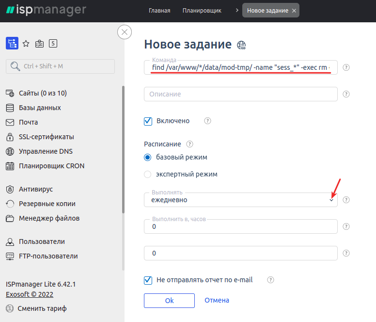

# Diagnosing and Resolving Script Errors

## General Recommendations

To optimize server and database performance, it’s important to consider several key factors that can impact query processing speed and overall site efficiency. Here are some steps you can take:

### **1. Increase Server Capacity:**

- **Upgrade RAM:** Increasing the server’s RAM can help process data faster.
- **Add More CPU Cores:** Additional CPU cores can speed up computations and database operations.

### **2. Check Server Settings:**

- **Eliminate Unnecessary Tasks:** Ensure there are no redundant tasks or processes running on the server that could slow it down.
- **Optimize Configuration:** Review server and database settings to ensure they are optimized for efficient operation.

### **3. Monitor Performance:**

- **Use Monitoring Tools:** Utilize specialized tools to monitor system performance, identify bottlenecks, and detect issues.

### **4. Experiment with Configuration:**

- **Test Resource Adjustments:** Experiment with increasing resources (e.g., memory, CPU cores) and evaluate their impact on performance.

### **5. Backup Data:**

- **Create Regular Backups:** Regularly backing up data ensures information security and protects against data loss.

Implementing these steps can help optimize server and database performance, improve system efficiency, and reduce query processing times. If needed, consult experienced system administrators for more precise configuration.

---

## Common Issues and Solutions

Below are some potential errors that may occur when working with scripts, along with methods to resolve them.

---

### **Infinite Redirect/Error in Redirect**

If you encounter an infinite redirect loop, adjust the server control panel settings (e.g., ISP Manager or similar). Enable the option "**Redirect HTTP requests to HTTPS**" (example for ISP Manager).

.png)

---

### **Slow or Failed Request Creation**

If requests take too long to create or fail altogether:

1. Disable the SMTP server in the "**Messages -> Email Templates**" section if you are using outgoing mail. Then, check the request creation speed.
2. If the request creation speed improves, switch to one of the [recommended SMTP servers](https://premium.gitbook.io/main/osnovnye-nastroiki/uvedomleniya-administratoram-i-polzovatelyam/uvedomleniya-po-e-mail#nastroika-smtp).

.png)

---

### **Currency Selection Table Freezes**

To resolve freezing issues when selecting currencies:

1. Go to the Cloudflare dashboard.
2. Under "**Caching**" -> "**Configuration**," set the caching option to "**No query string**."

.png)

---

### **Malformed Exported XML File**

If the exported XML file fails validation, it’s often due to empty lines at the beginning of one or more script files.

1. Locate the root folder of your site (e.g., `var/www/www-root/data/www/domain_name`) and navigate to it:
   ```
   cd var/www/www-root/data/www/domain_name
   ```
2. Use the following command to find files with empty first lines:
   ```
   find . -name "*.php" -type f -exec sh -c 'if [ "$(head -n 1 "$1" | tr -d "\n")" = "" ]; then echo "$1: empty first line"; fi' _ {} \;
   ```
3. Open the identified files and remove the empty lines.

Additionally, ensure the first line of the XML file includes encoding and version information (prolog). If missing, re-upload the [script files](https://premiumexchanger.com/uscripts/) to update them.

.png)

---

### **Unstable HTTPS Site Performance**

1. Verify the domain is correctly specified as **https://your_domain** in the "**Settings**" -> "**General**" section of the admin panel.
2. Check the database (`xxxx_options` table) to ensure the domain is also listed as **https://your_domain**.
3. If using Cloudflare, set the encryption type to **Flexible** under "**SSL/TLS**" -> "**Overview**."
4. If using a self-signed certificate, select "**Full (Encrypts end-to-end, using a self-signed certificate on the server)**."
5. Disable the permanent redirect to HTTPS in the site settings within ISP Manager.

.png)

---

### **Theme Activation Error**

If activating a theme results in an error like `Unclosed '{' on line ...`:

1. Enable the `short_open_tag` option in the PHP configuration file (`php.ini`).
2. Access ISP Manager as **root**, navigate to PHP settings, or manually edit the `php.ini` file.
3. Search for `short` and enable the displayed option.

.png)

---

### **Site Inaccessible on Certain Devices/Providers**

If the site doesn’t load on some devices or networks:

1. Disable proxying in the Cloudflare dashboard:
   - Go to "**DNS**" -> "**Records**."
   - Edit the A-record and disable proxying in the "**Proxy status**" column.
2. **Note:** Disabling proxying exposes your server’s real IP address and removes DDoS protection. Only disable proxying as a last resort.

.png)

---

### **Site Inaccessible in Russia (Disabling ECH)**

Roskomnadzor has started blocking Cloudflare due to its use of encrypted SNI headers (Server Name Indication). This technology prevents identifying the site being accessed via HTTPS, leading to blocks.

To disable Encrypted Client Hello (ECH) for your domain on Cloudflare:

1. Check if ECH is enabled:
   - Replace **example.com** with your domain in the following link:
     ```
     https://dns.google.com/query?name=example.com&type=HTTPS
     ```
   - If the response includes the parameter **`ech=`**, ECH is enabled.
2. Follow Cloudflare’s instructions to disable ECH.

**Note:** Disabling ECH does not guarantee site accessibility but often resolves the issue.

.png)

---

### **For Free Cloudflare Plans**

If you are on a free Cloudflare plan, additional steps may be required to resolve the issue.

Here’s the translation of the provided text into natural, fluent English:

---

### **Disabling ECH on the Free Plan is only available via the service API.**

You will need the following:

- **Email** — the email address associated with your Cloudflare account.
- **Global API Key** — a key used to authenticate your API requests.
- **Zone ID** — the unique identifier for your zone (domain) in Cloudflare.

#### Step 1: **Global API Key**
Go to the Cloudflare dashboard via the following link and copy your Global API Key: [https://dash.cloudflare.com/profile/api-tokens](https://dash.cloudflare.com/profile/api-tokens)

.png>)

.png>)

#### Step 2: **Zone ID**
Navigate to the management page for your domain in Cloudflare and scroll down. Locate the **Zone ID** field and copy it.

.png>)

---

### **Disabling ECH via curl (Option 1):**

Now that you have your Global API Key and Zone ID, you can disable ECH using `curl`.

#### Install curl

Curl is a tool for sending HTTP requests, which you’ll need to interact with the Cloudflare API.

1. **On Windows:**
   - Download and install curl from the [official website](https://curl.se/).
   - For **CMD**:
     1. Press `Win + R`.
     2. Type `cmd` and press Enter.
     3. Check the version by running the following command:
        ```bash
        curl --version
        ```
   - For **PowerShell**:
     1. Press `Win + R`.
     2. Type `cmd` and press Enter.
     3. Check the version by running the following command:
        ```bash
        curl.exe --version
        ```

2. **On Linux/MacOS:**
   - Curl is usually pre-installed. Verify by running:
     ```bash
     curl --version
     ```

---

Now that you have your Zone ID and API Key, execute the following command:

- Replace `{ZONE_ID}` with your Zone ID from the Cloudflare dashboard.
- Replace `{ACCOUNT_EMAIL}` with your Cloudflare account email.
- Replace `{GLOBAL_API_KEY}` with your Global API Key.

**For Windows CMD:**
```bash
curl -X PATCH "https://api.cloudflare.com/client/v4/zones/{ZONE_ID}/settings/ech" ^
     -H "X-Auth-Email: {ACCOUNT_EMAIL}" ^
     -H "X-Auth-Key: {GLOBAL_API_KEY}" ^
     -H "Content-Type: application/json" ^
     --data "{\"id\":\"ech\",\"value\":\"off\"}"
```

**For Windows PowerShell:**
```bash
curl -Method PATCH "https://api.cloudflare.com/client/v4/zones/{ZONE_ID}/settings/ech" `
    -Headers @{
        "X-Auth-Email" = "{ACCOUNT_EMAIL}";
        "X-Auth-Key" = "{GLOBAL_API_KEY}";
        "Content-Type" = "application/json"
    } `
    -Body '{"id":"ech","value":"off"}'
```

**For Linux:**
```bash
curl -X PATCH "https://api.cloudflare.com/client/v4/zones/{ZONE_ID}/settings/ech" \
     -H "X-Auth-Email: {ACCOUNT_EMAIL}" \
     -H "X-Auth-Key: {GLOBAL_API_KEY}" \
     -H "Content-Type: application/json" \
     --data '{"id":"ech","value":"off"}'
```

If the request is successful, Cloudflare will return a response confirming that ECH has been disabled:
```bash
{"result":{"id":"ech","value":"off","modified_on":null,"editable":true},"success":true,"errors":[],"messages":[]}
```

---

### **Disabling ECH via Postman (Option 2):**

You can also perform this action using Postman. Postman is a tool for testing APIs that allows you to send requests to a server, receive responses, and analyze them. It supports HTTPS and enables you to create requests with headers, parameters, and body content.

To disable ECH in Postman, create a new request and select the PATCH method. Replace `zone_id` in the URL with your Zone ID:
```
https://api.cloudflare.com/client/v4/zones/zone_id/settings/ech
```

In the `Headers` tab, add the following keys:
- `X-Auth-Email` — your Cloudflare account email.
- `X-Auth-Key` — your Global API Key.
- `Content-Type` — set the value to `application/json`.

.png>)

In the **Body** tab, select **raw** and enter the following JSON:
```json
{"id": "ech", "value": "off"}
```

Then click the `Send` button.

.png>)

---

### **If You Have a Paid Cloudflare Plan:**

1. Log in to your Cloudflare account.
2. Select your site.
3. Go to the **SSL/TLS** section.
4. Open the **Edge Certificates** tab.
5. Locate the **Encrypted Client Hello (ECH)** option.
6. Simply toggle it to the **Off** position.

.png>)

---

<details>
<summary>Image Captcha Not Displaying on Website Pages</summary>

Set write permissions (e.g., 777) for the folder `/wp-content/pn_uploads/captcha/` or `/wp-content/uploads/captcha/`.


If you’re unsure how to do this, contact your hosting provider’s support team for assistance.

</details>

---

The rest of the document contains troubleshooting steps for various issues, such as missing images, email delivery problems, QR code generation, and more. Let me know if you’d like me to translate those sections as well!

Here’s the translated text in natural English:

---

<details>
<summary>Error: "<strong>No columns in the database table {table name}</strong>"</summary>

Reactivate the main plugin (Premium Exchanger) in the "**Plugins**" section.

.png>).png>)

Then, disable the update mode in the "**Exchanger Settings**" → "**General Settings**" section.

.png>)

After this, the missing columns will be created in the table.

</details>

---

<details>
<summary>Site access unavailable</summary>

.png>)

You need to locate the XXXX\_options table in your database using PhpMyAdmin or Adminer and check the **home** and **siteurl** fields (they should contain your current domain).  
<mark style="color:blue;">PhpMyAdmin can be installed in ISP Manager via the "Settings — Software Configuration" section. Check the box for "MySQL Administration Web Interface" and click "Install" above the table.</mark>

</details>

---

<details>
<summary>Clearing merchant logs and enabling auto-cleanup</summary>

Over time, the "Merchant Logs" and "Auto-Payout Logs" modules can accumulate a large number of logs, which may quickly fill up the database and cause errors on the site if log auto-cleanup is not enabled.

<mark style="color:red;">We recommend enabling logging only during the setup of merchant modules. Once the system is stable for receiving payments and auto-payouts, logging can be disabled.</mark>

You can configure automatic log cleanup in the "Settings - Logging Settings" section:  
.png>)

In the "**Settings**" → "**Cron**" section, copy the cron job link and create a cron job on your server following [this guide](https://premium.gitbook.io/rukovodstvo-polzovatelya/osnovnye-nastroiki/faq/kak-sozdat-zadanie-cron-na-servere) (set the execution time to once every 24 hours or less frequently).

.png>).png>)  

If logs are not cleared via the "Delete Logs" button in the corresponding section, you will need to clear them directly from the database.  
.png>)

Access the database via PhpMyAdmin[^1]/Adminer and open the [`xxxx_merch_logs`](#user-content-fn-2)[^2] table (make sure to back up your database before clearing the table).

Go to the database web interface.  


_If the web interface is unavailable_ — _enable access to it by following these steps:_

_To determine which firewall is installed on the server, log in as the <mark style="color:red;">root user</mark> in the ISPmanager panel, open the Shell console, and run the command **`ufw status numbered`**._ If rules are displayed, disable them using the command **`ufw disable`**. After working with the database, **re-enable the rules** using the command **`ufw enable`**.

_If the command **`Command 'ufw' not found`** is displayed, the rules are configured in **iptables**._ To disable the rules there, run the command **`iptables -P INPUT ACCEPT && iptables -P FORWARD ACCEPT`**, and after working with the database, restart the server — the rules will be re-enabled automatically.

Locate the `xxxx_merch_logs` table (where xxxx is your table prefix).

.png>)

Go to the "Operations" tab.

.png>)

Clear the table by clicking "TRUNCATE."

.png>)

Confirm the data deletion.

.png>)

Repeat these steps for the [`xxxx_ap_logs`](#user-content-fn-3)[^3] table.

</details>

---

<details>
<summary>Error 404 when navigating to exchange direction page</summary>

Most likely, the "**Hyphen in Exchange Direction**" module is enabled in the "**Modules**" section, but the settings have not been saved to apply the changes. You can either disable it or leave it enabled (your choice).

.png>)

Go to the "**Settings → Permalinks**" section and click the "**Save Changes**" button without making any changes on the page.

.png>)

After this, check the display of exchange directions. If the changes are not immediately visible, [clear the cache in Cloudflare](https://premium.gitbook.io/main/osnovnye-nastroiki/faq/kak-sbrosit-kesh-v-cloudflare) (if you are using it).

</details>

---

<details>
<summary>Error 525 "SSL handshake failed" when accessing the site</summary>

The "SSL handshake failed" error indicates an issue establishing a secure connection between the client (usually a browser) and the server.

In your Cloudflare account settings, go to the "SSL/TLS" section and set the "Your SSL/TLS encryption mode" to "Flexible."


</details>

---

<details>
<summary>Admin panel errors after script update</summary>

Check the contents of the `userdata.php` file by following [this guide](https://premium.gitbook.io/rukovodstvo-polzovatelya/pered-nachalom-raboty/instrukciya-po-obnovleniyu#ustranenie-nepoladok-posle-obnovleniya).

</details>

---

<details>
<summary>Error in <code>script.js</code> file</summary>

If you encounter this error, disable `js` file caching in the site settings in ISP Manager.

.png>)

In the "File Extensions for Caching" list, <mark style="color:red;">**there should not be**</mark> the `js` format (if it is present, remove it and save the settings).

.png>)

</details>

---

<details>
<summary>Checking the size of database tables</summary>

If the site or admin panel starts to slow down, the issue may be caused by the growth of certain database tables (most often log tables).

To view the largest tables for subsequent cleanup, follow these steps:

In ISP Manager, go to the "**Databases**" section, select your database (copy the database name to a text file), and go to the "**Users**" section:


On the page, select the database owner and click "**Edit**."

.png>)

Click the eye icon to view the user password. Save the username and password in a text file.

.png>)

Go to the "**Shell Client**" section and enter the command `mysql -u`` `**`username`**` ``-p`, replacing **username** with the database username from the previous step. Execute the command, then enter the user password (characters will not be displayed as you type) and press Enter. Upon successful login, you will see the message "**Welcome to the MySQL monitor.**"

.png>)

Next, enter the command `SELECT table_name AS "Table", round(((data_length + index_length) / 1024 / 1024), 2) "Size in MB" FROM information_schema.TABLES WHERE table_schema = "`**`database_name`**`" ORDER BY (data_length + index_length) DESC;`, replacing **`database_name`** with your database name. Press Enter.

After completing these steps, a list of all tables sorted by size (largest tables at the top) will be displayed.

</details>

---

<details>
<summary>Redirecting to a subdomain when the main domain is blocked</summary>

First, add the subdomain to your license in the [user account](https://premiumexchanger.com/ulicense/). Then, add the following block of code to the nginx configuration file (replace 123.ru and test.123.ru with your domain and subdomain):

```nginx
server {
  server_name 123.ru;
  
  listen 80;
  
  location / {
    if ($argument_uri) {
      return 301 https://test.123.ru$request_uri;
    }
    
    ## remaining config here
  }
}
```

Here’s how it works: when a user accesses the site, the specified condition is checked. If the condition is met, a 301 redirect is performed, passing all request parameters (including affiliate link "tails").

The above example is for nginx; this configuration will not work in Apache.

</details>

---

<details>
<summary>System error (code: anticsfr)</summary>

.png>).png>)


As a quick temporary solution, simply refresh the page in your browser.

This error indicates an issue with session recording on the server or a change in the user's IP address. It’s likely that the session storage configuration is incorrect.

If sessions are being reset, you’ll need to adjust your PHP settings.  
.png>)

To resolve the issue, configure the session settings as shown in the screenshot below.

.png>)

**`session.gc_probability`** and **`session.gc_divisor`**: These two parameters together determine the probability of triggering the garbage collection process on each request. The probability is calculated as **`gc_probability/gc_divisor`**. For example, if **`gc_probability`** is 1 and **`gc_divisor`** is 1000, garbage collection will be triggered on approximately 0.1% of requests.

**`session.gc_maxlifetime`**: This parameter defines the maximum session lifetime in seconds. If a session exceeds this time, it will be considered "garbage" and removed during the next garbage collection process.

<mark style="color:red;">**After changing the PHP configuration, you must restart the web server for the changes to take effect.**</mark>

To automate session cleanup, you can add two CRON jobs to run once a day:  



```
find /var/www/*/data/mod-tmp/ -name "sess_*" -exec rm {} \;
```



```
find /var/www/*/data/bin-tmp/ -name "sess_*" -exec rm {} \;
```


</details>

--- 

Let me know if you need further refinements!

### Script Control Panel or Website Freezing/Errors When Creating Requests

If the script's control panel or website is freezing, lagging, or displaying errors during request creation, follow these steps to troubleshoot and resolve the issue:

---

## **Session Deletion**

To clear old sessions, execute the following commands via SSH:

1. Navigate to the appropriate directory:
   ```bash
   cd /var/www/<your_website_user>/data
   ```

2. Run the command to delete sessions older than 2 days:
   ```bash
   find mod-tmp -name "sess_*" -mtime +2 -type f -print0 | xargs -0rn 20 rm -f
   ```

This will remove all session files older than 2 days.

Additionally, you can check disk usage by opening another SSH session and running:
```bash
df -i
```

This command will display the disk's inode usage (the number of files). Depending on your server's configuration, clearing sessions may take anywhere from 10 minutes to 5 hours.

---

## **Server Configuration Settings**

Check the [**Settings** -> **Cron**](https://premium.gitbook.io/main/osnovnye-nastroiki/nastroiki/obshie-nastroiki#cron) section to ensure the settings match the provided instructions. If you’ve modified these settings previously, revert them to their original state.

---

## **PHP Configuration**

1. Log in to the ISP Manager control panel as the **root user** and verify the PHP version used by your website.

   .png)

2. Open the settings for the required PHP version.

   .png)

3. Ensure the following parameters are set as shown in the screenshot. If they differ, update them accordingly.

   .png)

4. To fully clear temporary files, run:
   ```bash
   find mod-tmp -name "sess_*" -type f -print0 | xargs -0rn 20 rm -f
   ```

After completing these steps, temporary files will be removed, and PHP will handle automatic file cleanup.

---

## **Increasing Memory Limit**

If the script processes large amounts of data, it may require more memory than currently allocated. To increase the memory limit:

1. Open the `wp-config.php` file for your domain and add the following lines after:
   ```php
   define('WP_DEBUG', false);
   ```
   ```php
   define('WP_MEMORY_LIMIT', '512M');
   define('WP_MAX_MEMORY_LIMIT', '1024M');
   ```

2. Update your server configuration to set:
   ```bash
   MEMORY_LIMIT = 512M
   ```

   .png)

---

## **Switching the Geo IP Service**

To improve IP-based country detection:

1. Go to the **GEO IP** -> **IP Detection Settings** section.
2. Change the source to **sypexgeo.net**.
3. Set the timeout to 7 seconds and save the changes.

   .png)

---

## **Admin Panel and Server Actions**

1. Disable all modules in the **Modules** section (make note of their current state beforehand). Check if the website runs faster.
2. If performance improves, re-enable the modules gradually (3-5 at a time) and identify which module causes the slowdown.
3. If the module `\wp-content\plugins\premiumbox\moduls\courselogs` exists, consider removing it, as it may heavily impact system performance.

If none of the above steps resolve the issue, contact your hosting provider's technical support team. Request a server load analysis and diagnostic report.

---

## **Increasing Maximum File Upload Size**

To allow users to upload larger files (e.g., for account or identity verification):

1. By default, the upload limit is 2 MB. To increase it:
   - If using ISP Manager, log in as the root user and navigate to **PHP Settings**.
   - Select the PHP version used by your website and adjust the **Max File Size** option.

     .png)

2. Alternatively, edit the `php.ini` file directly and update the following directives:
   ```ini
   upload_max_filesize = 128M
   post_max_size = 128M
   memory_limit = 256M
   max_execution_time = 300
   max_input_time = 300
   ```

   - `upload_max_filesize`: Set to a value larger than your backup file size.
   - `post_max_size`: Set to a value larger than your backup file size.
   - `memory_limit`: Ensure it exceeds your backup file size.
   - `max_execution_time`: Set to `0` for unlimited execution time.

3. Restart the server after making these changes.

If you encounter errors after increasing the file size limit, refer to the [official PHP documentation](https://www.php.net/manual/en/features.file-upload.common-pitfalls.php) for troubleshooting.

---

## **Setting the "Under Review" Status**

1. In the settings for all merchant modules, locate the **Request Status Handling** section. Select **Under Review** for all options and save the changes.

   

2. In the settings for all auto-payout modules, disable payouts for requests with the **Under Review** status by selecting **No** for the relevant option.

   

---

## **DNS Records for Email Configuration**

If you need to troubleshoot email-related issues, refer to this [DNS configuration cheat sheet](https://www.netmeister.org/blog/email-dns-records.html) for SPF, DKIM, DMARC, and other email verification records.

---

### **Additional Resources**

- **QR Generator Module**: [Download here](../../.gitbook/assets/qr_adress.zip)
- **class-form.php for Script Versions**:
  - Version 2.6: [Download here](../../.gitbook/assets/class-form.php)
  - Version 2.5: [Download here](../../.gitbook/assets/class-form%20(1).php)

[^1]: phpMyAdmin in ISP Manager can be installed via **Settings -> Software Configuration**. Check the "Web Interface for MySQL Administration" option and click **Install**.

[^2]: Merchant logs.

[^3]: Auto-payout logs.