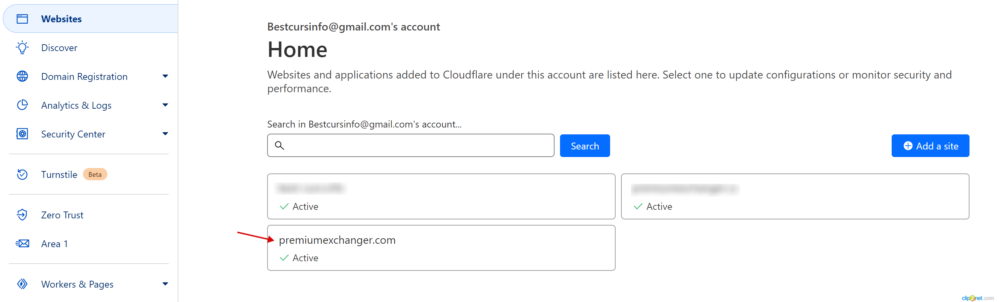
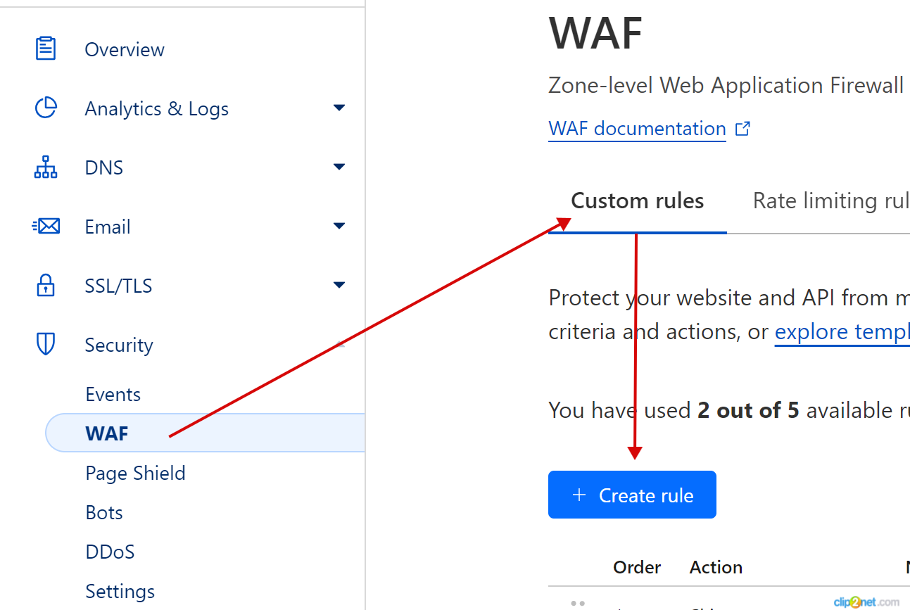
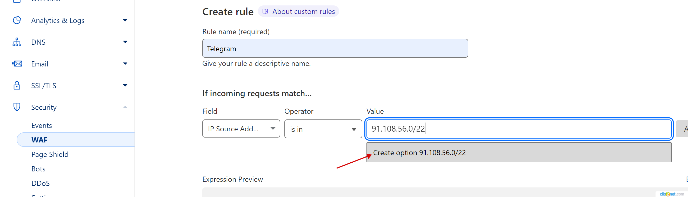
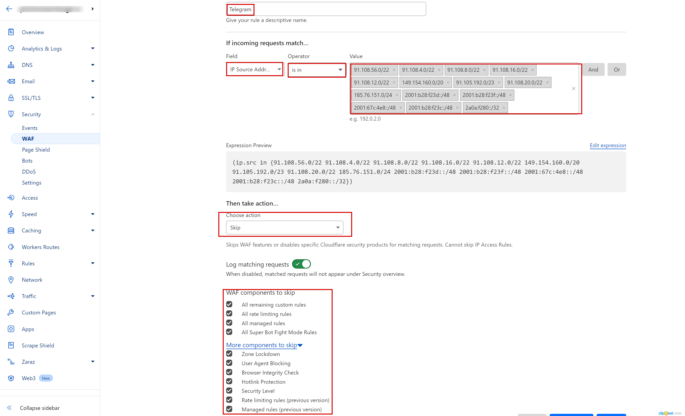

# Добавление IP-адресов в Whitelist в Cloudflare

1. Зайдите в личный кабинет [Cloudflare](https://dash.cloudflare.com/).
2. В разделе "**Websites**" кликните по названию домена, для которого хотите создать белый список (whitelist) IP-адресов.

<figure><figcaption></figcaption></figure>

3. Перейдите в раздел **Security -> WAF ->** вкладка **"Custom rules" ->** кнопка **"Create rule"**

<figure><figcaption></figcaption></figure>

4. Чтобы разрешить IP-адресу или диапазону IP-адресов доступ к вашему сайту без каких-либо ограничений со стороны Cloudflare, то **в точности задайте такие же настройки**, как указано на скриншоте ниже:


В поле "**Value**" кликайте именно по строке, которая появляется при вводе значения, чтобы это значение выбралось и применилось!



<figure><figcaption>
Пример добавление в Whitelist пула IP адресов Telegram
</figcaption></figure>

Также можно добавить **ASN (autonomous system number)** внешнего сервиса (в нашем примере это Telegram) вместо диапазона IP-адресов. Для этого нужно найти ASN (их может быть несколько) по IP-адресам (к примеру, 91.108.6.73), принадлежащим сервису, через раздел **Security Center** -> **Investigate.**

<figure><figcaption></figcaption></figure>

**ASN** для Telegra&#x6D;**: 62041, 211157** — их нужно добавить отдельными правилами в разделе **WAF -> Tools -> IP Access Rules:**

<figure><figcaption></figcaption></figure>

Созданные правила будут отображаться в разделе.

<figure><figcaption></figcaption></figure>
