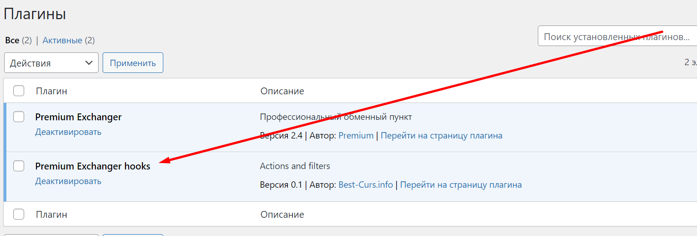

# How to Install an Online Chat?

## **Installation via the Website Control Panel (Jivo.ru only)**

1. Log in to your [Jivo.ru](https://www.jivo.ru/) account and copy the ID (without quotation marks) from the chat installation code.

<figure><figcaption></figcaption></figure>

2. Paste the copied ID into the website control panel under the section "**Settings → General Settings**" in the field labeled "**Jivosite.ru ID**," and save the changes.

<figure><figcaption></figcaption></figure>

## **Installation Using a Hook (Any Online Chat)**

1. Insert the online chat code into the file located at _`/wp-content/plugins/premiumhook/premiumhook.php`_ in place of the following line:

`<!— Put online chat code or another code here / Razmestite kod onlajn chata ili drugoi kod vmesto jetogo teksta !—>`

2. Go to the "**Plugins**" section and activate the plugin called "**Premium Exchanger hooks**."

<figure><figcaption></figcaption></figure>