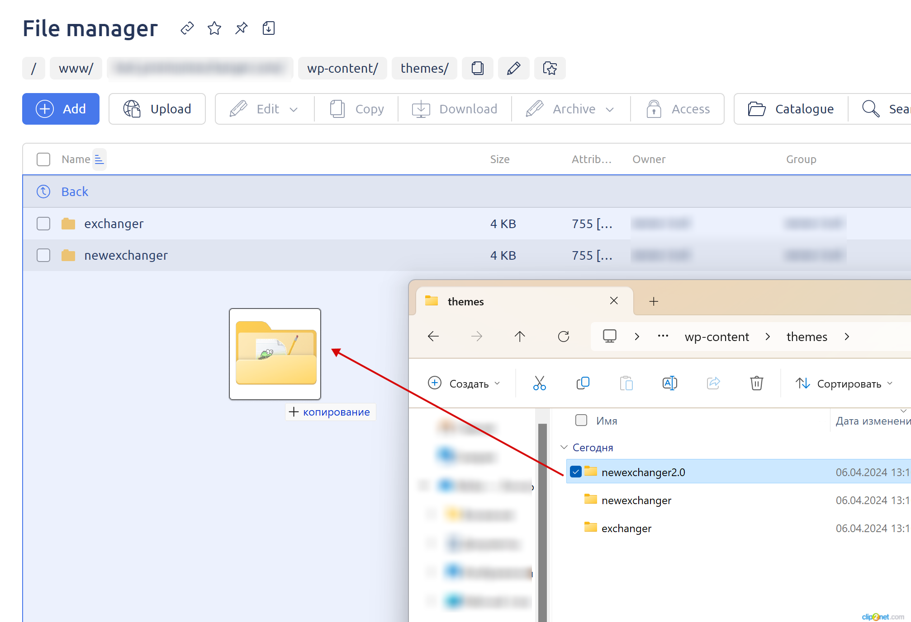
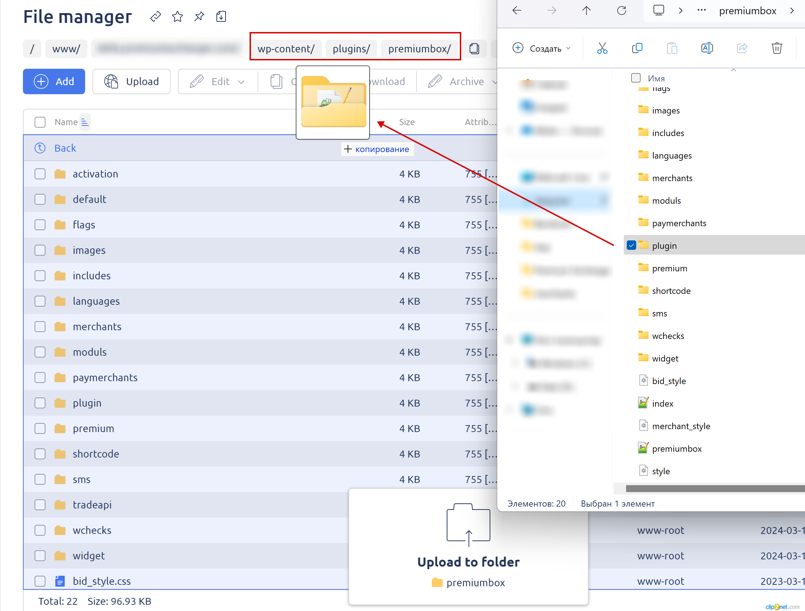

# Как обновить файлы на сервере?

Периодически необходимо заменять файлы модулей на сервере в связи с выходом новой версии модуля, устранением багов в действующем модуле и другими причинами.


Перед любыми манипуляциями с файлами на сервере — рекомендуем делать бэкап корневой папки на компьютер:

\
Все манипуляции с файлами производятся через панель ISP Manager из-под <mark style="color:green;">**пользователя, созданного для сайта**</mark> (**не&#x20;**<mark style="color:red;">**root**</mark>).



Чтобы найти путь, по которому находится корневая папка сайта на сервере — ознакомьтесь с [инструкцией](https://premium.gitbook.io/rukovodstvo-polzovatelya/osnovnye-nastroiki/faq/kak-naiti-kornevuyu-papku-saita-na-servere).



Обратите внимание, что модули несовместимы между версиями скрипта — к примеру, если вы используете версию скрипта 2.7, то и все модули должны иметь версию 2.7.\*.

При установке несовместимого модуля вы получите ошибку (сайт не будет открываться) и вам придется загрузить совместимые модули заново.


## Модули скрипта

1. Скачайте архив скрипта **для обновления** со [страницы **"Ваши скрипты"**](https://premiumexchanger.com/uscripts/) под любую версию PHP и **вашу версию скрипта,** и распакуйте архив на компьютере.

<figure><figcaption></figcaption></figure>

2. **Обязательно** деактивируйте модули, которые вы планируете обновить, в разделе "**Модули**".

<figure><figcaption></figcaption></figure>

3. Перейдите к указанному на скриншоте пути к директории с модулями: `/wp-content/plugins/premiumbox/moduls/`

<figure><figcaption></figcaption></figure>

4. Выберите **один или несколько необходимых модулей** и перетащите их в окно ISP Manager в аналогичную директорию на сервере:

<figure><figcaption></figcaption></figure>

5. Внизу страницы появится окно, в котором будет указана папка назначения (папка "**moduls**")

<figure><figcaption></figcaption></figure>

6. При появлении окна о совпадении файлов — перезапишите файлы (кнопка "**Заменить**").

<figure><figcaption></figcaption></figure>

7. Активируйте обновленные модули в разделе "**Модули**".

После этих действий модули будут обновлены, дополнительные действия не требуются.

## Модули мерчантов и автовыплат


Убедитесь, что вы скачиваете модуль именно под ту версию скрипта, которая установлена на вашем сервере. Версия скрипта отображается, к примеру, на странице "**Заявки**".

.png>)




В личном кабинете в разделе **"**[**Ваши скрипты**](https://premiumexchanger.com/uscripts/)**"** в блоке "**Дополнительные модули**" скачайте мерчант для требуемой платежной системы.

<figure><figcaption></figcaption></figure>

Содержимое архива с модулем загрузите на сервер в директорию `/wp-content/plugins/premiumbox/merchants` (приём средств) или  `/wp-content/plugins/premiumbox/paymerchants` (автовыплата) и разархивируйте файлы (при возникновении окна о совпадении файлов — перезапишите файлы).



Скачайте дистрибутив с обновленным модулем (подходит любой архив под **вашу версию скрипта**) в личном кабинете в разделе ["**Ваши скрипты**"](https://premiumexchanger.com/uscripts/)

<figure><figcaption></figcaption></figure>

Разархивируйте скачанный архив на компьютере и по указанному пути найдите папку с необходимым модулем мерчанта:

<figure><figcaption></figcaption></figure>

&#x20;или автовыплаты:

<figure><figcaption></figcaption></figure>

Содержимое архива с модулем загрузите на сервер в директорию `/wp-content/plugins/premiumbox/merchants` (приём средств) или `/wp-content/plugins/premiumbox/paymerchants` (автовыплата) (при появлении окна о совпадении файлов - перезапишите файлы)



## Файлы стандартного дизайна скрипта

1. Скачайте архив скрипта **для обновления** со [страницы **"Ваши скрипты"**](https://premiumexchanger.com/uscripts/) под <mark style="color:red;">**вашу версию скрипта**</mark> (любая версия PHP) и распакуйте архив на компьютере.

<figure><figcaption></figcaption></figure>

2. Перейдите к указанному на скриншоте пути к директории с дизайнами: `/wp-content/themes/`

<figure><figcaption></figcaption></figure>

4. Выберите нужную  папку с дизайном (`newexchanger2.0` — новый стандартный дизайн 2024 года) и перетащите е в окно ISP Manager в аналогичную директорию.

<figure><figcaption></figcaption></figure>

5. При появлении окна о совпадении файлов — перезапишите файлы (кнопка "**Заменить**").

<figure><figcaption></figcaption></figure>

7. Активируйте загруженный дизайн в панели управления сайтом в разделе "**Внешний вид -> Темы**"

<figure><figcaption></figcaption></figure>

8. Могут потребоваться дополнительные настройки внешнего вида в его настройках, если вы активируете новый дизайн на сайте. Основные настройки дизайна находятся подразделах в раздела "**Внешний вид**".

## Файлы скрипта

1. Скачайте архив скрипта **для обновления** со [страницы **"Ваши скрипты"**](https://premiumexchanger.com/uscripts/) под <mark style="color:red;">**вашу версию скрипта**</mark> (любая версия PHP) и распакуйте архив на компьютере.

<figure><figcaption></figcaption></figure>

2. Перейдите к указанному на скриншоте пути к директории с модулями: `/wp-content/plugins/premiumbox/`

<figure><figcaption></figcaption></figure>

3. Выберите **одну или несколько необходимых директорий** и перетащите их в окно ISP Manager в аналогичную директорию:

<figure><figcaption></figcaption></figure>

4. При появлении окна о совпадении файлов — перезапишите файлы (кнопка "**Заменить**").

<figure><figcaption></figcaption></figure>
