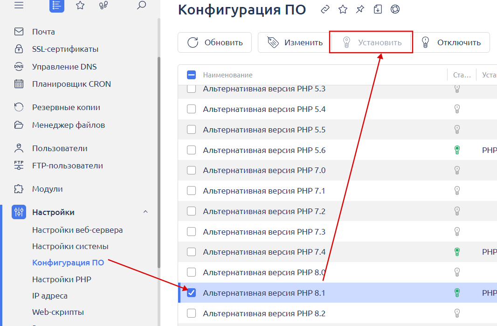
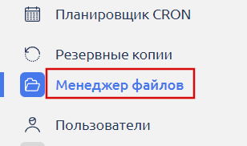
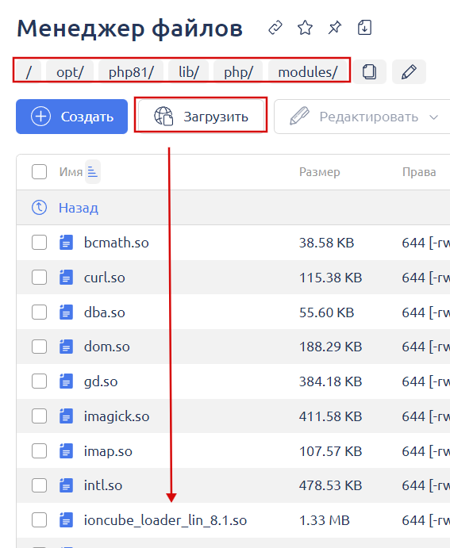
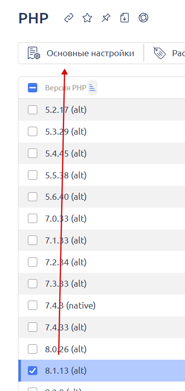
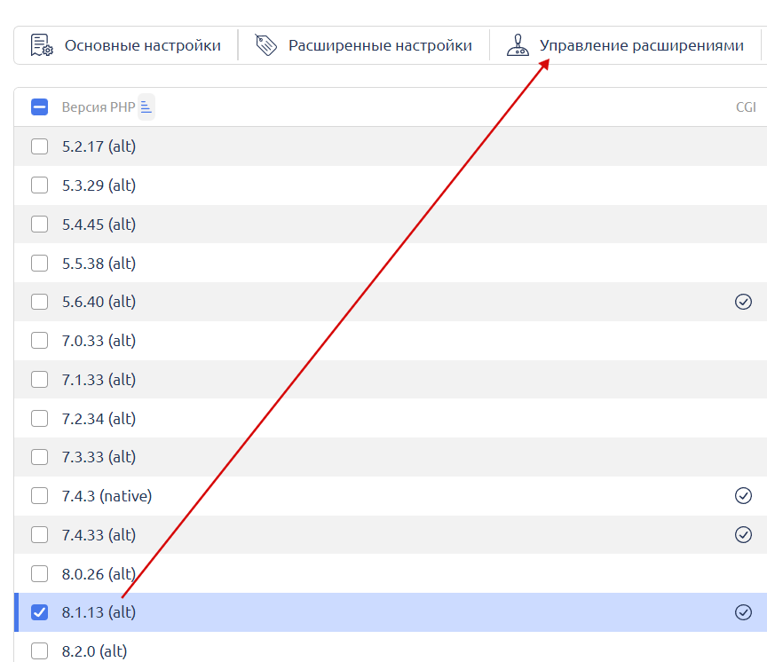
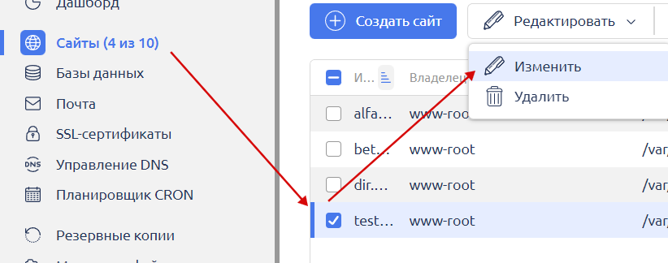

# Как обновить ionCube Loader

1. Установите PHP 8.1 на сервер в панели управления ISP Manager под **root-пользователем** в разделе "**Настройки" -> "Конфигурация ПО"**.&#x20;

<figure><figcaption></figcaption></figure>

2. Скачайте на ПК актуальную версию [Ioncube Loader](https://www.ioncube.com/loaders.php) и распакуйте архив.

<figure><figcaption></figcaption></figure>

2. Под **root-пользователем** зайдите в панель управления ISP Manager в файловый менеджер.

<figure><figcaption></figcaption></figure>

4. Через файловый менеджер зайдите в директорию `/opt/php81/lib/php/modules/` (путь до папки на вашем сервере может отличаться — при отличии от указанного пути уточните верный путь у техподдержки вашего хостинга) и загрузите файл **ioncube\_loader\_lin\_8.1.so** из скачанного архива на сервер с заменой существующего файла.

<figure><figcaption></figcaption></figure>

5. В разделе "**Настройки" -> "Настройки PHP"** перейдите в "**Основные настройки PHP"** для 8.1.

<figure><figcaption></figcaption></figure>

7. Установите настройки как указано на скриншоте ниже и сохраните их.

<figure><figcaption></figcaption></figure>

8. Откройте раздел "**Управление расширениями"** для PHP 8.&#x31;**.**

<figure><figcaption></figcaption></figure>

9. Обязательно выключите и включите повторно модуль Ioncube для корректной активации новой версии.

<figure><figcaption></figcaption></figure>

10. В разделе "**Сайты**" активируйте PHP 8.1 для вашего сайта.

<figure><figcaption></figcaption></figure>

<figure><figcaption></figcaption></figure>
