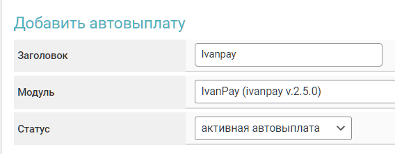
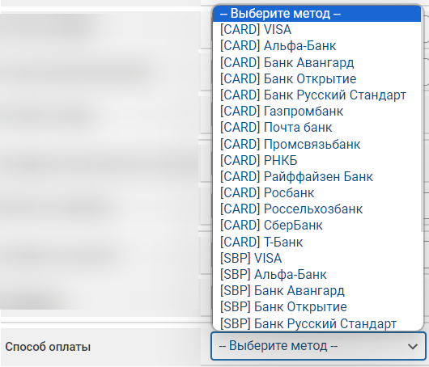
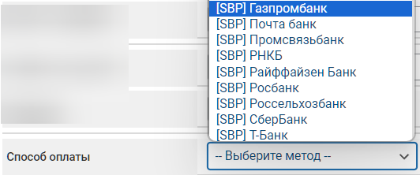

# Ivanpay


<mark style="color:red;">Before setting up auto payouts, be sure to read</mark> [<mark style="color:blue;">the risk warning</mark>](https://premiumexchanger.com/wiki/preduprezhdenie-auto/)<mark style="color:blue;">!</mark>



If you need to update the module on your server, please follow this [instruction](https://premium.gitbook.io/rukovodstvo-polzovatelya/osnovnye-nastroiki/faq/kak-obnovit-faily-na-servere#moduli-avtovyplat).


## Settings in the Merchant’s Personal Account 


To discuss terms and connection details, please contact the [service representative](https://t.me/IvanPay_pro).

**Disclaimer:** When connecting your website to any service, please independently assess the potential risks involved in the partnership.


Register an account on the [IvanPay service](https://ivanpay.com/).

<figure><figcaption></figcaption></figure>

In your merchant personal account, copy the information from the "**Your API Address**" field, as well as the API key provided to you by the service representative.

<figure><figcaption></figcaption></figure>

## Module Settings 

In the admin panel, create a new merchant under "**Auto Payouts**" -> "**Add Auto Payout**."

Select Ivanpay from the dropdown menu in the "**Module**" field, enter a name for the module, and click "**Save**."

<figure><figcaption></figcaption></figure>

Fill in the required authorization fields.

<figure><figcaption></figcaption></figure>

**Domain** — the merchant domain you previously copied from the "**Your API Address**" field in your merchant account.

**API Key** — the API key provided to you by your Ivanpay manager.

## Special Fields

<figure><figcaption></figcaption></figure>

<figure><figcaption></figcaption></figure>

**Payment Method** — select the desired method for making payouts.


Please note a particular feature of the Ivanpay service — **whenever possible**, payouts are made from a bank card of the bank you selected in the module settings. However, if no cards from the selected bank are available, the payout will be made from a card of another bank currently available in the service. The payout method itself does not change and remains the original one — either CARD or SBP.


When using the **\[SBP] SBP** method (without specifying a bank), you need to pass the merchant the name of the bank that the client will select in the exchange form.

To do this, create a new custom field in the "**Currencies**" section → "**Additional currency fields**" and configure it as shown in the screenshot below:

<figure><figcaption></figcaption></figure>

List of banks to include in the "**Options**" field for different language versions:



Альфа-Банк  
СберБанк  
Т-Банк  
РНКБ  
Открытие  
Русский Стандарт  
Авангард  
Райффайзен  
Газпромбанк  
Почта банк  
Россельхозбанк  
РОСБАНК  
Промсвязьбанк  
МТС Банк  
Совкомбанк  
Банк Уралсиб  
ОТП банк  
ВТБ  
Ак Барс Банк  
Ozon Банк  
Банк УБРиР  
Экспобанк  
Банк ЗЕНИТ  
Примсоцбанк  
ЮниКредит Банк  
АО КБ ЮНИСТРИМ  
Яндекс Банк  
Банк Левобережный  



Alfa-Bank  
SberBank  
T-Bank  
RNCB Bank  
Otkritie  
Russian Standard  
Bank Avangard  
Raiffeisenbank  
Gazprombank  
Pochta Bank  
Rosselkhozbank  
ROSBANK  
Promsvyazbank  
MTS Bank  
Sovcombank  
Bank Uralsib  
OTP Bank  
VTB Bank  
Ak Bars Bank  
Ozon Bank  
UBRiR Bank  
Expobank  
Zenit Bank  
Primsotsbank  
UniCredit Bank  
UNISTREAM Commercial Bank  
Yandex Bank  
Levoberezhny Bank  



Next, add the custom field for the currency selected for payout in this exchange direction within the field’s own settings:

<figure><figcaption></figcaption></figure>

Or in the currency settings under the "**Additional fields**" tab:

<figure><figcaption></figcaption></figure>

Save your changes.

After that, the field will appear in the exchange form, and the client will be required to select one of the options when creating a request.

<figure><figcaption></figcaption></figure>

## Continuing the setup

Then proceed with configuring the merchant by following the [general setup instructions](https://premium.gitbook.io/rukovodstvo-polzovatelya/osnovnye-nastroiki/merchanty-i-avtovyplaty/avtovyplaty/obshie-nastroiki-merchantov-avtovyplat).