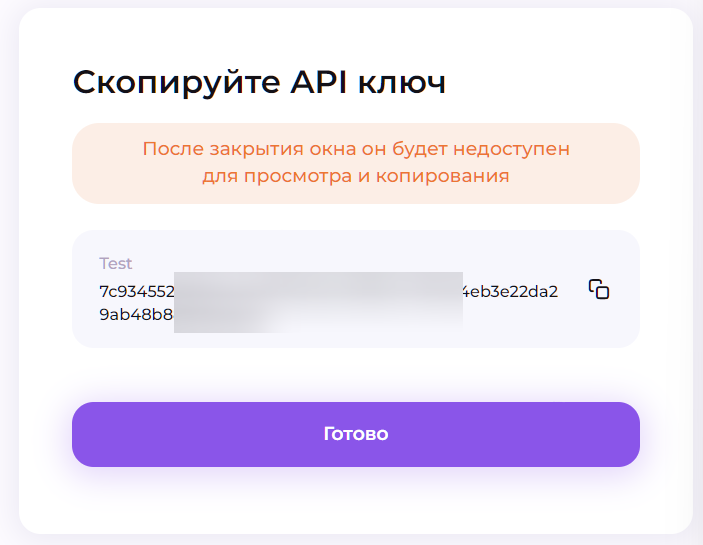
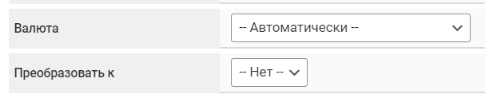

# Alfabit Crypto


If you need to update the module on your server, please follow the [instructions](https://premium.gitbook.io/rukovodstvo-polzovatelya/osnovnye-nastroiki/faq/kak-obnovit-faily-na-servere#moduli-merchantov).



To discuss terms and set up a connection, please contact the [service representative](https://t.me/AlfaBitSupportVIP).

**Disclaimer:** When connecting your website to any service, please independently assess the potential risks involved in the partnership.


## Merchant Account Settings

Register and verify your account on the [Alfabit](https://pay.alfabit.org/) platform. Then go to the "**Merchants**" section and click the "**Create Merchant**" button.

<figure><figcaption></figcaption></figure>

Fill in the required fields and click "**Create Project**."

<figure><figcaption></figcaption></figure> <figure><figcaption></figcaption></figure> <figure><figcaption></figcaption></figure>

Go to the merchant settings, select the "**API Keys**" tab, and click "**Add**."

<figure><figcaption></figcaption></figure>

Fill in the required fields and click "**Save**."

<figure><figcaption></figcaption></figure>


Select one or both options "**Accept Funds / Withdraw Funds**" depending on how you intend to use the merchant account.

Optionally, add your server’s IP address under "**Trusted IPs**" (recommended).


<figure><figcaption></figcaption></figure>

Save the generated key to a text file and click "**Done**."

## Module Settings

In the admin panel, create a new merchant by going to "**Merchants**" -> "**Add Merchant**."

Select Alfabit Crypto from the "**Module**" dropdown menu, enter a name for the module, and click "**Save**."

<figure><figcaption></figcaption></figure>

Fill in the required authorization fields.

<figure src="../../../.gitbook/assets/image (372).png" alt="" width="458"><figcaption></figcaption></figure>

**API Key** — the **public key** generated in your Alfabit personal account.

## Special Fields

<figure><figcaption></figcaption></figure>

**Currency** — select the currency you want to receive funds in, or choose "**Automatic**" (in this case, the wallet address will be requested based on the currency code from the exchange direction where the merchant is connected; the list of methods will only appear after entering a valid API key for module authorization).

<figure><figcaption></figcaption></figure>


Please note the minimum acceptance amounts for the currencies you use (found under "**Merchants**", "**Rates**" tab in the Alfabit personal account) — the amounts in your requests must exceed these minimums; otherwise, the merchant will not process the payment:\
.png>)


**Convert to** — select the currency to which the payment received from the client will be converted (at the merchant’s exchange rate at the time of conversion), or choose "**No**" to disable conversion. The tooltip below the field shows the possible currency pairs for conversion (the list of methods will only appear after entering a valid API key for module authorization).

<figure><figcaption></figcaption></figure>


Please note that requests with an amount equivalent to less than 12 USDT will not be converted (merchant-side restriction) when this option is enabled — funds from such requests will be credited to the account in the original currency.

.png>)


## Continuing the setup

Next, proceed with configuring the merchant by following the [general setup instructions](https://premium.gitbook.io/rukovodstvo-polzovatelya/osnovnye-nastroiki/merchanty-i-avtovyplaty/merchanty/obshie-nastroiki-merchantov).