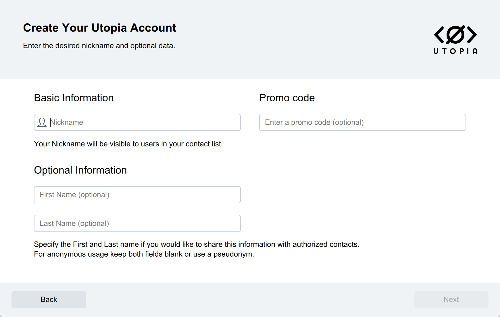
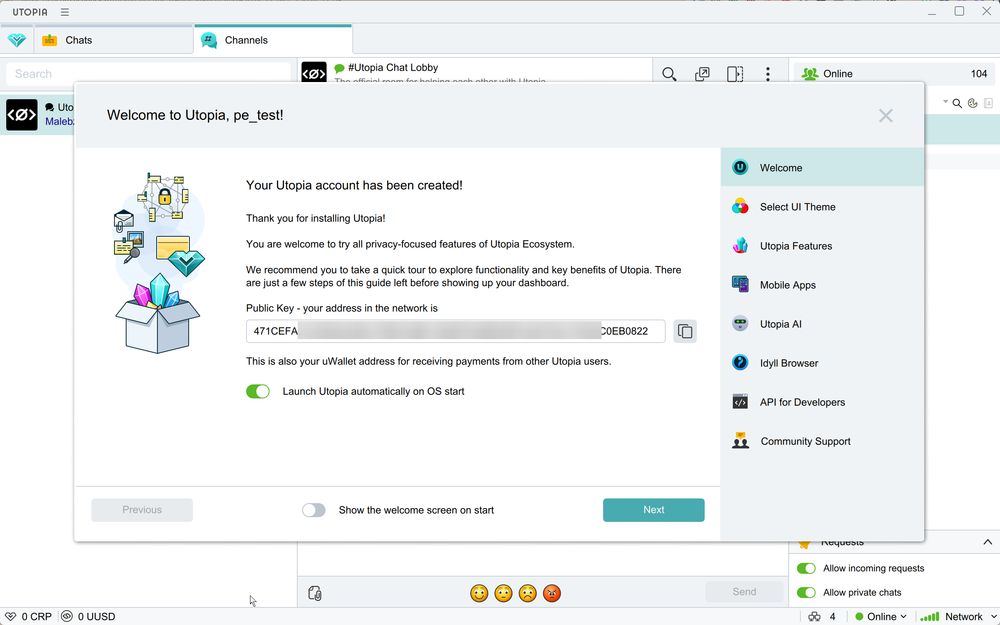

# Utopia


If you need to update the module on your server, please follow the [instructions](https://premium.gitbook.io/rukovodstvo-polzovatelya/osnovnye-nastroiki/faq/kak-obnovit-faily-na-servere#moduli-merchantov).


## Merchant-Side Setup


The initial setup of the service on your server can be assisted by the merchant support team:

* Utopia Messenger: UNKNOWN1\
  .png>)
* Telegram: [@utp1984](https://t.me/utp1984)
* Email: [1984@u.is](mailto:1984@u.is)


Download the [Utopia app](https://u.is/en/download.html) for your operating system and install it. Complete the registration process and create a new wallet.

<figure><figcaption>
Creating an account
</figcaption></figure>

<figure><figcaption>
Fill in the required fields
</figcaption></figure>

<figure><figcaption>
Specify the folder path where your private key will be stored and create a password for your wallet
</figcaption></figure>

<figure><figcaption>
Generating the private key
</figcaption></figure>

<figure><figcaption>
Your public key is the address of your wallet
</figcaption></figure>

<figure><figcaption>
Main application screen
</figcaption></figure>

<figure><figcaption>
Available currencies
</figcaption></figure>

## Module Configuration

In the admin panel, create a new merchant by going to "**Merchants**" -> "**Add Merchant**."

Select "Utopia" from the dropdown menu in the "**Module**" field, enter a name for the module, and click "**Save**."

<figure><figcaption></figcaption></figure>

Fill in the required authorization fields.

<figure><figcaption></figcaption></figure>

**Domain** — The URL for connection (your server’s IP address + the port assigned to the application during initial setup)

**Token** — Your public key (the wallet address you received during registration)


To ensure correct processing of payment details, the currency code in the "Giving" field must be set to USD, UUSD, or CRP (Crypton token).

.png>)


## Utopia Voucher Module

To accept Utopia vouchers as a payment method, configure a separate module.

### Module Settings

In the admin panel, create a new merchant by going to "**Merchants**" -> "**Add Merchant**."

Select **Utopia Voucher** from the dropdown menu in the "**Module**" field, enter a name for the module, and click "**Save**."

<figure><figcaption></figcaption></figure>

Fill in the required authorization fields.

<figure><figcaption></figcaption></figure>

- **Domain** — the connection URL (your server’s IP address plus the port assigned to the application during initial setup)
- **Token** — the public key (your wallet address obtained when registering with the service)


To ensure vouchers are accepted correctly, the currency code in the "**Give**" field must be either **UUSD** (US Dollar) or **CRP** (Utopia’s native token).

There is no need to add a "**From Account**" field for the "**Give**" currency in the exchange form — the client’s order will display a "**Proceed to Payment**" button. Clicking this button opens a page where the client can enter the voucher code. After entering a valid code, the client will be redirected back to the order page.


## Continuing Setup

Next, continue configuring the merchant by following the [general setup instructions](https://premium.gitbook.io/rukovodstvo-polzovatelya/osnovnye-nastroiki/merchanty-i-avtovyplaty/merchanty/obshie-nastroiki-merchantov).