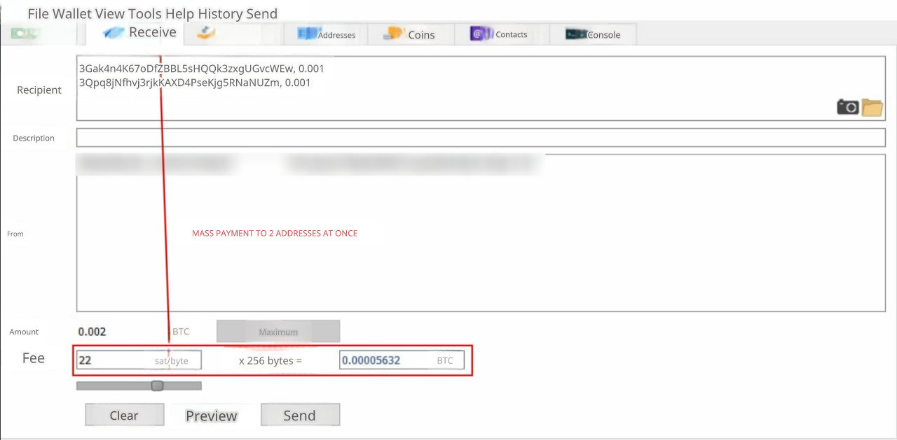

# Модуль Electrum

## Описание работы модуля

Когда обменник выплачивает биткоин клиенту, с обменника берется комиссия сети за транзакцию. Если делать выплаты клиентам по принципу: 1 заявка = 1 транзакция, то возникают существенные потери на комиссиях сети.

Чтобы обменнику снизить издержки на комиссиях, нужно делать массовые выплаты по заявкам - когда в одну транзакцию объединяются несколько адресов для выплаты клиентам. Чем больше адресов в этой транзакции, тем ниже комиссия для обменника, а тем больше заработок обменника. По такому принципу работают криптобиржи, когда выводят средства клиентам.

**Мерчант и выплата Electrum**

Мы разработали платные модули мерчанта и автовыплаты [Electrum](https://electrum.org/) под BTC, которые также поддерживают массовые выплаты BTC. Для работы выплаты требуется установка библиотеки на сервер.

**С помощью модулей под кошелек Electrum можно организовать полноценный прием и выплату BTC с минимальными комиссиями.**

Кошелек Electrum можно использовать как на компьютере, так и на сайте. Размеры комиссий сети на выплату определяются автоматически с помощью сервиса [Mempool](https://mempool.space/api/v1/fees/recommended)

**Сколько можно сэкономить на массовых выплатах**

Массовые выплаты обоснованы, когда у обменника в течение 10-15 минут набирается хотя бы 2 заявки на выплату биткоина и более.

На 05.12.2023 рекомендованная комиссия на отправку 60 sat/byte. Смотрите скриншоты комиссий из кошелька Electrum ниже.

При отправке биткоина на 1 адрес возникает комиссия 0.00004928 BTC. Если делать 8 одиночных транзакций в час, то за сутки комиссия составит 0,00004928 BTC \* 8 \* 24 = 0,00946176 BTC. За месяц - 0,2838528 BTC или 8455 USD по текущему курсу (на 25.05.2022).

<figure><figcaption></figcaption></figure>

При отправке биткоина сразу на 2 адреса возникает комиссия 0.00005632 BTC. Если массово выплачивать хотя бы на два адреса каждые 15 минут в течение 24 часов, то комиссия составит 0.00005632 BTC \* 4 \* 24 = 0,00540672 BTC. За месяц - 0,1622016 BTC или 4820 USD по текущему курсу (на 25.05.2022).

<figure><figcaption></figcaption></figure>

**Итого: 8455-4820 = 3635 USD — экономия обменника в месяц на комиссии сети при использовании модуля массовых выплат.**

**Стоимость**

Стоимость готовых модулей (мерчанта и выплаты) составляет 1490$ на все ваши лицензии. Модули предоставляется сразу после оплаты.

Для покупки и по любым вопросам [пишите](https://premiumexchanger.com/podderzhka/) в техническую поддержку.
