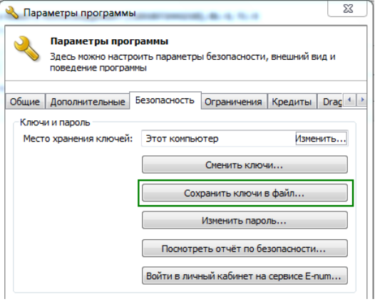

# X19 Interface (Webmoney)

You can activate the "**Webmoney X19**" module in the control panel under the "**Modules" → "Modules"** section.

The X19 module allows for the following automatic checks before creating an exchange request:

1. WM ↔ WM. Check if the wallets belong to the same WMID.
2. Cash in office ↔ WM. Verify the client's full name and passport number*.
3. Bank account ↔ WM. Verify the client's full name.
4. Bank card ↔ WM. Verify the client's full name.
5. Money transfer systems ↔ WM. Verify the client's full name.
6. SMS ↔ WM. Verify the client's phone number.
7. PayPal ↔ WM. Verify the client's account number.
8. Skrill (Moneybookers) ↔ WM. Verify the client's account number.
9. QIWI Wallet ↔ WM. Verify the client's account number.
10. Yandex.Money ↔ WM. Verify the client's account number.
11. EasyPay ↔ WM. Verify the client's account number.

* — The passport number check is only applicable for WM → Cash in office.

All checks in the X19 module work both ways: WM → XXX and XXX → WM.

If a payment system is not listed among the checks, it means that exchanges involving that payment system are prohibited by WebMoney rules.

To set up the X19 module, follow these steps:

1. Your exchange service must be listed in the [Megastock](https://megastock.ru/) directory in at least one of the following sections: "Online exchange of electronic currencies," "Deposit and withdrawal of electronic currencies," or "Mobile communications." If your site is not listed in the Megastock directory, you will not have access to the X19 XML interface.


The Megastock directory administration strictly monitors compliance with the [directory placement rules](https://megastock.ru/site_requirements.aspx). We recommend reviewing these rules beforehand, completing all necessary requirements, and only then submitting a request for listing in the directory.


2. In your WebMoney Keeper Classic, go to the menu item "**Tools" → "Program Settings"**. Then, navigate to the **"Security"** tab and click the **"Save key to file"** button. Follow the procedures prompted by WM Keeper. Specify the path to save the key file and enter your key file password twice.

<figure><figcaption></figcaption></figure>

3. Upload the saved .kwm key file to your hosting in the directory: `your_domain/wp-content/plugins/premiumbox/moduls/x19/webmoney`.
4. On your hosting, open the file `your_domain/wp-content/plugins/premiumbox/moduls/x19/webmoney/index.php` for editing (file encoding should be UTF-8) and enter the following settings:


If the `index.php` file is not present in the specified directory, rename the `primer.php` file to `index.php` and make the necessary settings.


* `define('WMX19_ID', '123456789000'); // Enter your WMID.`
* `define('WMX19_KEEPER_TYPE','CLASSIC'); // Leave CLASSIC unchanged if you have WM Keeper WinPro (Classic), or enter LIGHT if you have WM Keeper Light WebPro (Light).`
* `define('WMX19_CLASSIC_KEYPATH',PN_PLUGIN_DIR.'moduls/x19/webmoney/123456789000.kwm'); // Specify the name of your .kwm key file.`
* `define('WMX19_CLASSIC_KEYPASS','123456'); // Enter the password for the .kwm key file that you used when saving the key in WM Keeper.`
* `define('WMX19_LIGHT_CERTPATH',PN_PLUGIN_DIR.'moduls/x19/webmoney/123456789000.cer'); // Absolute path to the .cer certificate. ONLY for WM Keeper WebPro (Light).`
* `define('WMX19_LIGHT_KEYPATH','PN_PLUGIN_DIR.'moduls/x19/webmoney/123456789000.key'); // Absolute path to the .key private key. ONLY for WM Keeper WebPro (Light).`
* `define('WMX19_LIGHT_KEYPASS','123456'); // Password for the .key private key. ONLY for WM Keeper WebPro (Light).`

5. The WMID is determined using the X8 XML interface, which is automatically activated when connecting the X2 XML interface. Activate the X2 XML interface in the [merchant settings](https://merchant.webmoney.ru/conf/purses.asp) under the "Additional parameters" section.
6. When creating exchange directions in your exchange service, you will have the option to select the type of verification using the X19 interface.