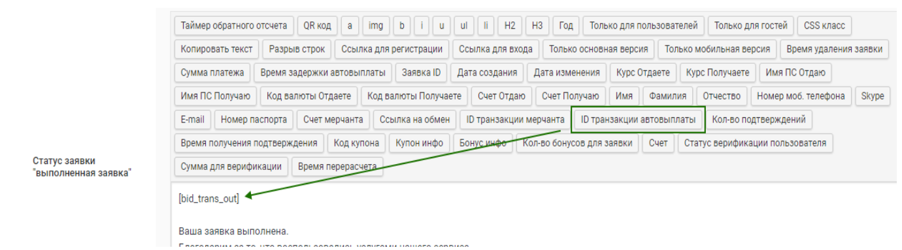
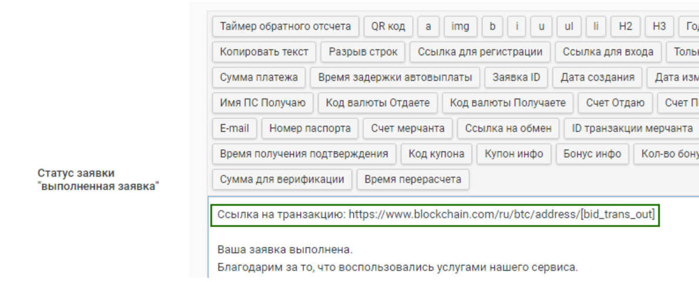

# Хэш и ссылка на транзакцию

При использовании автовыплаты для криптовалюты имеется возможность отобразить для пользователя хэш транзакции на странице заявки.

Для этого необходимо в разделе "**Направления обменов**" перейти к редактированию направления и выбрать вкладку "**Информация для пользователя**".

Далее найти текстовое поле "**Статус заявки** "**выполненная заявка**". Над текстовым полем отображается панель с шорткодами. За вывод хэша транзакции отвечает шорткод "**ID транзакции автовыплаты**". Установите курсор мыши в поле в том месте, где хотите вывести полученное количество подтверждений, после этого нажмите на шорткод "**ID транзакции автовыплаты**". В текстовом поле отобразится код в квадратных скобках **\[bid\_trans\_out]**, который на странице заявки для пользователя преобразуется в хэш транзакции.

<figure><figcaption></figcaption></figure>

Хэш транзакции можно сделать в виде активной ссылки. Например, код для активной ссылки на хэш-транзакцию Bitcoin выглядит следующим образом — скопируйте код и разместите его в текстовом поле "**Статус заявки** "**выполненная заявка**":

`Ссылка на транзакцию: https://www.blockchain.com/ru/btc/tx/[bid_trans_out]`

<figure><figcaption></figcaption></figure>

Обратите внимание, что хэш транзакции на странице заявки появляется не сразу — требуется время, чтобы платежный шлюз обработал заявку и передал хэш.
