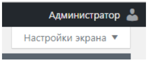
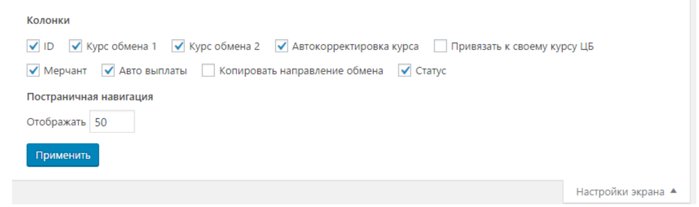

# Настройки экрана в панели управления

Если содержимое некоторых таблиц в панели управления отображается некорректно, то в правом верхнем углу в некоторых разделах вы можете найти блок "**Настройки экрана**".

<figure><figcaption></figcaption></figure>

Разверните данный блок и выполните настройки экрана. Отключите некоторые столбцы таблицы, чтобы информация в таблице стала читабельной.&#x20;


В разных разделах панели управления содержаться различные наборы опций для отключения


<figure><figcaption></figcaption></figure>
