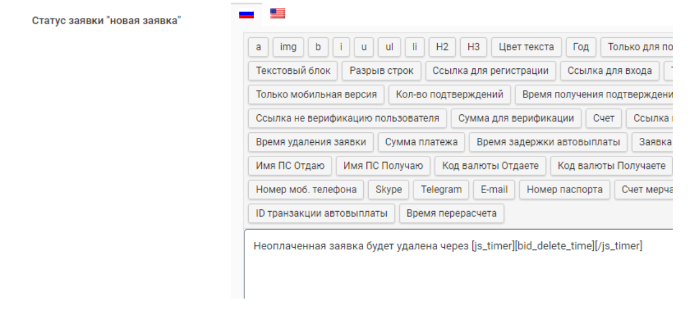

# Timer for Deleting Unpaid Applications

With this feature, you can display a timer on the application page that counts down the time until an unpaid application is deleted. To set this up, follow these steps:

1. In the website control panel, go to the "**Modules" → "Modules"** section and activate the "**Countdown Timer**" module if it is currently deactivated.

2. In the website control panel, navigate to "**Exchange Directions" → "Automatic Deletion of Unpaid Applications**" and enable the automatic deletion feature for unpaid applications. The settings you configure will apply to all exchange directions on the site.

<figure><figcaption></figcaption></figure>

You can also activate this option with personalized settings for each exchange direction in the settings of each exchange direction under the "**Deletion of Unpaid Applications**" tab.

<figure><figcaption></figcaption></figure>

3. Go to the settings of the exchange direction for which you want to display the timer. In the "**User Information**" tab, in the "**Application Status: New Application**" field, insert the code: An unpaid application will be deleted in **\[js\_timer]\[bid\_delete\_time]\[/js\_timer]**.

<figure><figcaption></figcaption></figure>

4. Save the changes in the settings.