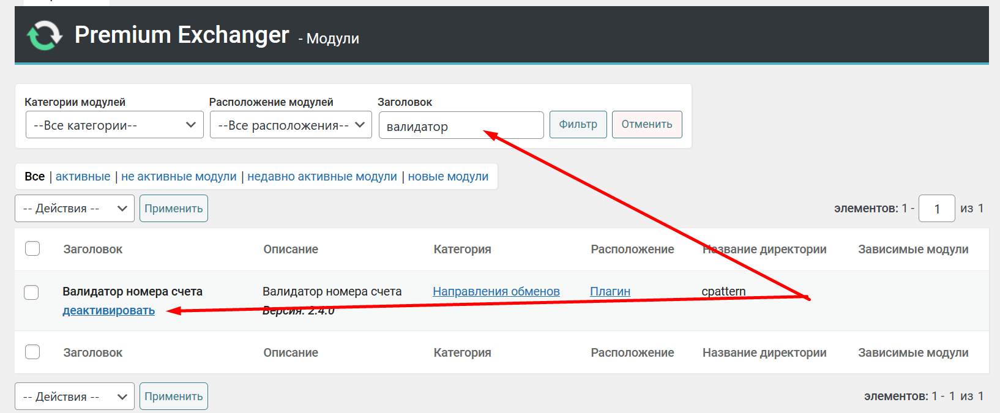

# Cryptocurrency Wallet Validator



1. To connect the cryptocurrency wallet validator that the user inputs in the application creation form, go to the "**Modules -> Modules**" section and ensure that the "**Account Number Validator**" module is active.

<figure><figcaption></figcaption></figure>

2. Navigate to the "**Currencies -> Currencies**" section, search for the required payment system, and proceed to edit it. Go to the "**Field Settings**" tab. Locate the "**Account Number Validator**" field. Select the appropriate currency and save the settings.

<figure><figcaption></figcaption></figure>

<figure><figcaption></figcaption></figure>

As a result, when creating an application, the system will check the validity of the address entered by the user. If the user inputs an incorrect wallet address, an error message will be displayed.