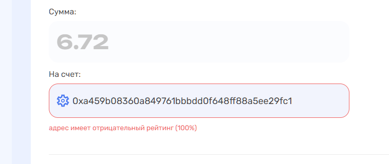
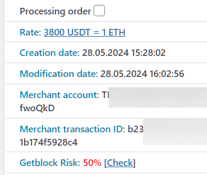
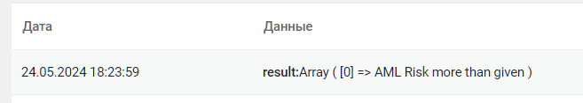

# BitOK

## Подключение к сервису


Для подключения к сервису напишите [менеджеру](https://t.me/premiumexchanger_business) — он создаст чат с вами и представителями AML сервиса для обсуждения условий подключения, тарифов и других вопросов


После получения доступа к сервису пополните счет для выполнения проверок реквизитов клиентов на вашем обменнике.

Зайдите в личный кабинет, раздел "[**Ключи API**](https://kyt.bitok.org/api-keys)". Выпустите новый ключ по кнопке "**Создать ключ**", в открывшемся окне укажите желаемое название для ключа и IP-адрес вашего сервера (необязательно).

<figure><figcaption></figcaption></figure>

Нажмите "**Создать**" и скопируйте в текстовый файл сгенерированные ключи.

<figure><figcaption></figcaption></figure>

В панели администратора скрипта, в разделе "**Модули**" -> "**BitOK**" заполните поля для авторизации в модуле:



<figure><figcaption></figcaption></figure>

**API ключ** — **API ключ**, сгенерированный в ЛК сервиса BitOK

**API secret** — **Секрет API**, сгенерированный в ЛК сервиса BitOK

**Время ожидания результата проверки (сек, макс до 25-30 сек)** — время ожидания ответа от сервиса после отправки реквизитов (рекомендуем устанавливать значение в диапазоне от 15 до 28). Если проверяется кошелек при создании заявки, то на указанное значение в секундах будет увеличиваться время создание заявки после нажатия клиентом кнопки "**Создать заявку**".

**Риск, если API не работает (в автовыплате)** — укажите желаемое значение риска (от 0 до 100), которое будет иметь значение, если от API сервиса не будет получен ответ. Значение должно быть выше значения из поля "**Критичный уровень риска хэша**".



<figure><figcaption></figcaption></figure>

**API ключ** — **API ключ**, сгенерированный в ЛК сервиса BitOK

**API secret** — **Секрет API**, сгенерированный в ЛК сервиса BitOK

**Время ожидания результата проверки (сек, макс до 25-30 сек)** — время ожидания ответа от сервиса после отправки реквизитов (рекомендуем устанавливать значение в диапазоне от 15 до 28). Если проверяется кошелек при создании заявки, то на указанное значение в секундах будет увеличиваться время создание заявки после нажатия клиентом кнопки "**Создать заявку**".

**Статус заявки, если превышен риск** — автоматический перевод заявки в выбранный из выпадающего списка статус при превышении риска (опция актуальная, когда проверка адреса или хеша выполняется в уже созданной заявке)

**Риск, если API не работает** — укажите желаемое значение риска (от 0 до 100), которое будет иметь значение, если от API сервиса не будет получен ответ. Значение должно быть выше значения из полей "**Критичный уровень риска адреса**" и "**Критичный уровень риска хеша**".



## Настройка модуля


Обратите внимание, что уровень риска в модуле настраивается для всех направлений обмена, где он будет использоваться, вне зависимости от валюты. Индивидуальных настроек для каждого направления обмена не предусмотрено


В разделе "**Модули**" -> "**BitOK**" отображаются поля для настройки уровня риска, при котором будет срабатывать модуль. В зависимости от настроек направления обмена:

* **для кошелька** — запрещать создание заявки с указанным кошельком
* **для хеша входящей транзакции** — запрещать проводить автовыплату (при использовании подключенного модуля автовыплаты)

### Настройки для проверки адреса

**Критичный уровень риска адреса** — <mark style="color:red;">**обязательно**</mark> укажите значение (от 0 до 100), при превышении которого модуль будет сообщать о риске для заявки в разделе "Заявки" (перед настройкой раздела рекомендуем запросить у менеджера BitOK консультацию по настройке уровня риска)

**Остальные параметры** — установка уровней риска для тех или иных категорий (заполнять не требуется, т.к. настройка по категориям производится на стороне сервиса BitOK)

<figure><figcaption></figcaption></figure> <figure><figcaption></figcaption></figure>

### Настройки для проверки хеша входящей транзакции

**Критичный уровень риска хеша** — <mark style="color:red;">**обязательно**</mark> укажите значение (от 0 до 100), при превышении которого модуль будет сообщать о риске для заявки в разделе "Заявки" (перед настройкой раздела рекомендуем запросить у менеджера BitOK консультацию по настройке уровня риска)

**Остальные параметры** — установка уровней риска для тех или иных категорий (заполнять не требуется, т.к. настройка по категориям производится на стороне сервиса BitOK)

<figure><figcaption></figcaption></figure> <figure><figcaption></figcaption></figure>

### Ручные проверки

Также в этом же разделе вы можете производить проверки адресов и хешей вручную.

Для проверки адреса укажите его значение в поле "**Адрес**", выберите корректную валюту для этого адреса и нажмите кнопку "**Проверка**".

Для проверки хеша укажите адреса кошелька **для приема средств** по проверяемой транзакции в поле "**Адрес**", выберите корректную валюту для этого адреса, а также укажите сам хеш в поле "**TxID**" и нажмите кнопку "**Проверка**".

<figure><figcaption></figcaption></figure>

Результаты проверки будут отображаться в начале страницы с настройками модуля, а также в разделе "**Модули**" -> "**Bitok logs**".

<figure><figcaption></figcaption></figure>

<figure><figcaption></figcaption></figure>

## Настройка модуля в направлении обмена


Ошибка как на скриншоте ниже, означает, что у вас нет доступных проверок — необходимо приобрести новый пакет проверок на сервисе BitOK.

.png>)


Вы можете использовать модуль как для проверки адреса и хеша без вмешательств в заявку, так и для запрета создания заявки или запрета выплаты по ней.

Откройте настройки направления обмена, в котором хотите использовать проверки и перейдите на вкладку "**Bitok**"

### Версия 2.5

<figure><figcaption></figcaption></figure>

Проверка счетов "**Отдаю**" и "**Получаю**":

<figure><figcaption></figcaption></figure> <figure><figcaption></figcaption></figure>

* **Нет** — проверка не будет производиться
*   **Да** — проверка будут производиться только для информационных целей без запрета на создание заявки\

    <figure><figcaption></figcaption></figure>
*   **Да и запретить создавать заявку** — проверка будут производиться для запрета создания заявки при превышении заданного уровня риска\

    <figure><figcaption></figcaption></figure>
* **Сумма обмена "от"** — укажите размер суммы из заявки, при превышении которого будет выполняться проверка адреса. При сумме ниже указанной, проверка выполняться не будет.\
  \
  Значение указывается в валюте, для которой будет проверяться адрес (к примеру для проверки адреса USDT укажите 1000, для BTC — 0.015 и т.п., но все значения вы указываете на своё усмотрение).

Проверка TxID:

<figure><figcaption></figcaption></figure>

* **Нет** — проверка не будет производиться
*   **Да** — проверка будут производиться только для информационных целей без запрета выплаты\
    \

    <figure><figcaption></figcaption></figure>
*   **Да и прекратить выплату** — проверка будут производиться для запрета выплаты по заявке при превышении заданного уровня риска  (актуально только если в направлении обмена подключена автовыплата).\
    При переходе заявки в статус "**Ошибка автовыплаты**" при превышении уровня риска вы можете убедиться в срабатывании модуля, перейдя в раздел "**Мерчанты**" -> "**Лог автовыплат**", где будет отображаться следующая запись:\

    <figure><figcaption></figcaption></figure>
* **Сумма обмена "от"** — укажите размер суммы из заявки, при превышении которого будет выполняться проверка хеша. При сумме ниже указанной, проверка выполняться не будет.\
  Значение указывается в валюте для стороны "**Отдаю**"

### Версия 2.6

<figure><figcaption></figcaption></figure>

Проверка счетов "**Отдаю**" и "**Получаю**":

<figure><figcaption></figcaption></figure> <figure><figcaption></figcaption></figure>

* **Нет** — проверка не будет производиться
*   **Да, во время создания заявки** — проверка будут производиться для запрета создания заявки при превышении заданного уровня риска\

    <figure><figcaption></figcaption></figure>
* **Да, при оплате** — проверка счета будет производиться после приема платежа, сделанного клиентом (только, если в направлении обмена подключен модуль мерчанта на прием средств)
* **Да, во время автовыплаты** — проверка счета будет производиться перед выплатой средств клиенту (только, если в направлении обмена подключен модуль автовыплаты средств)
* **Превышение риска:**\
  • **Ничего** — Проверки будут производиться только для информационных целей\
  • **Ошибка** — При превышении риска, указанного в настройках модуля, будет отображаться ошибка
* **Сумма обмена "от"** — укажите размер суммы из заявки, при превышении которого будет выполняться проверка адреса. При сумме ниже указанной, проверка выполняться не будет.\
  \
  Значение указывается в валюте, для которой будет проверяться адрес (к примеру для проверки адреса USDT укажите 1000, для BTC — 0.015 и т.п., но все значения вы указываете на своё усмотрение).

Проверка TxID:

<figure><figcaption></figcaption></figure>

<figure><figcaption></figcaption></figure>

* **Нет** — проверка не будет производиться
* **Да, при оплате** —&#x20;
*   **Да, во время автовыплаты** — \
    \

    <figure><figcaption></figcaption></figure>
*   **Да и прекратить выплату** — проверка будут производиться для запрета выплаты по заявке при превышении заданного уровня риска  (актуально только если в направлении обмена подключена автовыплата).\
    При переходе заявки в статус "**Ошибка автовыплаты**" при превышении уровня риска вы можете убедиться в срабатывании модуля, перейдя в раздел "**Мерчанты**" -> "**Лог автовыплат**", где будет отображаться следующая запись:\

    <figure><figcaption></figcaption></figure>
* **Сумма обмена "от"** — укажите размер суммы из заявки, при превышении которого будет выполняться проверка хеша. При сумме ниже указанной, проверка выполняться не будет.\
  Значение указывается в валюте для стороны "**Отдаю**"
