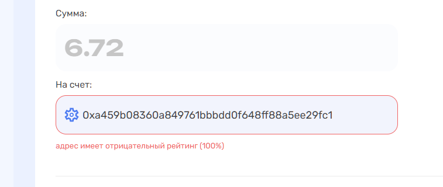

# CoinKyt

## Подключение к сервису


Для подключения к сервису напишите [менеджеру](https://t.me/premiumexchanger_business) — он создаст чат с вами и представителями AML сервиса для обсуждения условий подключения, тарифов и других вопросов


Авторизуйтесь в сервисе [CoinKyt](https://explorer.coinkyt.com/authorization).

Зайдите в личный кабинет и выпустите новый ключ по кнопке "**Сгенерировать**" в разделе "**API**". Скопируйте выпущенный ключ в буфер обмена или в текстовый файл.

<figure><figcaption></figcaption></figure>

В панели администратора скрипта, в разделе "**Модули**" -> "**CoinKyt**" заполните поля для авторизации в модуле:

<figure><figcaption></figcaption></figure>

**API ключ** — **API ключ**, сгенерированный в ЛК сервиса CoinKyt

**Время ожидания результата проверки (сек, макс до 25-30 сек)** — время ожидания ответа от сервиса после отправки реквизитов (рекомендуем устанавливать значение в диапазоне от 15 до 28).

**Статус заявки, если превышен риск** — статус, в который будет переходить заявка при превышении установленного в настройках риска

**Риск, если API не работает** — желаемое значение риска (от 0 до 100), которое будет иметь результат проверки, если от API сервиса не будет получен ответ. Значение должно быть выше значения из полей "**Критичный уровень риска адреса/хеша**".

## Настройка модуля


Обратите внимание, что уровень риска в модуле настраивается для всех направлений обмена, где он будет использоваться, вне зависимости от валюты. Индивидуальных настроек для каждой валюты не предусмотрено.


В разделе "**Модули**" -> "**CoinKyt**" отображаются поля для настройки уровня риска, при котором будет срабатывать модуль. В зависимости от настроек направления обмена:

* **для кошелька** — запрет на создание заявки с указанным клиентом кошельком
* **для хеша входящей транзакции** — запрет проводить автовыплату (при использовании подключенного модуля автовыплаты)

### Настройки для проверки адреса

<figure><figcaption></figcaption></figure>

**Критичный уровень риска адреса** — <mark style="color:red;">**обязательно**</mark> укажите значение (от 0 до 100), при превышении которого модуль будет сообщать о риске для заявки в разделе "**Заявки**" (перед настройкой раздела рекомендуем запросить у менеджера CoinKyt консультацию по настройке уровня риска)

**Остальные параметры** — установка уровней риска для тех или иных категорий (перед настройкой раздела рекомендуем запросить у менеджера CoinKyt консультацию по настройке уровня риска)

### Настройки для проверки хеша входящей транзакции

<figure><figcaption></figcaption></figure>

**Критичный уровень риска хеша** — <mark style="color:red;">**обязательно**</mark> укажите значение (от 0 до 100), при превышении которого модуль будет сообщать о риске для заявки в разделе "**Заявки**" (перед настройкой раздела рекомендуем запросить у менеджера CoinKyt консультацию по настройке уровня риска)

**Остальные параметры** — установка уровней риска для тех или иных категорий (перед настройкой раздела рекомендуем запросить у менеджера CoinKyt консультацию по настройке уровня риска)

### Ручные проверки

<figure><figcaption></figcaption></figure>

В этом же разделе вы можете производить проверки адресов и хешей вручную.

**Для проверки адреса** укажите его значение в поле "**Адрес**", выберите корректную валюту для этого адреса и нажмите кнопку "**Проверка**".

<figure><figcaption>
Доступные для проверки валюты
</figcaption></figure>

**Для проверки транзакции** укажите её идентификатор в поле "**TxID**", выберите корректную валюту и нажмите кнопку "**Проверка**".

Результаты проверки будут отображаться в начале страницы с настройками модуля, а также в разделе "**Модули**" -> "**CoinKyt logs**".

<figure><figcaption></figcaption></figure>

<figure><figcaption></figcaption></figure>

## Настройка модуля в направлении обмена

Вы можете использовать модуль как для проверки адреса и хеша без вмешательств в заявку, так и для запрета создания заявки или запрета выплаты по ней.

Откройте настройки направления обмена, в котором хотите использовать проверки и перейдите на вкладку "**CoinKyt**"

<figure><figcaption></figcaption></figure>

Проверка счетов "**Отдаю**" и "**Получаю**":

<figure><figcaption></figcaption></figure> <figure><figcaption></figcaption></figure>

* **Нет** — проверка не будет производиться
*   **Да, во время создания заявки** — проверка будут производиться для запрета создания заявки при превышении заданного уровня риска\

    <figure><figcaption></figcaption></figure>
* **Да, при оплате** — проверка счета будет производиться при приеме платежа, сделанного клиентом (только, если в направлении обмена подключен модуль мерчанта на прием средств)

<figure><figcaption></figcaption></figure>

* **Да, во время автовыплаты** — проверка счета будет производиться перед выплатой средств клиенту (только, если в направлении обмена подключен модуль автовыплаты средств)
* **Превышение риска:**\
  • **Ничего** — проверки будут производиться только для информационных целей\
  • **Ошибка** — при превышении риска, указанного в настройках модуля, клиенту будет отображаться ошибка при создании заявки или при попытке автовыплаты (в зависимости от настроек)
* **Сумма обмена "от"** — размер суммы из заявки, только при превышении которого будет выполняться проверка адреса или транзакции. При сумме ниже указанной, проверка выполняться не будет.


Значение указывается в валюте, для которой будет проверяться адрес (к примеру для проверки адреса USDT укажите 1000, для BTC — 0.015 и т.п. — все значения вы указываете на своё усмотрение)


Проверка TxID:

<figure><figcaption></figcaption></figure>

* **Нет** — проверка TxID входящего платежа не будет производиться
* **Да, при оплате** — проверка TxID входящего платежа будет производиться при приеме платежа, сделанного клиентом (только, если в направлении обмена подключен модуль мерчанта на прием средств)
* **Да, во время автовыплаты** — проверка TxID входящего платежа будет производиться перед выплатой средств клиенту (только, если в направлении обмена подключен модуль автовыплаты средств)

<figure><figcaption></figcaption></figure>

* **Сумма обмена "от"** — укажите размер суммы из заявки, при превышении которого будет выполняться проверка хеша. При сумме ниже указанной, проверка выполняться не будет (значение суммы указывается в валюте для стороны "**Отдаю**")
