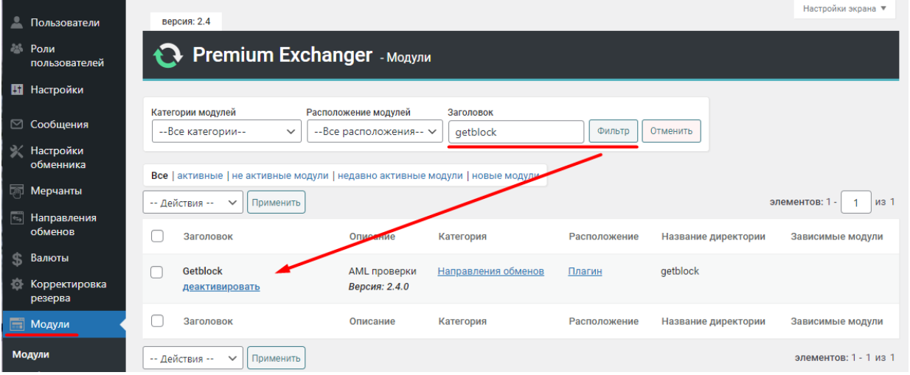
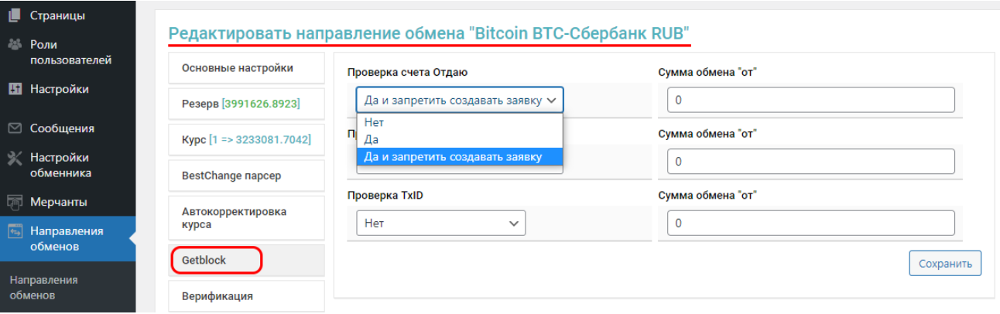
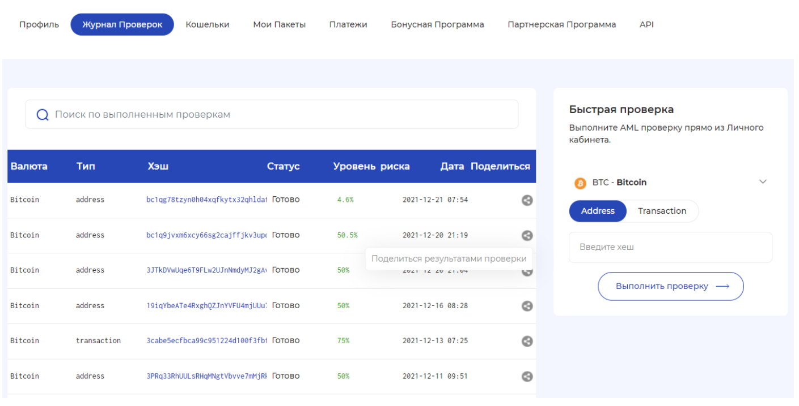

# GetBlock Module Setup

1. To get started, navigate to the "**Modules**" section and find the **GetBlock** module by its title, then activate it.

<figure><figcaption></figcaption></figure>

2. Next, go to the module settings:

<figure><figcaption></figcaption></figure>

* **API Key** – This is your personal access key. To obtain your key, send an email to [info@getblock.net](mailto:info@getblock.net).
* **Critical Risk Level** – This is the risk level in percentage above which you do not want to accept cryptocurrency.
* **Risk if API is Down** – This determines the risk level to be used in case of system failures. For example, if you set it to 100, the system will consider such a wallet/transaction 100% risky and will not allow the exchange. Conversely, if you set it to 0, the system will not cancel the request even in case of errors during verification.
* [**Max Risk (for Auto Payout)**](#user-content-fn-1)[^1] – This is the risk level in percentage for "dirty" currencies.

3. In this section, you can also test the API functionality (address, transaction, hash).\
   For example, enter an address, select a currency, and click the "**Check**" button. A pop-up window will display the server's response.


For more details, refer to the GetBlock documentation [here](https://getblock.net/api/documentation).


<figure><figcaption></figcaption></figure>

4. Next, you need to configure the exchange directions for which risk level checks will be performed. The following options are available:

<figure><figcaption></figcaption></figure>

* **Check Sender's Account** – At the request creation stage, the sender's address is checked. If the risk level exceeds the allowable limit and the option “**Yes, and prohibit creating the request**” is selected, the client will receive a message and will not be able to create the request.
* **Check Recipient's Account** – At the request creation stage, the recipient's address is checked.
* **Check TxID** – This checks the transaction sent by the client. This is necessary when the client uses multiple inputs in their transaction.
* **Exchange Amount From** – This allows you to set a threshold for the checks. Amounts below those specified in these fields will not be checked.

<figure><figcaption></figcaption></figure>

5. In the "**Exchange Directions**" section, under the "**User Information**" tab, you can configure how the results of the checks will be displayed:

<figure><figcaption></figcaption></figure>

## Working with the Module

Once the module is activated, a **GetBlock Risk** field will appear in the request log.

Here, the risk percentage is displayed if the check has already been performed, and there is also a "**Check**" button if you need to perform a check.

By clicking on the percentage, you can see a window with the details of the check. At the bottom of the window, there is a link to the full check result. In case of disputes with the client, you can send them this link so they can personally see the risk level and the sources of funds in their wallet:

<figure><figcaption></figcaption></figure>

This is how the check result will look via the link on the GetBlock website:

<figure><figcaption></figcaption></figure>

All completed checks can be viewed in your personal account on the [getblock.net](https://getblock.net/) website.

<figure><figcaption></figcaption></figure>

## Module Features

### v2.5 and Below

GetBlock can return a response with the results of the check in up to 25 seconds, but the configured server by default waits for a response from the service for 5 seconds.

To avoid situations where the service does not respond within 5 seconds, you can increase the server's waiting time through code (the server must be high-performance) to 25 seconds in the `index.php` file located at `wp-content/plugins/premiumbox/moduls/getblock`.

<figure><figcaption>
Change the value to <strong>25</strong> and save the changes in the file.
</figcaption></figure>

If a response from GetBlock is received in a shorter period, the waiting will end, and the request will be created/declined (depending on the settings).

### v2.6 and Above

The value for the above option is specified in the module settings in the admin panel, and there is no need to change the value on the server.

<figure><figcaption></figcaption></figure>

[^1]: all fields