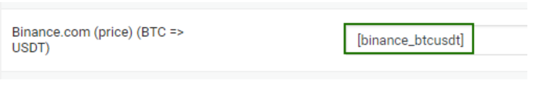

# Converting Reserves When Using a Merchant

Let’s assume you are using Binance Auto-Payout to pay in BTC. On your Binance account, the reserve is stored in USDT. To calculate the current reserve for BTC, you need to convert the USDT reserve into BTC.

1. In the dashboard, navigate to **"Merchants" → "Auto-Payouts"**, and open the settings for the Binance module. At the bottom of the module settings page, find the active link labeled **"Currency Reserve Shortcode"** and click on it. Copy the shortcode for **"Binance (binance) — USDT"**.

   <figure><figcaption></figcaption></figure>

2. In the website dashboard, go to **"Parsers 2.0" → "Source Rates"**, and copy the shortcode for **BTC=>USDT**.

   <figure><figcaption></figcaption></figure>

3. Navigate to the settings for the BTC currency and open the **"Reserves"** tab. For the **"Currency Reserve"** parameter, select the **"By Formula"** option.

4. To calculate the current reserve in BTC, divide the USDT reserve by the **BTC → USDT** exchange rate. In the **"Reserve Formula"** field that appears below, enter the following formula in the currency settings:

   <figure><figcaption></figcaption></figure>

   Here:
   - **\[binance_usdt]** is the shortcode you copied from the Binance Auto-Payout module settings.
   - **\[parser_binance_btcusdt]** is the shortcode you copied from the **"Parsers 2.0"** section, with the **parser_** prefix added.

You can set up convertible reserves for other currencies in a similar way.