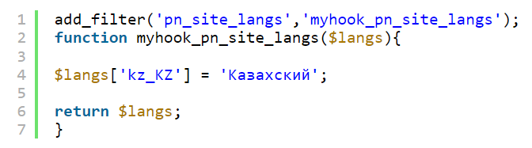

# Adding a New Language

By default, **Premium Exchanger** supports only two languages: Russian and English.

However, you can add new languages by following these steps:

1. Add the appropriate filter to the hooks plugin at the end of the file located at `wp-content/plugins/premiumhook/premiumhook.php`.  
2. In the **Plugins** section of your WordPress admin panel, activate the plugin **Premium Exchanger hooks**:

<figure><figcaption></figcaption></figure>

The data for the new language should follow the [ISO 3166-1](https://en.wikipedia.org/wiki/ISO_3166-1) standard.

Once you add a new language via the filter, additional input fields will appear in the admin panel. However, this is not enough — the plugin, theme, and WordPress itself will not yet recognize the new language, and all text will remain in English by default.

To proceed, you’ll need to download the translation software [Poedit](https://poedit.net/download).  
Poedit offers both free and paid versions. Either version will work for this process, but the paid version includes an automatic translation feature for all strings in the file.

---

### Localizing WordPress (Basic WordPress Options)

1. Use any search engine to find the WordPress localization files for your desired language. For example, search for "WordPress in Kazakh." Download the appropriate distribution package.
2. In the downloaded package, navigate to the folder `wp-content/languages/` and copy the localization files to your website.

For example, in the Kazakh version, the localization files are:

- `kk_KZ.po`
- `kk_KZ.mo`
- `kk_KZ.php`

---

### Localizing the Premium Exchanger Theme (Frontend)

1. Open the theme folder: `wp-content/themes/your_theme_name/lang/`.
2. Download the files `ru_RU.po` and `ru_RU.mo`. After downloading, rename them to match your language prefix. For example, the files should be renamed to `kk_KZ.po` and `kk_KZ.mo`.
3. Open the `kk_KZ.po` file in Poedit.
4. Select the string you want to translate. On the left, you’ll see the original English text, and on the right, you can enter the translation for your language.
5. After making your changes, save the file and upload it back to the specified folder. Your theme is now localized.

---

### Localizing the Premium Exchanger Plugin (Admin Panel)

1. Open the plugin folder: `wp-content/plugins/premiumbox/languages/`.
2. Download the files `pn-ru_RU.po` and `pn-ru_RU.mo`. After downloading, rename them to match your language prefix. For example, the files should be renamed to `pn-kk_KZ.po` and `pn-kk_KZ.mo`.
3. Open the `pn-kk_KZ.po` file in Poedit.
4. Select the string you want to translate. On the left, you’ll see the original English text, and on the right, you can enter the translation for your language.
5. After making your changes, save the file and upload it back to the specified folder. The plugin is now localized.

---

### Localizing the Premium Exchanger Framework (Admin Panel)

1. Open the framework folder: `wp-content/plugins/premiumbox/premium/languages/`.
2. Download the files `pn-ru_RU.po` and `pn-ru_RU.mo`. After downloading, rename them to match your language prefix. For example, the files should be renamed to `pn-kk_KZ.po` and `pn-kk_KZ.mo`.
3. Open the `pn-kk_KZ.po` file in Poedit.
4. Select the string you want to translate. On the left, you’ll see the original English text, and on the right, you can enter the translation for your language.
5. After making your changes, save the file and upload it back to the specified folder. The framework is now localized.

---

### Adding a Flag Icon

After completing all the steps, add a flag icon for your language with the appropriate prefix — for example, `kk_KZ.png`. The flag must be in **.png** format and should be placed in the following folder:  
`wp-content/plugins/premiumbox/flags/`.

---


After adding new languages, make sure the **Premium Exchanger hooks** plugin is activated in the **Plugins** section. If it’s not activated, enable it.  
.png>)
