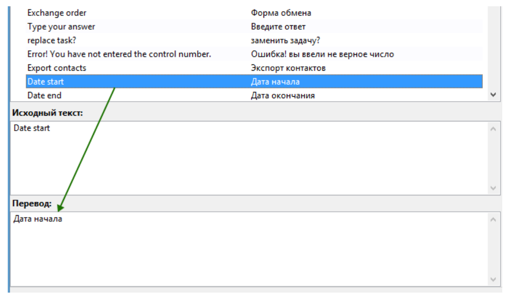

# Editing Translations and Modifying Text

By default, the website is localized in English and Russian. The primary language of the website is English. You can find the language settings in the website's control panel under "**Settings**" → "**Language Settings**."

<figure><figcaption></figcaption></figure>

In the website's control panel, you will see the following tabs:

<figure><figcaption></figcaption></figure>

By switching between these tabs, you can add text for the Russian and English versions of the website, respectively. This allows you to edit or add the main content of the site.

Some of the website's content is in English because it is the primary language and is embedded directly in the website's code. The same content in Russian is stored in special language files. To edit the content embedded in the website's code, follow these steps:

1. Use an FTP client or the file manager provided by your hosting service to download the folder `wp-content/plugins/premiumbox/` to your computer.

2. Download, install, and launch the [Poedit](https://poedit.net/download) program.

3. In Poedit, open the file `pn-ru_RU.po`, which is located in the downloaded folder `wp-content/plugins/premiumbox/languages/`.

<figure><figcaption></figcaption></figure>

4. In Poedit, click the "**Update**" button.

<figure><figcaption></figcaption></figure>

5. On the left side of the program, you will see the original text in English, and on the right side, the Russian translation. Use the search function ("**Edit** → **Find**" or **CTRL+F**) to locate the desired text in either English or Russian. Replace the necessary translation text with your own (do **not** edit the original text in English <mark style="color:red;">under any circumstances!</mark>).

After making your edits, click the "**Save**" button.

<figure><figcaption></figcaption></figure>

6. Use an FTP client or the file manager to upload the folder `wp-content/plugins/premiumbox/` from your computer back to the hosting server, replacing the existing files.

7. Repeat the same steps for other files as needed:

   * To edit the translation of the design: `wp-content/themes/exchanger/lang/`
   * To edit the translation of the Premium Exchanger framework: `wp-content/plugins/premiumbox/premium/languages/`

---

## Modifying Text in English

<figure><figcaption></figcaption></figure>

1. Right-click on the text you want to modify. This will display the file associations and line numbers in the script files where the text appears.

2. Use a text editor like [Notepad++](https://notepad-plus-plus.org/downloads/) (set to UTF-8 without BOM encoding) to open the specified files on your computer.

3. Navigate to the indicated line in the file and edit the text in English. The modified text must **only** be in English; other languages are not allowed. Save your changes.

4. Return to Poedit and click the "**Update**" button.

5. Use the search function to locate the English text you just edited in the file.

6. Provide the Russian translation for the text in the designated field. Click the "**Save**" button.

7. Use an FTP client or the file manager to upload the folder `wp-content/plugins/premiumbox/` from your computer back to the hosting server, replacing the existing files.