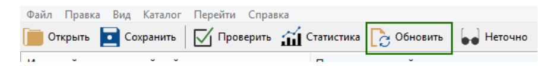

# Editing Translations and Modifying Text

By default, the website is localized in English and Russian. The primary language of the site is English. You can find the language settings in the site management panel under "**Settings**" → "**Language Settings**."

<figure><figcaption></figcaption></figure>

In the site management panel, you will see the following tabs:

<figure><figcaption></figcaption></figure>

By switching between the tabs, you can add text for the Russian and English versions of the site accordingly. This way, you can edit or add the main content.

Some of the site's content is in English, as it is the primary language and is directly embedded in the site's code. The corresponding content in Russian is stored in special language files. To edit the content in the site's code, you need to:

1. Using an FTP client or the built-in file manager on your hosting, download the folder `wp-content/plugins/premiumbox/` to your computer.

2. Download the [Poedit](https://poedit.net/download) program, install it, and launch it.

3. In Poedit, open the file `pn-ru_RU.po`, which is located in the downloaded folder `wp-content/plugins/premiumbox/languages/`.

<figure><figcaption></figcaption></figure>

4. In Poedit, click the "**Update**" button.

<figure><figcaption></figcaption></figure>

5. On the left side of the program, you will find the original text in English, and on the right side, the translation in Russian. Use the search function ("**Edit**" → "**Find**" or **CTRL+F**) to locate the desired text in either English or Russian. Replace the necessary translation text with your own (do not edit the original text <mark style="color:red;">!).

Click the "**Save**" button after finishing your edits.

<figure><figcaption></figcaption></figure>

6. Using an FTP client or the built-in file manager, upload the `wp-content/plugins/premiumbox/` folder from your computer back to the hosting (overwriting the files).

7. You need to perform similar actions for other files:

* To edit the design translation — `wp-content/themes/exchanger/lang/`
* To edit the translation for the Premium Exchanger framework — `wp-content/plugins/premiumbox/premium/languages/`.

## Changing Text in English

<figure><figcaption></figcaption></figure>

1. Right-click on the text you want to change. You will see links to the files and line numbers in the script files where this text appears.
2. Using the [Notepad++](https://notepad-plus-plus.org/downloads/) editor, open the specified files (UTF-8 encoding without BOM) on your computer.
3. Go to the specified line in the file and edit the text in English. The modified text should be provided **only in English**; other languages are not allowed. Save your changes.
4. Return to Poedit and click the "**Update**" button.
5. Use the search function to find the English text you just edited in the file.
6. Provide the Russian translation of the text in the designated field. Click the "**Save**" button.
7. Using an FTP client or the built-in file manager, upload the `wp-content/plugins/premiumbox/` folder from your computer back to the hosting (overwriting the files).