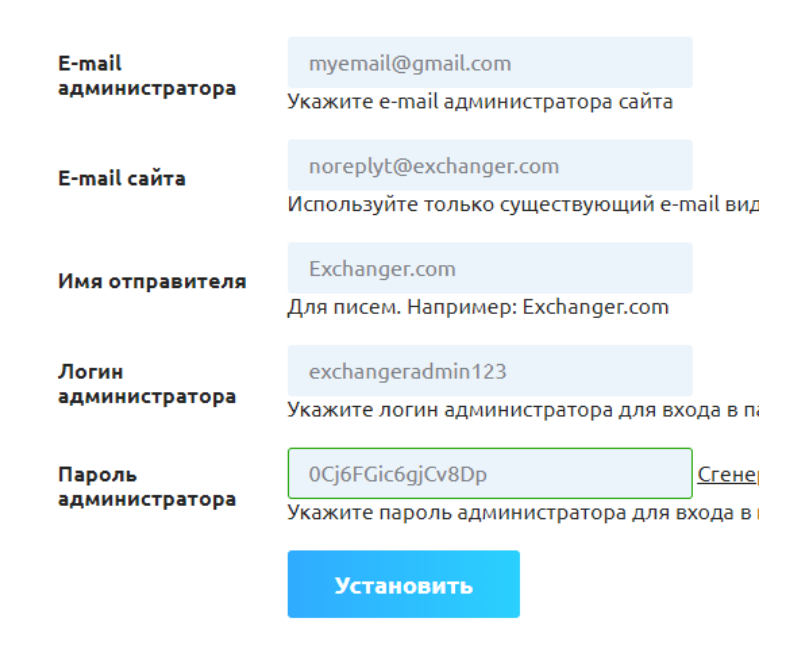

# Script Installation Instructions


The images in this guide may differ from those used in your personal system.

Throughout this document, replace "**your_domain**" with the direct address of your website (for example, if your website address is **premiumexchanger.com**, you should replace "**your_domain**" with **premiumexchanger.com**).



Please note that **all** files must be uploaded under a <mark style="color:green;">user created for the website</mark> (not <mark style="color:red;">root</mark>). Uploading files under the <mark style="color:red;">root user</mark> will lead to unstable website performance.

If you have already uploaded files under the root user, you need to take the following steps:

1. Back up all files on the server.
2. [Download from our website](https://premiumexchanger.com/uscripts/) the distribution for UPDATING according to your script version (most often this is version 2.5) and your PHP version.

3. Upload it to the root folder of your website and extract the archive, replacing the existing files.


## Recommended Security Settings and Server Requirements 

We recommend implementing the following server settings to reduce the risk of server hacking where your website is hosted:

* Update the [Ioncube Loader](https://www.ioncube.com/loaders.php) module to the latest version.
* Install the [fail2ban](https://github.com/fail2ban/fail2ban) module on the server.
* Install antivirus software on the server.
* Block ports for FTP, SSH, and various shell clients.
* Block standard addresses for server authorization forms. For example, for ISP Manager:
  • `https://ip_address/manager/`\
  • `https://ip_address/manager/ispmngr/`\
  • `https://ip_address/ispmngr/`
* Change the default port for the server authorization form. For ISP Manager, the default port is usually 1500. Set any available port value.
* Block access to phpMyAdmin and its port.
* Block access to email clients. For example,\
  • `https://ip_address/webmail/`\
  • `https://ip_address/roundcube/`\
  • and similar addresses.
* For all server users, including root, set a password of at least 15-25 characters.

#### Server System Requirements:

* PHP 8.1/8.2/8.3;
* MySQL 5.0 and above;
* IonCube Loader 13.0 and above;
* Task scheduler (cron);
* Required additional PHP functions, extensions, and libraries: iconv, mb, curl, gd, openssl, soap, gmpobject, ziparchive.

## Installing the Main Product on the Server 

**1. Uploading Files**


We want to emphasize again that website files **must always** be uploaded under a <mark style="color:green;">user created for the website</mark>, not under the <mark style="color:red;">root user</mark>.


In your personal account, go to the "[**Your Scripts**](https://premiumexchanger.com/uscripts/)" section and download the appropriate script build based on the PHP version installed on your server. If you are unsure which version is installed on your server, please contact your hosting support for assistance.

<figure><figcaption>
The script distribution already includes all available merchants and modules. Separate installation of merchants and modules is not required.
</figcaption></figure>

The downloaded archive or its contents need to be uploaded to the server. The upload should be done in the root folder of the website (usually, this is the `public_html`, `www`, or `docs` folders). Use the file manager built into the control panel, or use an FTP client like Total Commander, CuteFTP, etc. The FTP client should have binary mode enabled for file transfers (this mode is usually set by default).

**2. Generating a License**

In the "[**Your Licenses**](https://premiumexchanger.com/ulicense/)" section, download the archive with the license files `license.zip`. To do this, specify your domain name (and subdomain name if necessary) where the script will be installed, and click the "**Save**" button. Then click the "**Download for version X.X**" button. Upload the downloaded `license.zip` archive to the root folder of your website (usually, this is the `public_html`, `www`, or `docs` folders) and extract the archive.

<figure><figcaption></figcaption></figure>


<mark style="color:red;">If the domain name for the license is not specified and saved, you will not be able to download the archive with the license files.</mark> <mark style="color:red;"></mark><mark style="color:red;">**Be careful**</mark> <mark style="color:red;"></mark><mark style="color:red;">when specifying the domain name to avoid mistakes. It is not possible to change, redo, or replace the license for another domain. You will need an additional license for a second domain.</mark>


The license files are crucial for the script's functionality, so please adhere to the following rules:

* License files must not be renamed. Use them with the names you downloaded them with.
* License files must be located in the root folder of the website (usually, this is the `public_html`, `www`, or `docs` folders).
* The file permissions for the license files should be set to 644.
* The contents of the license files must remain unchanged.

**3. Creating a Database**

In the web control panel of your server (for example, ISP Manager), find the "**Databases**" section and create a new database. Enter the database name, database user name, and generate a strong password:

<figure><figcaption></figcaption></figure>

Remember or write down this information, as you will need it later.

**4. Installation**

In your browser's address bar, enter the following link:

`https://your_domain/installer/`, navigate to it, and follow the instructions:

4.1. Select the installation language.

<figure><figcaption></figcaption></figure>

4.2. Check the basic system requirements of your server. If any parameter does not meet the requirements, you will see a warning. Click "**Skip**" if the check did not reveal any errors. If errors were found, correct them and restart the installation process.

<figure><figcaption></figcaption></figure>

4.3. Check the PHP functions and libraries on your server. If any parameter does not meet the requirements, you will see a warning. Click "**Skip**" if the check did not reveal any errors. If errors were found, correct them and restart the installation process.

<figure><figcaption></figcaption></figure>

4.4. Check the write permissions for certain files and folders. If any parameter does not meet the requirements, you will see a warning. Click "**Skip**" if the check did not reveal any errors. If errors were found, correct them and restart the installation process.

<figure><figcaption></figcaption></figure>

4.5. Fill in the database name, database user name, and password that you specified in step 3. Click the "**Update Config**" button.

<figure><figcaption></figcaption></figure>

4.6. Click the "**Select File**" button and choose the `damp_db.sql` file. The files are located in the root of the downloaded archive on your computer. Specify the [full address of the website](#user-content-fn-1)[^1]. Click the "**Import**" button.

<figure><figcaption></figcaption></figure>

If the system cannot import the database file and displays an error, manually import the database file through phpMyAdmin available on your server. Then, in the database, update the `home` and `siteurl` values in the `pr_options` table to reflect the full name of your website.

4.7. Enter the personal email address of the website administrator, the website email address (create the corresponding mailbox on the server), the sender's name (usually the name of the website), and set the administrator's login and password for accessing the control panel. Click the "**Install**" button.

<figure><figcaption></figcaption></figure>

4.8. Choose the language for the website and control panel.

<figure><figcaption></figcaption></figure>

4.9. **Be sure to delete the installer files!** On the last step of the installation, click the link: "**Attention! Click here to delete the installer files**."\
\
**The script installation is complete.**

5. Website Control Panel\

<figure><figcaption></figcaption></figure>

**Default control panel address:** `https://your_domain/prmmxchngr/`

Use the login and password that were specified during installation.


To use two-factor authentication (2FA) when logging into the admin panel, [set up code delivery through your preferred communication channel](https://premium.gitbook.io/main/osnovnye-nastroiki/nastroiki/administratory-i-polzovateli/dvukhfaktornaya-avtorizaciya-2fa-v-paneli-upravleniya-saitom) (via email, Telegram, SMS, or [through a 2FA app](https://premium.gitbook.io/main/osnovnye-nastroiki/nastroiki/administratory-i-polzovateli/dvukhfaktornaya-avtorizaciya-2fa-v-paneli-upravleniya-saitom#id-2fa-s-ispolzovaniem-prilozheniya)).


## Installing Additional Modules 


The script distribution "out of the box" already includes all available merchants and modules. There is no need for separate installation of merchants and modules.


**1. Merchant Modules for Receiving Payments**

1.1. In your personal account, go to the "[**Your Scripts**](https://premiumexchanger.com/uscripts/)" section and download the merchant module for the required payment system from the "**Additional Modules**" block.

1.2. Upload the contents of the downloaded archive to your server in the directory `your_domain/wp-content/plugins/premiumbox/merchants.`

Next, configure the module according to the instructions provided in the [user manual](https://premium.gitbook.io/rukovodstvo-polzovatelya/navigaciya/merchanty-i-vyplaty).

**2. Auto-Payment Modules**

2.1. In your personal account, go to the "[**Your Scripts**](https://premiumexchanger.com/uscripts/)" section and download the auto-payment module for the required payment system from the "**Additional Modules**" block.

2.2. Upload the contents of the downloaded archive to your server in the directory `your_domain/wp-content/plugins/premiumbox/paymerchants`.

Next, configure the module according to the instructions provided in the [user manual](https://premium.gitbook.io/rukovodstvo-polzovatelya/navigaciya/merchanty-i-vyplaty/vyplaty).

[^1]: The Cyrillic domain should be specified in the format `xn--90aiufb.xn--p1ai`