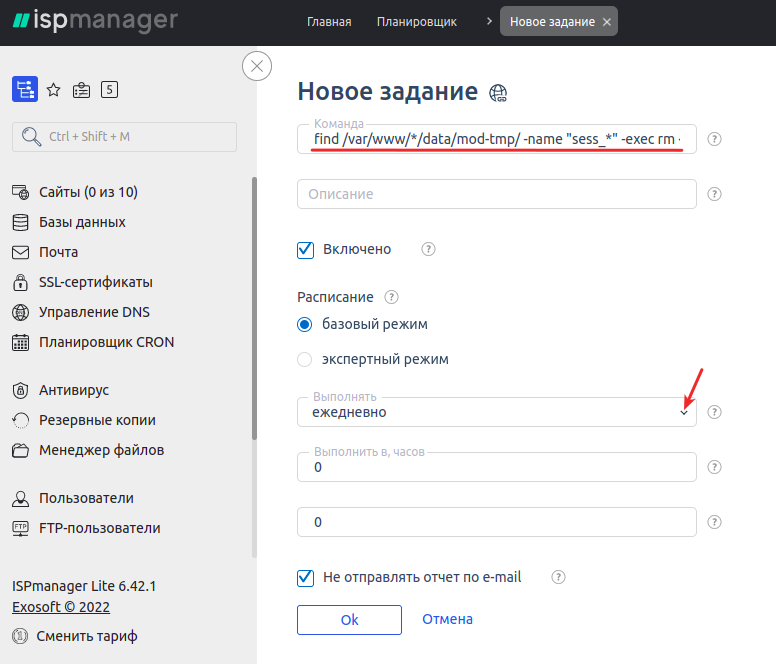

# Диагностика и решение ошибок при работе со скриптом

Общие рекомендации

Для оптимизации работы сервера и базы данных, следует учитывать несколько ключевых моментов, которые могут повлиять на скорость обработки запросов и эффективность работы сайта. Вот некоторые шаги, которые можно предпринять:

**1. Увеличение мощности сервера:**

* Повышение объема оперативной памяти: Рекомендуется увеличить объем оперативной памяти сервера для более быстрой обработки данных.
* Увеличение числа ядер процессора: Дополнительные ядра процессора могут ускорить выполнение вычислений и операций с базой данных.

**2. Проверка настроек сервера:**

* Проверка наличия лишних задач: Убедитесь, что на сервере нет лишних задач или процессов, которые могут замедлять его работу.
* Оптимизация конфигурации: Проверьте настройки сервера и базы данных на оптимальность для обеспечения эффективной работы.

**3. Мониторинг производительности:**

* Использование инструментов мониторинга: Для контроля производительности системы рекомендуется использовать специальные инструменты, которые помогут выявить узкие места и проблемы.

**4. Эксперименты с конфигурацией:**

* Проведение тестовых изменений: Для оптимизации работы сервера можно провести эксперименты с увеличением ресурсов (память, ядра процессора) и оценить их влияние на скорость работы.

**5. Резервное копирование данных:**

* Создание резервных копий: Регулярное создание резервных копий данных поможет обеспечить безопасность информации и защиту от потери важных данных.

Проведение вышеуказанных действий может помочь оптимизировать работу сервера и базы данных, улучшить производительность системы и сократить время обработки запросов. При необходимости, рекомендуется консультироваться с опытными специалистами по администрированию для более точной настройки системы.

## Известные проблемы и методы их решения

Ниже описаны возможные ошибки, которые могут возникать при работе со скриптом и методы решения этих ошибок.

<details>

<summary>Бесконечный редирект/ошибка редиректа</summary>

При бесконечной переадресации в настройках панели управления сервером (ISP Manager или другая) установите галочку напротив пункта "**Перенаправлять HTTP-запросы в HTTPS**" (пример для ISP Manager)

.png>)

</details>

<details>

<summary>Долго создается заявка или не создается вовсе</summary>

Отключите SMTP-сервер в разделе "**Сообщения -> E-mail шаблоны**", если вы используете исходящую почту, после этого проверьте скорость создания заявки.

Если заявка будет создаваться быстрее, то необходимо сменить SMTP сервер на [один из рекомендуемых нами](https://premium.gitbook.io/main/osnovnye-nastroiki/uvedomleniya-administratoram-i-polzovatelyam/uvedomleniya-po-e-mail#nastroika-smtp).

.png>)

</details>

<details>

<summary>Зависает таблица направлений обмена при выборе валют</summary>

Установите настройки кэширования в ЛК Cloudflare — выберите опцию "**No query string**" в разделе "**Caching**" -> "**Configuration**"


</details>

<details>

<summary>Некорректно формируется экспортный XML-файл</summary>

Если вместо экспортного XML-файла отображается ошибка валидации файла, это чаще всего означает, что в файлах скрипта могут быть первые пустые строки в одном или некоторых файлах.

.png>)

Так будет выглядеть открытый локально XML-файл, скачанный со страницы в браузере (ПКМ -> "Сохранить как -> XML-файл"

.png>)

Для устранения ошибки необходимо найти файлы с пустыми строками. Для этого:

Найдите корневую папку сайта (из-под root часто это `var/www/www-root/data/www/имя_домена`), заходим в неё - `cd var/www/www-root/data/www/имя_домена`

Из-под пользователя для сайта аналогично, но путь к корню короче (`cd www/имя_домена`)

Затем выполните команду поиска пустых первых строк для поиска по всем файлам сайта:

`find . -name "*.php" -type f -exec sh -c 'if [ "$(head -n 1 "$1" | tr -d "\n")" = "" ]; then echo "$1: empty first line"; fi' _ {} \;`

В ответе будут все файлы, у которых первая строка пустая.

.png>)

Найдите вручную все найденные файлы на сервере, откройте их и удалите пустые строки.

Также проблема при формировании файла может заключаться в том, что на 1 строке в файле отстутствует информация о кодировке и версии XML (prolog) — в этом случае стоит перезалить [файлы скрипта для обновления](https://premiumexchanger.com/uscripts/) поверх существующих файлов на сервере (из-под <mark style="color:green;">пользователя, созданного для сайта</mark>, не <mark style="color:red;">root</mark>!).

.png>)

</details>

<details>

<summary>Нестабильная работа сайта на протоколе HTTPS</summary>

Проверьте, как указан домен в разделе "**Настройки**" -> "**Общие**" в панели администратора, должен быть указан как **https://ваш\_домен**

.png>)

Проверьте как указан домен в БД (таблица `xxxx_options`), должен быть указан как **https://ваш\_домен**

.png>)

Открыть БД вы можете в панели управления ISP Manager, раздел "Базы данных"

.png>)

.png>)

Если кнопка "**Web-интерфейс**" отсутствует, установите phpMyAdmin.

phpMyAdmin для работы с БД в ISP Manager можно установить через раздел "**Настройки** - **Конфигурация ПО"** - отметить галочкой "**Веб-интерфейс администрирования MySQL**" - нажать кнопку "**Установить**" над таблицей (действия производить из-под <mark style="color:red;">root</mark>)

В личном кабинете Cloudflare установите тип шифрования как **Flexible** в разделе "**SSL/TLS**" -> "**Overview**"

.png>)

<mark style="background-color:red;">Если же у вас используете самоподписанный сертификат, выпущенный не в ЛК Cloudflare - выберите пункт "</mark><mark style="background-color:red;">**Full (Encrypts end-to-end, using a self signed certificate on the server)**</mark><mark style="background-color:red;">"</mark>

Уберите галочку постоянного редиректа на HTTPS в настройках сайта в ISP Manager

.png>)

.png>)

</details>

<details>

<summary>Не активируется тема для сайта</summary>

Если при активации темы отображается следующая ошибка:

.png>)

Активируйте опцию `short_open_tag` в файле конфигурации PHP (`php.ini`).&#x20;

Для этого зайдите в ISP Manager под пользователем <mark style="color:red;">**root**</mark> и перейдите в настройки PHP (или откройте файл `php.ini` на сервере, если не используете ISP Manager):

.png>)

В поиске в правом верхнем углу наберите `short` и активируйте отображаемую опцию.

.png>)

После этого активируйте тему, которая отображала ошибку.

</details>

<details>

<summary>Не открывается сайт на некоторых устройствах/провайдерах</summary>

Отключите проксирование в личном кабинете Cloudflare. Перейдите в раздел "**DNS**" ➔ "**Records**" и начните редактирование А-записи.

<mark style="color:red;">**Обращаем ваше внимание, что отключение проксирования позволит злоумышленникам найти реальный IP-адрес вашего сервера и отключит защиту от DDoS-атак. Отключайте проксирование только в крайних случаях.**</mark>

<figure><figcaption></figcaption></figure>

Отключите проксирование в столбце "**Proxy status**"

<figure><figcaption></figcaption></figure>

Сохраните изменения.

<figure><figcaption></figcaption></figure>

После этих действий сайт должен открываться на всех устройствах и провайдерах.

</details>

<details>

<summary>Не открывается сайт из РФ (отключение ECH)</summary>

Роскомнадзор начал блокировать Cloudflare.

Cloudflare принудительно включил всем своим пользователям шифрование заголовка SNI (Server Name Indication). Это значит, что при использовании опции невозможно узнать, к какому сайту происходит подключение через HTTPS. Роскомнадзор отреагировал на это и заблокировал сайты, использующие эту технологию.

Как результат, многие сайты которые используют Cloudflare, оказались недоступны для многих пользователей из РФ.

Если вам нужно отключить Encrypted Client Hello (ECH) для вашего домена на Cloudflare, выполните следующие шаги. Этот процесс включает проверку текущего статуса ECH, а затем его отключение через Cloudflare.

<mark style="color:red;">**Обращаем ваше внимание, что отключение опции ECH не гарантирует доступ к сайту, но этот способ помогает в большинстве случаев.**</mark>

**Проверка, включен ли ECH**

Сначала необходимо проверить, включен ли ECH для вашего домена. Для этого перейдите по следующей ссылке, заменив **example.com** на ваш домен:

[https://dns.google.com/query?name=**example.com**\&type=HTTPS](https://dns.google.com/query?name=example.com\&type=HTTPS)

.png>)

Если в ответе есть параметр **`ech=`**, это подтверждает поддержку ECH. Если ECH включен, то переходите к следующему шагу.

\---------------------------------------------------------------------------------------------------------

## Если у вас <mark style="color:red;">бесплатный тариф</mark> Cloudflare:

<mark style="color:orange;">**На бесплатном тарифе доступно отключение ECH только через API сервиса.**</mark>

Вам потребуются:

* E-mail — почта от вашего аккаунта в Cloudflare
* **Global API Key** — ключ для аутентификации запросов
* **Zone ID** — это уникальный ID вашей зоны (домена) в Cloudflare

1. **Global API Key**. Перейдите на страницу Cloudflare по следующей ссылке и скопируйте ваш глобальный API-ключ: [https://dash.cloudflare.com/profile/api-tokens](https://dash.cloudflare.com/profile/api-tokens)

.png>)

.png>)

2. **Zone ID**. Перейдите в управление вашим доменом на Cloudflare и прокрутите вниз страницу. Найдите строку **Zone ID** и скопируйте её.

.png>)

### **Отключение ECH через curl (вариант 1):**

Теперь, когда у вас есть Global API Key и Zone ID, вы можете отключить ECH с помощью `curl`.&#x20;

#### Установите curl​.

Curl — это инструмент для отправки HTTP-запросов, который понадобится для взаимодействия с API Cloudflare.

1.  На Windows:

    Скачайте и установите curl с [официального сайта](https://curl.se/).

    * Для CMD
      1. Нажмите Win + R.
      2. Введите cmd и нажмите Enter.
      3.  Проверьте версию, выполнив команду:\
          CMD:

          
          ```bash
          curl --version
          ```
          
    * Для Powershell
      1. Нажмите Win + R.
      2. Введите cmd и нажмите Enter.
      3.  Проверьте версию, выполнив команду:\
          Powershell:

          
          ```bash
          curl.exe --version
          ```
          
2.  На Linux/MacOS: Обычно `curl` уже установлен. Проверьте, выполнив команду:\
    Bash:

    
    ```bash
    curl --version
    ```
    

Теперь, когда у вас есть Zone ID и API Key, выполните следующую команду:

* `{ZONE_ID}` замените на Zone ID Взятого из панели управления dash.cloudflare.com
* `{ACCOUNT_EMAIL}` — замените на вашу почту от dash.cloudflare.com.
* `{GLOBAL_API_KEY}` — замените на ваш API Key

Windows CMD:


```bash
curl -X PATCH "https://api.cloudflare.com/client/v4/zones/{ZONE_ID}/settings/ech" ^
     -H "X-Auth-Email: {ACCOUNT_EMAIL}" ^
     -H "X-Auth-Key: {GLOBAL_API_KEY}" ^
     -H "Content-Type: application/json" ^
     --data "{\"id\":\"ech\",\"value\":\"off\"}"
```


Windows Powershell:


```bash
curl -Method PATCH "https://api.cloudflare.com/client/v4/zones/{ZONE_ID}/settings/ech" `
    -Headers @{
        "X-Auth-Email" = "{ACCOUNT_EMAIL}";
        "X-Auth-Key" = "{GLOBAL_API_KEY}";
        "Content-Type" = "application/json"
    } `
    -Body '{"id":"ech","value":"off"}'
```


Linux:


```bash
curl -X PATCH "https://api.cloudflare.com/client/v4/zones/{ZONE_ID}/settings/ech" \
     -H "X-Auth-Email: {ACCOUNT_EMAIL}" \
     -H "X-Auth-Key: {GLOBAL_API_KEY}" \
     -H "Content-Type: application/json" \
     --data '{"id":"ech","value":"off"}'
```


Если запрос выполнен правильно, Cloudflare вернёт ответ, подтверждающий отключение ECH:


```bash
{"result":{"id":"ech","value":"off","modified_on":null,"editable":true},"success":true,"errors":[],"messages":[]}
```


### **Отключение ECH через Postman (вариант 2):**

Ту же процедуру можно проделать при помощи Postman. Postman — инструмент для тестирования API, который позволяет отправлять запросы к серверу, получать от него ответы и анализировать их. Он поддерживает работу с протоколом HTTPS и позволяет создавать запросы с использованием заголовков, параметров и тела. Это позволяет тестировать API, которые используют шифрованные соединения для обеспечения безопасности передачи данных.

Для отключения ECH в Postman создайте следующий запрос, выбрав метод PATCH. В запросе замените `zone_id` на ваш Zone ID.:


```
https://api.cloudflare.com/client/v4/zones/zone_id/settings/ech
```


Во вкладке `Headers` добавьте ключи:

* `X-Auth-Email` — адрес электронной почты, привязанный к вашему аккаунту Cloudflare;
* `X-Auth-Key` — ваш Global API Key;
* `Content-Type` — в столбце `Value` укажите значение `application/json`.

.png>)

В **Body** выберите **raw** и введите следующий JSON:

.png>)

```
{"id": "ech", "value": "off"}
```

И нажмите кнопку `Send`.

.png>)

## Если у вас <mark style="color:green;">платный тариф</mark> Cloudflare:

1. Авторизуйтесь в Cloudflare.
2. Выберите ваш сайт.
3. Зайдите в раздел SSL/TLS.
4. Перейдите во вкладку Edge Certificates.
5. Найдите параметр Encrypted Client Hello (ECH).
6. Просто выключите эту опцию, поставив её в состояние Off.

.png>)

</details>

<details>

<summary>Не отображается картинка с кодом (капча) на страницах сайта</summary>

Установите права на запись (например, 777) для папки `/wp-content/pn_uploads/captcha/ или /wp-content/uploads/captcha/`.


Если вы не знаете как это сделать, то обратитесь в службу поддержки хостинга с данным вопросом.

</details>

<details>

<summary>Не отображается правая колонка с валютами ("Получаю") на главной странице обменника после включения модуля "Сортировка направлений"</summary>

Выполните "**Шаг 3**" в разделе "**Настройки обменника**" -> "**Миграция**" в блоке "**Специальные шаги миграции**" — валюты в таблице на главной должны начать отображаться корректно.

.png>)

.png>)

</details>

<details>

<summary>Не отображаются картинки в браузере Firefox (раздел "Партнеры")</summary>

.png>).png>)

Причина: некорректный экспорт исходных svg-изображений.

Решение:

1. Загрузить и распаковать архив с картинками в папку `/wp-content/uploads/partners/` на сервере
2. В админ-панели сайта в разделе "**Партнёры**" необходимо прописать новый путь до картинок (пример:`/wp-content/uploads/partners/bestchange.svg`)\
   .png>)
3. Загрузка файлов не поверх существующих файлов с их заменой, а в отдельную папку решает проблему с работой кэша Cloudflare и браузера

</details>

<details>

<summary>Не отправляются письма по статусам заявок, коды подтверждений</summary>

Возможно, домен был помечен как рассылающий спам, поэтому письма проходят через фильтры — необходимо уточнить информацию у техподдержки провайдера.

Свяжитесь с вашим хостинг-провайдером и уточните, не блокирует ли он отправку писем. Возможно, существуют ограничения на сервере (к примеру, [релей](https://korporativnaya-pochta.com/articles/smart-relay-zaschita-ot-spama-dlya-korporativnoy-pochty)), которые мешают доставке электронной почты.

Если содержимое письма выглядит подозрительно для почтовых сервисов, можно попробовать его дополнить или изменить, чтобы избежать проблем с доставкой.

Измените тему отправляемого письма для статуса "**Новая заявка**" на менее формальную. Возможно, при отправке письма активируется фильтр на SMTP-сервере, который блокирует доставку.

Если письма приходят только некоторым пользователям сайта или попадают в папку "Спам" - проверьте наличие [SPF и/или DKIM записей](https://neuropassenger.ru/dostavlyaemost-pisem/) для вашего домена и сконфигурируйте их при необходимости.

* [Проверка SPF записи](https://mxtoolbox.com/spf.aspx)
* [Проверка DKIM-записи](https://mxtoolbox.com/dkim.aspx)

</details>

<details>

<summary>Не работает генерация QR-кодов в заявках</summary>

В версии модуля "**QR код генератор**" 2.5.2 был заменен сервис для генерации кодов для более стабильной работы — обновите модуль до актуальной версии по [инструкции](https://premium.gitbook.io/main/osnovnye-nastroiki/faq/kak-obnovit-faily-na-servere#moduli-skripta).

[Ссылка на скачивание модуля напрямую](https://2574066779-files.gitbook.io/~/files/v0/b/gitbook-x-prod.appspot.com/o/spaces%2Fm9kqZXsNykrN6VyxxXBO%2Fuploads%2FfYDoTZNwTpp1UzsalKcy%2Fqr_adress.zip?alt=media\&token=f0d2c22e-8619-45d3-9bb4-e141746ec080).

Шорткод в шаблонах для статусов заявок менять не потребуется.

</details>

<details>

<summary>Не работает парсер BestChange или Парсеры 2.0 (не обновляются курсы валют)</summary>


Вероятно, файлы на сервер были загружены под рутом (root), а должны загружаться под пользователем для сайта - необходимо сменить владельца файлов и директорий. Порядок действий:

* скачайте корневую папку со всеми файлами как архив на ПК
* удалите эти файлы на сервере под рутом
* зайдите в ISP Manager под пользователем, созданным для сайта
* загрузите архив на сервер и распакуйте его по тому же пути

</details>

<details>

<summary>Не работает парсинг данных из экспортного XML-файла для BestChange</summary>

В панели управления CloudFlare включите [Bot Fight Mode](https://developers.cloudflare.com/bots/get-started/free/).\
.png>)

Fight Mode имеет отдельный список исключений — дополнительно добавьте в него IP-адрес **`162.19.29.225`**, вне зависимости от того, как вы настроили другие правила.

.png>)

</details>

<details>

<summary>Не работает редактирование направлений обмена</summary>


.png>)

Замените на вашем сервере файл по пути `wp-content/plugins/premiumbox/premium/includes/class-form.php` (файл находится [внизу этой страницы](https://premium.gitbook.io/main/osnovnye-nastroiki/faq/diagnostika-i-reshenie-oshibok-pri-rabote-so-skriptom#fail-class-form.php-dlya-raznykh-versii-skripta).

Обратите внимание, что файл **всегда** должен загружаться только для соответствующей версии скрипта и только из-под пользователя, созданного для сайта (<mark style="color:red;">**не root!**</mark>).


</details>

<details>

<summary>Не работает таймер обратного отсчета на сайте</summary>

Если вместо таймера (конструкция `[js_timer][bid_delete_time][/js_timer]`) отображается "---"\
.png>)\
в разделе "**Настройки**" -> "**Основные настройки**" установите формат даты любой, <mark style="color:red;">**кроме**</mark> d/m/Y:

.png>)

</details>

<details>

<summary>Отображается ошибка "<strong>Нет столбцов в таблице БД {название таблицы}</strong>"</summary>

Переактивируйте основной плагин (Premium Exchanger) в разделе "**Плагины**".

.png>).png>)

Затем отключите режим обновления в разделе "**Настройки обменника**" → "**Основные настройки**".

.png>)

После этого недостающие столбцы будут созданы в таблице.

</details>

<details>

<summary>Отсутствует доступ к сайту</summary>

.png>)

Необходимо найти таблицу XXXX\_options в вашей БД через Phpmyadmin или Adminer и проверить поля **home** и **siteurl** (должен быть указать ваш актуальный домен)\
\
<mark style="color:blue;">phpMyAdmin в ISP Manager можно установить через раздел "Настройки — Конфигурация ПО — отметить галочкой "Веб-интерфейс администрирования MySQL" - нажать кнопку "Установить" над таблицей</mark>

</details>

<details>

<summary>Очистка логов мерчантов и включение автоочистки</summary>

При долгой работе модулей "Логи мерчантов" и "Логи автовыплат" записанные логи могут относительно быстро заполнить БД и могут возникнуть ошибки при работе с сайтом, если не включена автоочистка логов.

<mark style="color:red;">Рекомендуем включать логирование только на время настройки модулей мерчантов, при стабильной работе приема средств и автовыплат логи можно отключить.</mark>

Вы можете настроить автоматическую очистку логов в разделе "Настройки - Настройки логирования":\
.png>)

В разделе "**Настройки**" -> "**Cron**" скопируйте ссылку для задания cron и создайте задание на сервере по [инструкции](https://premium.gitbook.io/rukovodstvo-polzovatelya/osnovnye-nastroiki/faq/kak-sozdat-zadanie-cron-na-servere) (время выполнения - раз в 24 часа или реже).

.png>).png>)\
\
Если логи не очищаются через соответствующий раздел по кнопке "Удалить логи", то требуется очистить логи через БД.\
.png>)

Необходимо зайти в БД через PhpMyAdmin[^1]/Adminer и открыть таблицу [`xxxx_merch_logs`](#user-content-fn-2)[^2] (на всякий случай сделайте бэкап БД перед очисткой таблицы)

Перейдите в веб-интерфейс БД.&#x20;


_Если веб-интерфейс недоступен_ — _откройте к нему доступ по инструкции:_

_Как узнать какой файрволл установлен на сервере: под <mark style="color:red;">root-пользователем</mark> зайдите в панель ISPmanager, в консоли Shell выполните команду **`ufw status numbered`**_ — &#x435;_&#x441;ли будут выведены правила, то отключение правил производится командой **`ufw disable`**. После работ с базой данных **обязательно** включите правила обратно командой **`ufw enable`**._

_Если будет выведена команда **`Command 'ufw' not found`**, значит правила настроены в **iptables**_ — _чтобы отключить правила там, нужно выполнить команду **`iptables -P INPUT ACCEPT && iptables -P FORWARD ACCEPT`**, а после работ с базой данных перезагрузить сервер_ — _правила включатся автоматически_

Найдите таблицу `xxxx_merch_logs` (где xxxx - ваш префикс таблицы).

.png>)

Перейдите на вкладке "Операции/Operations".

.png>)

Очистите таблицу по нажатию "TRUNCATE"

.png>)

Подтвердите очистку данных.

.png>)

Повторите действия для таблицы [`xxxx_ap_logs`](#user-content-fn-3)[^3].

</details>

<details>

<summary>Ошибка 404 при переходе на страницу направления обмена</summary>

Скорее всего, у вас включен модуль "**Тире в направлении обмена**" в разделе "**Модули**", но не сохранены настройки для применения изменений — вы можете отключить его или оставить включенным (на ваше усмотрение).

.png>)

Перейдите  в раздел "**Настройки -> Постоянные ссылки**" и нажмите на кнопку "**Сохранить изменения**", ничего не меняя на самой странице.

.png>)

После этого проверьте отображение направлений обмена. Если изменения не будут сразу же отображаться — [сбросьте кэш в Cloudflare](https://premium.gitbook.io/main/osnovnye-nastroiki/faq/kak-sbrosit-kesh-v-cloudflare) (если используете его).

</details>

<details>

<summary>Ошибка 525 "SSL handshake failed" при заходе на сайте</summary>

Ошибка "SSL handshake failed" указывает на то, что произошла проблема при установлении защищенного соединения между клиентом (обычно это браузер) и сервером.

В настройках личного кабинета в Cloudflare в разделе "SSL/TLS" установите параметр "Your SSL/TLS encryption mode" как "Flexible"


</details>

<details>

<summary>Ошибки панели администратора после обновления скрипта</summary>

Проверьте содержимое файла userdata.php по [инструкции](https://premium.gitbook.io/rukovodstvo-polzovatelya/pered-nachalom-raboty/instrukciya-po-obnovleniyu#ustranenie-nepoladok-posle-obnovleniya)

</details>

<details>

<summary>Ошибка файла <code>script.js</code></summary>

При получении этой ошибки отключите кэширование формата `js` в настройках сайта в ISP Manager

.png>)

В списке "Расширения файлов для кэширования" <mark style="color:red;">**не должно быть**</mark> формата `js` (если он там есть — удалите его и сохраните настройки).

.png>)

</details>

<details>

<summary>Проверка размера таблиц в базе данных</summary>

Если сайт или панель администратора начинают тормозить — проблема может быть в разрастании некоторых таблиц в базе данных (чаще всего это таблицы логов).

Для просмотра самых больших таблиц для их последующей очистки выполните следующие действия:

В панели ISP Manager зайдите в раздел "**Базы данных**", выберите вашу БД (скопируйте название БД в текстовый файл) и перейдите в раздел "**Пользователи**":


На странице выберите владельца БД и нажмите "**Изменить**":

.png>)

Нажмите на значок глаза, что просмотреть пароль пользователя. Сохраните имя пользователя и пароль в текстовый файл.

.png>)

Перейдите в раздел "**Shell-клиент**" и введите команду `mysql -u`` `**`username`**` ``-p`, где вместо **username** укажите имя пользователя БД из предыдущего пункта. Выполните команду, а затем введите пароль пользователя (символы не будут отображаться про вводе) и нажмите Enter. При успешной авторизации вы увидите текст "**Welcome to the MySQL monitor.**"

.png>)

Затем введите команду `SELECT table_name AS "Table", round(((data_length + index_length) / 1024 / 1024), 2) "Size in MB" FROM information_schema.TABLES WHERE table_schema = "`**`database_name`**`" ORDER BY (data_length + index_length) DESC;`, где вместо **`database_name`** укажите имя башей БД. Нажмите Enter.

После выполнения этих пунктов отобразится список всех таблиц, отсортированных по размеру (самые большие таблицы сверху).

</details>

<details>

<summary>Редирект на поддомен при блокировке основного домена</summary>

Сперва нужно добавить поддомен в лицензию в [личном кабинете](https://premiumexchanger.com/ulicense/). После этого в конфигурационном файле nginx добавьте следующий блок кода (укажите ваш домен вместо 123.ru и test.123.ru):

```nginx
server {
  server_name 123.ru
  
  listen 80;
  
  location / {
    if ($argument_uri) {
      return 301 https://test.123.ru$request_uri;
    }
    
    ## тут оставшийся конфиг  }
}
```

Логика работы следующая: пользователь обращается к сайту, где выполняется заданное условие. В случае его выполнения осуществляется перенаправление с кодом 301, при этом передаются все параметры запроса (в том числе "хвост" партнерской ссылки).

Выше пример реализации для nginx, в Apache такая конфигурация работать не будет.

</details>

<details>

<summary>Системная ошибка (код: anticsfr)</summary>

.png>).png>)


В качестве быстрого временного решения проблемы - достаточно перезагрузить страницу в браузере.

Эта ошибка указывает на проблему с записью сессий на сервере или изменением IP-адреса пользователя. Вероятно, настройка хранения пользовательских сессий выполнена некорректно.

Если сессия сбивается, это означает, что вам потребуется дополнительная настройка PHP.\
.png>)

Для решения проблемы необходимо установить настройки сессий так, как показано на скриншоте ниже.

.png>)

**`session.gc_probability`** и **`session.gc_divisor`**: Эти два параметра вместе определяют вероятность запуска процесса сбора мусора на каждом запросе. Вероятность рассчитывается как **`gc_probability/gc_divisor`**. Например, если **`gc_probability`** равно 1, а **`gc_divisor`** равно 1000, то сбор мусора будет запускаться примерно на 0,1% запросов

**`session.gc_maxlifetime`**: Этот параметр определяет максимальное время жизни сессии в секундах. Если сессия старше этого времени, она будет считаться "мусором" и будет удалена при следующем запуске процесса сбора мусора

<mark style="color:red;">**После изменения конфигурации PHP, вам нужно перезапустить веб-сервер для применения изменений.**</mark>

Для автоматической очистки сессий можно добавить 2 задания CRON с периодом выполнения раз в сутки:\



```
find /var/www/*/data/mod-tmp/ -name "sess_*" -exec rm {} \;
```



```
find /var/www/*/data/bin-tmp/ -name "sess_*" -exec rm {} \;
```


</details>

<details>

<summary>Тормозит/зависает панель управления скриптом или сайт, отображаются ошибки при создании заявки</summary>

## Удаление сессий

Выполните команду через ssh:

`cd /var/www`/**`имя_пользователя_сайта`**/`data`

Выполните команду:

`find mod-tmp -name "sess_*" -mtime +2 -type f -print0 | xargs -0rn 20 rm -f`

После этого удалятся все сессии старше 2 дней.

Также вы можете зайти по SSH из другого окна (сессии) и ввести:

`df -i`

После ввода команды вы увидите заполненность диска файлами.\


Количество inode (количество возможных файлов) на разных серверах может существенно отличаться, поэтому очистка может занять от 10 минут до 5 часов

## Настройки обращения к серверу

Обратите внимание на [раздел "**Настройки**" -> "**Cron**"](https://premium.gitbook.io/main/osnovnye-nastroiki/nastroiki/obshie-nastroiki#cron) — настройки в нём должны соответствовать инструкции.

Если вы меняли эти настройки ранее — верните их к исходному виду.

## Настройки PHP

Зайдите в панель управления ISP Manager из-под **root-пользователя** и проверьте версию PHP для сайта.


Затем откройте настройки нужной версии PHP


Для указанных ниже параметров на вашем сервере должны быть установлены значения как на скриншоте. Если они отличаются от приведенных ниже —

&#x20;измените их.


Для полной очистки файлов выполните команду `find mod-tmp -name "sess_*" -type f -print0 | xargs -0rn 20 rm -f`

После этих действий временные файлы будут удалены с сервера и будет работать автоочистка файлов через PHP.

## Увеличение лимита памяти

В случае обработки большого объема данных, скрипту может не хватать выделенной оперативной памяти на сервере для нормальной работы. Чтобы увеличить лимит оперативной памяти, который может использовать WordPress, необходимо выполнить следующие шаги:

1. На сервере открыть файл `ваш_домен/wp-config.php` и после строки `define(‘WP_DEBUG’, false);` прописать следующие строки и сохранить изменения:

```
define('WP_MEMORY_LIMIT', '512M');define('WP_MAX_MEMORY_LIMIT', '1024M');
```

2. В конфигурации вашего сервера установить значение `MEMORY_LIMIT = 512M`.

.png>)

.png>)

## Смените сервис определения страны по IP-адресу пользователя

В разделе "**GEO IP**" ➔ "**Настройки определения IP**" смените источник на **sypexgeo.net**, установите таймаут в 7 секунд и сохраните изменения.

<figure><figcaption></figcaption></figure>

## Другие действия в админ-панели и на сервере

Вы можете отключить все модули в разделе "**Модули**" (зафиксировав состояние "до") и проверить — будет ли сайт работать быстрее?

Если да, то необходимо будет постепенно включать модули обратно (по 3-5 за раз) и проверять на каком шаге начнется торможение — после этого анализировать сам модуль, вызывающий торможение.

Также вы можете удалить на сервере модуль `\wp-content\plugins\premiumbox\moduls\courselogs` (если он есть) — он может нагружать систему больше всего.

Если вышеуказанные рекомендации не помогли, обратитесь в техподдержку **вашего хостинга** — попросите их провести диагностику и предоставить информацию по нагрузке на ваш сервер.

</details>

<details>

<summary>Увеличение максимального размера загружаемых файлов</summary>

При необходимости вы можете установить своё значение для загружаемых пользователями файлов через ЛК или в заявке (картинки для верификации счетов/личности).

Ограничение по умолчанию составляет 2 мегабайта.

При использовании ISP Manager — зайдите под root-пользователем в панель и перейдите в раздел "**Настройки PHP**":


Выберите версию PHP, которая используется на вашем сайте и зайдите в её настройки:

.png>)

.png>)

Установите желаемое значение для опции "**Макс. размер файла**" и сохраните изменения. Перезагрузите сервер.

Если вы не используете панель ISP Manager — в файле php.ini найдите нижеуказанные директивы, установите для них свои значения и перезагрузите сервер.


```
upload_max_filesize = 128M — макс. размер одного загружаемого файла
post_max_size = 128M — макс. размер набора файлов, загружаемых за один запрос
memory_limit 256M — лимит памяти PHP
max_execution_time 300 — макс. время исполнения запроса в секундах
max_input_time 300 — макс. время время в секундах, которое скрипт может потратить на разбор входных данных
```


upload\_max\_filesize — установите значение, превышающее размер вашей резервной копии\
post\_max\_size — установите значение > чем резервная копия\
memory\_limit — установите значение > чем резервная копия\
max\_execution\_time — установите значение 0 (бесконечно)

Если после увеличения размера файлов вы получаете ошибки - воспользуйтесь [официальным руководством для PHP](https://www.php.net/manual/ru/features.file-upload.common-pitfalls.php) по устранению ошибок.

</details>

<details>

<summary>Установка статуса "<strong>На проверке</strong>"</summary>

1. В настройках **всех** **используемых** модулей мерчантов для указанного ниже блока настроек ("**Работа со статусами заявок**") выберите из выпадающего списка вариант "**На проверке**" для всех опций и сохраните изменения.


2. В настройках **всех** **используемых** модулей автовыплат установите запрет на совершение выплаты для заявок, находящихся в статусе "**На проверке**" — выберите пункт "**Нет**" для выделенной ниже опции.


</details>

<details>

<summary>Шпаргалка по настройке DNS записей для работы почты на домене</summary>

Время от времени приходится разбираться с некоторыми аспектами проверки электронной почты. Это включает в себя проверку ряда DNS-записей и запросов.

[Краткая шпаргалка](https://www.netmeister.org/blog/email-dns-records.html), которую вы можете использовать в следующий раз, когда не вспомните, какие записи используются для проверки SPF, DKIM, DMARC и т. д.

</details>

### Модуль "**QR Генератор**":



### Файл class-form.php для разных версий скрипта:

Версия 2.6:



Версия 2.5:



[^1]: phpMyAdmin в ISP Manager можно установить через раздел "Настройки - Конфигурация ПО - отметить галочкой "Веб-интерфейс администрирования MySQL" - нажать кнопку "Установить" над таблицей

[^2]: Логи мерчантов

[^3]: Логи автовыплат
