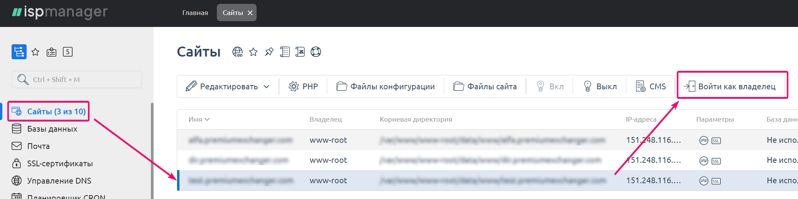
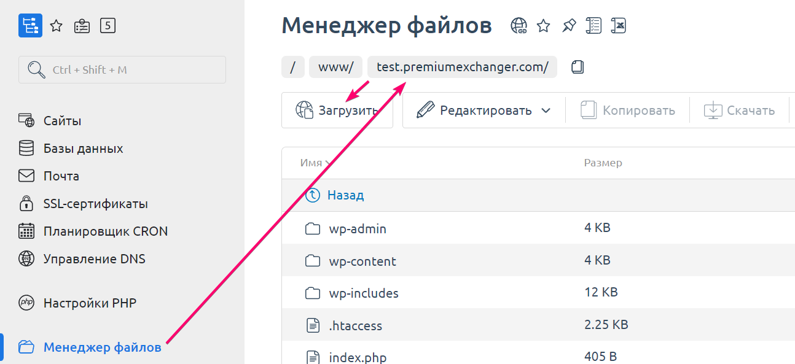

# Как найти корневую папку сайта на сервере?

1. Авторизуйтесь на вашем сервере в ISP Manager под пользователем root. Перейдите в раздел "**Сайты**", выберите необходимый сайт и нажмите кнопку "**Войти как владелец**".

<figure><figcaption></figcaption></figure>

2. В разделе "**Менеджер файлов**" откройте директорию вашего сайта: `https://`_`имя_вашего_домена/`_ — это и будет корневой папкой вашего сайта.  &#x20;

<figure><figcaption></figcaption></figure>
