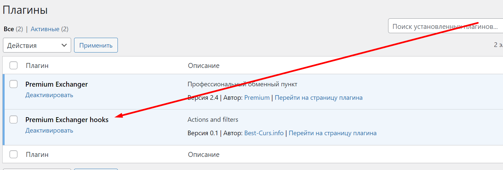

# Как установить онлайн-чат?

## **Установка через панель управления сайтом (только для Jivo.ru)**

1. В личном кабинете [Jivo.ru](https://www.jivo.ru/) скопируйте ID без кавычек из кода для установки чата.

<figure><figcaption></figcaption></figure>

2. Вставьте скопированный ID в панель управления сайтом в разделе "**Настройки" → "Основные настройки" →** в поле "**Jivosite.ru ID**" и сохраните настройки.

<figure><figcaption></figcaption></figure>

## **Установка с помощью хука (любой онлайн-чат)**

1. Разместите код онлайн-чата в файле _`/wp-content/plugins/premiumhook/premiumhook.php`_ вместо строки:

`<!— Put online chat code or another code here / Razmestite kod onlajn chata ili drugoi kod vmesto jetogo teksta !—>`

2. В разделе "**Плагины**" активируйте плагин "**Premium Exchanger hooks**".

<figure><figcaption></figcaption></figure>
