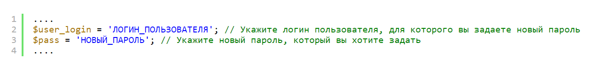
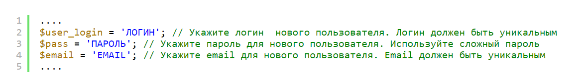

# Как восстановить доступ в панель управления обменником?

Воспользуйтесь одним из способов восстановления доступа ниже.

## Утерян пароль для существующего пользователя


Если был утерян пароль — для начала попробуйте восстановить пароль через специальную форму на сайте — **`https://ваш_домен/lostpass/`**. Если на вашу почту придет письмо для сброса пароля, то следуйте инструкциям в письме.

Если письмо не пришло, то либо для данного пользователя настройками безопасности запрещено сбрасывать пароль, либо не настроен [e-mail шаблон](https://premium.gitbook.io/main/osnovnye-nastroiki/uvedomleniya-administratoram-i-klientam/uvedomleniya-po-e-mail#nastroika-shablonov-pisem) для данного типа уведомлений.


В этом случае необходимо сбросить пароль для существующего пользователя-администратора.

1. Скачайте файл по ссылке ниже:



2. С помощью текстового редактора (к примеру, Notepad++) локально откройте файл **`setpass.php`** и отредактируйте следующие строки (**`user_login`** и **`pass`**).

<figure><figcaption></figcaption></figure>

3. Сохраните изменения. Кодировка файла должна быть UTF-8 без BOM.
4. Загрузите файл **`setpass.php`** в [корневую папку](https://premium.gitbook.io/rukovodstvo-polzovatelya/osnovnye-nastroiki/faq/kak-naiti-kornevuyu-papku-saita-na-servere) вашего сайта.
5. С помощью браузера обратитесь к файлу **`https://ваш_домен/setpass.php`** — после перехода по ссылке отобразится пустая страница — пароль был изменен на указанный в файле.
6. Войдите в панель управления сайтом привычным для вас способом (обычно это **`https://ваш_домен/prmmxchngr`**), используя новый пароль.
7. Удалите файл **`setpass.php`** из корневой папки.

## Утерян pin-код для входа в панель администратора

Если у вас включена авторизация по pin-коду, но он не приходит и вы не можете попасть в панель управления, вам необходимо:

* В файле **`/wp-content/plugins/premiumbox/userdata.php`**`.`

<figure><figcaption>
ISP Manager, вложенность папок
</figcaption></figure>

* &#x20;в указанной строке (**`PN_ADMIN_GOWP`**) **false** заменить на **true** и сохранить изменения.


Директива **`PN_ADMIN_GOWP`** позволяет временно сбросить url для входа в панель администратора на **`ваш_домен/wp-admin/`**. При этом на этот период также будет отключена ссылка на авторизацию через e-mail.


<figure><figcaption>
Файл userdata.php
</figcaption></figure>

* Авторизоваться на сайте по стандартному адресу **`https://ваш_домен/wp-admin/`** без ввода pin-кода.
* Выполнить необходимые [настройки](https://premium.gitbook.io/rukovodstvo-polzovatelya/navigaciya/nastroiki/dvukhfaktornaya-avtorizaciya-2fa-v-paneli-upravleniya-saitom) для правильной работы оповещения.
* Вернуть обратно **true** на **false** в файле **`userdata.php`**.

## Утерян URL для входа в панель управления

Если вы забыли URL для входа в панель управления, вам необходимо:

* В файле **`/wp-content/plugins/premiumbox/userdata.php`**`.`

<figure><figcaption>
ISP Manager, вложенность папок
</figcaption></figure>

* &#x20;в указанной строке (**`PN_ADMIN_GOWP`**) **false** заменить на **true** и сохранить изменения.

<figure><figcaption>
Файл userdata.php
</figcaption></figure>

* Авторизоваться в панели управления по адресу **`https://ваш_домен/wp-admin/`**
* Проверить URL в обоих полях в разделе  "**Настройки**" -> "**Общие**"  (должен быть указан только сам домен, обязательно должен быть указан протокол **https://** перед именем домена)

<figure><figcaption></figcaption></figure>

* Проверить URL для входа в разделе "**Настройки**" -> "**Основные настройки**" и, при необходимости, заменить его.

<figure><figcaption></figcaption></figure>

* Вернуть обратно **true** на **false** в файле **`userdata.php`** и в следующий раз зайти в панель управления по URL, указанному в настройках.

## Не зайти в панель управления из-за ограничения по IP-адресу

В этом случае необходимо создать нового временного пользователя-администратора, чтобы из-под него отключить ограничения по IP-адресу для существующего администратора.

1. Скачайте файл по ссылке ниже:



2. С помощью текстового редактора (к примеру, Notepad++) откройте файл `createuser.php` и отредактируйте следующие строки (**`user_login`**, **`pass`**, **`email`**).

<figure><figcaption></figcaption></figure>

3. Сохраните изменения. Кодировка файла должна быть UTF-8 без BOM.
4. Загрузите файл **`createuser.php`** в [корневую папку](https://premium.gitbook.io/rukovodstvo-polzovatelya/osnovnye-nastroiki/faq/kak-naiti-kornevuyu-papku-saita-na-servere) вашего сайта.
5. С помощью браузера обратитесь к файлу **`https://ваш_домен/createuser.php`** — после перехода по ссылке отобразится пустая страница — новый пользователь был создан.
6. Войдите в панель управления привычным для вас способом (обычно это **`https://ваш_домен/prmmxchngr`**), используя новые логин и пароль.
7. Удалите файл **`createuser.php`** из корневой папки.

## Деактивирован плагин Premium Exchanger

Если плагин Premium Exchanger был деактивирован и вы не можете попасть в панель управления, выполните следующие действия:

1.  Временно переименуйте файл **`/wp-content/themes/exchanger/functions.php`** на сервере. Временное имя файла может быть любым.\

    <figure><figcaption></figcaption></figure>
2. С помощью вашего логина и пароля войдите в панель управления по адресу **`https://имя_домена/wp-admin/`**`.`
3.  В панели управления в разделе "**Плагины**" активируйте плагин "**Premium Exchanger**".\

    <figure><figcaption></figcaption></figure>
4. Верните имя **`functions.php`** переименованному ранее файлу.
