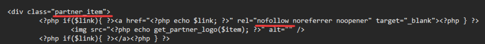

---
layout:
  width: default
  title:
    visible: true
  description:
    visible: false
  tableOfContents:
    visible: true
  outline:
    visible: true
  pagination:
    visible: true
---

# Обновление системных директорий (только для версии 2.6 и выше)

Данное обновление **требуется** произвести в целях повышения безопасности работы скрипта.

Файлы скрипта всегда должны загружаться и быть распакованы на сервере из-под <mark style="color:green;">**пользователя, созданного для сайта**</mark> **(**&#x43D;е <mark style="color:red;">**root**</mark>**)**!

Вам необходимо:

* Сделать [бэкап всех файлов сайта на сервере](https://premium.gitbook.io/main/osnovnye-nastroiki/faq/kak-sdelat-bekap-saita)
*   Скачать архив по ссылке ниже **под вашу версию скрипта**\

    <figure><figcaption></figcaption></figure>

### Версия 2.6



### Версия 2.7



*   Загрузить архив в [корневую папку сайта](https://premium.gitbook.io/main/osnovnye-nastroiki/faq/kak-naiti-kornevuyu-papku-saita-na-servere)&#x20;

    <figure><figcaption></figcaption></figure>

и распаковать его с заменой существующих файлов

<figure><figcaption></figcaption></figure>

<figure><figcaption></figcaption></figure>

Обновление файлов завершено!
