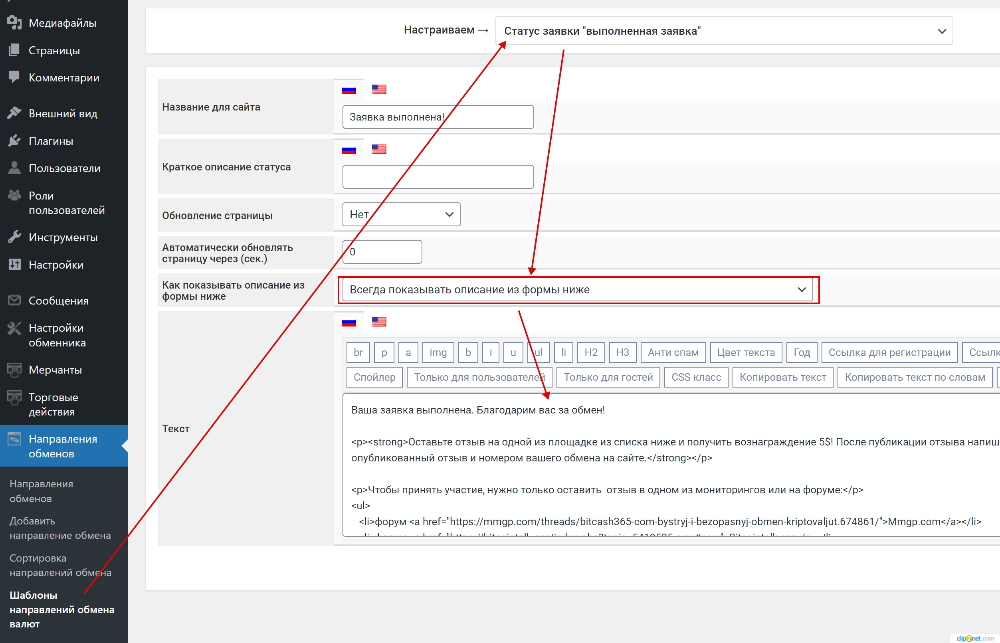

# Просьба для клиента написать отзыв об успешном обмене

Для того, чтобы повысить репутацию обменника, рекомендуем вам, как владельцу обменника, предлагать клиентам оставлять отзывы на вашем сайте на отзовиках, мониторингах и форумах.


В текущих реалиях за публикацию отзыва после обмена обычно платят живыми деньгами в качестве благодарности в размере 5-10$.


### Перечень ресурсов

Ресурсы, на которые **рекомендуется** отправлять клиентов, совершивших у вас обмен. Ссылки должны вести на страницу вашего ресура в этих сервисах!

Отзовики:

* [MyWOT](https://www.mywot.com/)
* [Trustpilot](https://www.trustpilot.com/)
* [ВебПроверка](https://webproverka.com/)

Мониторинги:

* [Kurs.expert](https://kurs.expert)
* [ExchangeSumo](https://exchangesumo.com/)
* [Exnode](https://exnode.ru/)
* [Bits.media](https://bits.media/exchanger/)

Форумы:

* [Mmgp](https://mmgp.com/)
* [Bits.media](https://bits.media/)
* [Bitcoin Talk](https://bitcointalk.org/)
* [CryptoTalk](https://cryptotalk.org/)

### Размещение текста с предложением оставить отзыв&#x20;

Удобнее всего просить пользователя написать отзыв на странице заявки после успешного обмена и в письме, которое получает пользователь по завершению обмена.



В разделе **Направления обменов -> Шаблон направлений обмена валют** в шаблон для статуса "**Выполненная заявка**" добавьте текст с предложением оставить отзыв и с обязательным **указанием прямых ссылок** на страницу вашего обменник на отзовиках, форумах, мониторингах!

<figure><figcaption></figcaption></figure>

На странице заявки этот шаблон будет выглядеть так:

<figure><figcaption></figcaption></figure>



В разделе **Сообщения -> Email шаблоны** настройте шаблон письма для отправки клиенту текста по статусу "**Выполненная заявка**" на e-mail.

<figure><figcaption></figcaption></figure>



**Текста шаблона для размещение на странице заявки и email письме**


Внимание! При копировании текста и размещение его в панели управления вашего сайта, замените текст ВАША\_ССЫЛКА актуальной ссылкой на страницу вашего обменника на указанной площадке.


Текст для копирования:

<pre><code>Ваша заявка выполнена. Благодарим вас за обмен!
<strong>&#x3C;strong>&#x3C;p>Оставьте отзыв на одной из площадок из списка ниже и сразу получите вознаграждение - 5$! 
</strong>&#x3C;p>После публикации отзыва напишите нам на e-mail или в телеграм с ссылкой на опубликованный отзыв и номером вашего обмена на сайте.&#x3C;/p>&#x3C;/strong>
&#x3C;p>Список площадок для публикации отзыва:&#x3C;/p>

&#x3C;p>Отзовики&#x3C;/p>
&#x3C;ul>
    &#x3C;li>&#x3C;a href="ВАША_ССЫЛКА">MyWOT&#x3C;/а>&#x3C;/li>
    &#x3C;li>&#x3C;a href="ВАША_ССЫЛКА">Trustpilot&#x3C;/a>&#x3C;/li>
    &#x3C;li>&#x3C;a href="ВАША_ССЫЛКА">ВебПроверка&#x3C;/a>&#x3C;/li>
&#x3C;/ul>

&#x3C;p>Мониторинги&#x3C;/p>
&#x3C;ul>
    &#x3C;li>&#x3C;a href="ВАША_ССЫЛКА">Kurs.expert&#x3C;/а>&#x3C;/li>
    &#x3C;li>&#x3C;a href="ВАША_ССЫЛКА">ExchangeSumo&#x3C;/a>&#x3C;/li>
    &#x3C;li>&#x3C;a href="ВАША_ССЫЛКА">Exnode&#x3C;/a>&#x3C;/li>
&#x3C;/ul>

&#x3C;p>Форумы&#x3C;/p>
&#x3C;ul>
    &#x3C;li>&#x3C;a href="ВАША_ССЫЛКА">Mmgp.com&#x3C;/а>&#x3C;/li>
    &#x3C;li>&#x3C;a href="ВАША_ССЫЛКА">Bits.media&#x3C;/a>&#x3C;/li>
    &#x3C;li>&#x3C;a href="ВАША_ССЫЛКА">Bitcointalk.org&#x3C;/a>&#x3C;/li>
    &#x3C;li>&#x3C;а href="ВАША_ССЫЛКА">Cryptotalk.org&#x3C;/a>&#x3C;/li>
&#x3C;/ul>
</code></pre>

