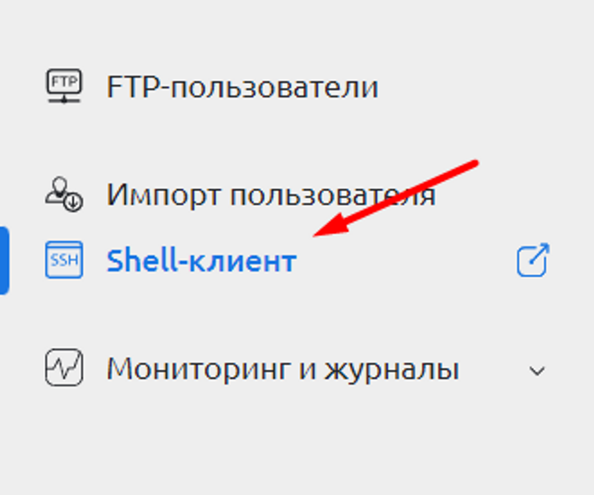
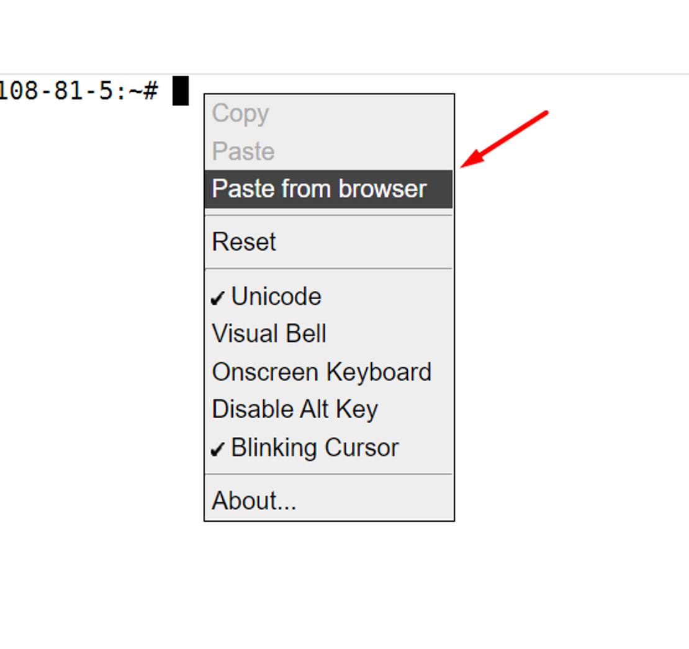
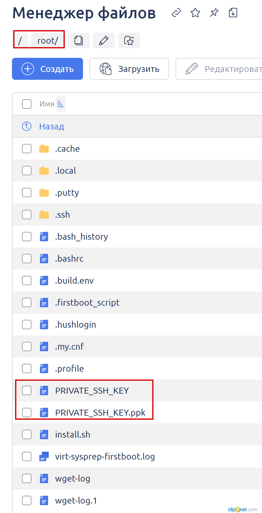
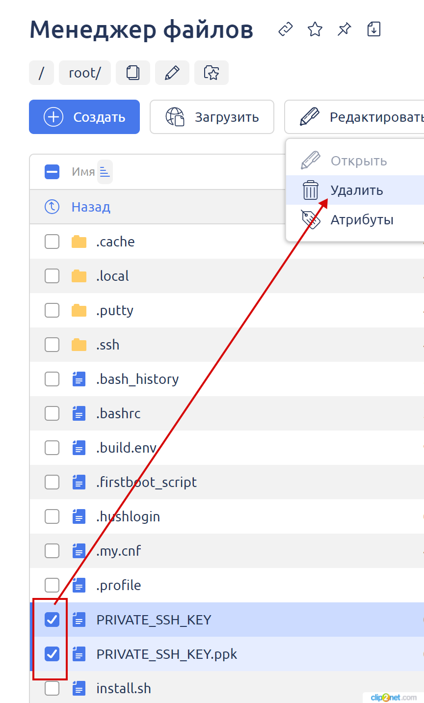

# Замена SSH-ключей авторизации на сервере

Команды выполняются через панель управления ISP Manager под root пользователем. По данной инструкции вы можете поменять ssh-ключи, которые используются на сервере для авторизации через ssh/sftp.

1. Авторизуйтесь в панели управления сервером ISP Manager под root пользователем.
2. Перейдите в раздел "**Администрирование" -> "Shell-клиент"**.

<figure><figcaption></figcaption></figure>

3. Нажмите правой кнопкой мыши на пустом экране и выберите "**Paste from browser**" в контекстном меню.

<figure><figcaption></figcaption></figure>

4. Введите команду в открывшемся окне и нажмите кнопку "**ОК**". Затем нажмите клавишу **Enter** для выполнения команды.
5. Выполняйте последовательно указанные ниже команды повторяй пункт 3 и 4 для каждой из команды.
6. Список команды для выполнения (при наведении на команду, используйте иконку копирования текста справа)

<pre><code><strong>rm ~/.ssh/authorized_keys
</strong></code></pre>

```
ssh-keygen -m PEM -t rsa -b 2048 -f ~/PRIVATE_SSH_KEY -q -N ""
```

```
puttygen ~/PRIVATE_SSH_KEY -o ~/PRIVATE_SSH_KEY.ppk -O private
```

```
touch ~/.ssh/authorized_keys
```

```
cat ~/PRIVATE_SSH_KEY.pub >> ~/.ssh/authorized_keys
```

```
rm ~/PRIVATE_SSH_KEY.pub -f
```

7. Через раздел "**Файловый менеджер**" перейдите в папку "**root**".

<figure><figcaption></figcaption></figure>

8. Скачайте два SSH ключа к себе на компьютер:

`PRIVATE_SSH_KEY` —используйте для MasOS/Linux\
`PRIVATE_SSH_KEY.ppk` — используйте для Windows

<figure><figcaption></figcaption></figure>

9. Удалите созданные ключи после их скачивания.

<figure><figcaption></figcaption></figure>

10. Проведите тестовое подключение через SSH/SFTP используя новые ключи.
