# 2328 1


Перед настройкой автовыплат обязательно прочитайте [предупреждение о рисках!](https://premium.gitbook.io/main/osnovnye-nastroiki/merchanty-i-avtovyplaty/avtovyplaty/preduprezhdenie-o-riskakh)



Если вам необходимо обновить модуль на сервере — воспользуйтесь [инструкцией](https://premium.gitbook.io/main/osnovnye-nastroiki/faq/obnovlenie-failov-skripta-na-servere/kak-obnovit-faily-na-servere#moduli-merchantov-i-avtovyplat)


## Настройки в личном кабинете мерчанта


Для начала работы с мерчантом нужно настроить 2FA и пройти KYC на его стороне.

**Дисклеймер**: при подключении вашего сайта к тому или иному сервису, пожалуйста, самостоятельно оценивайте возможные риски сотрудничества.


Работа с мерчантом выполняется через Telegram бота - [https://t.me/OO1kBOT](https://t.me/OO1kBOT)\
Нужные для работы модуля ключи генерируются в разделе "Дополнительный функционал - API доступ - Создать новый API ключ"

<figure><figcaption></figcaption></figure>

Для генерации API ключей и начала работы предварительно потребуется пройти верификацию на стороне мерчанта и подключить к аккаунту 2FA.

<figure>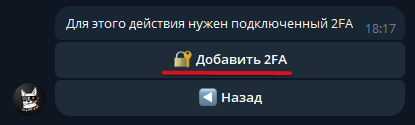<figcaption></figcaption></figure> <figure>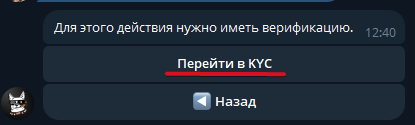<figcaption></figcaption></figure>

После завершения проверок потребуется указать название для ключей, это может быть любой текст.

<figure>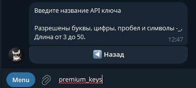<figcaption></figcaption></figure> <figure>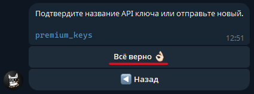<figcaption></figcaption></figure>

На следующем шаге нужно будет явно указать действия, которые будут доступны для создаваемой пары ключей. Для работы мерчанта на приём средств достаточно будет прав "Баланс" и "Вывод".

Если планируете использовать и модуль мерчанта от 001k.bot, можно сразу включить права на "Депозит".

<figure>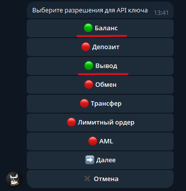<figcaption></figcaption></figure>

И указать, что ключи создаются **не только** для чтения, выбрав **"Нет"** в следующем вопросе.

<figure>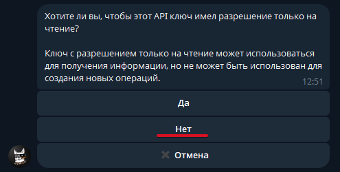<figcaption></figcaption></figure>

Далее можно добавить IP вашего сервера в белый список мерчанта или пропустить этот шаг разрешив все IP.

<figure>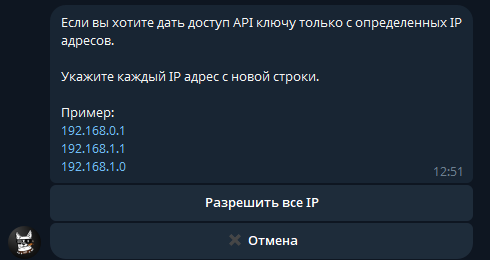<figcaption></figcaption></figure>

Активировать ключи нужно **сразу после их создания.**

<figure>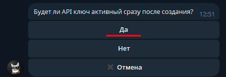<figcaption></figcaption></figure>

После подтверждения всех указанных опций и подтверждения через 2FA будут сгенерированы API ключи для работы. Скопируйте такие ключи.

<figure>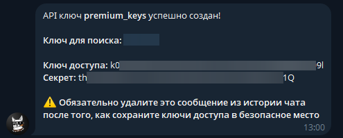<figcaption></figcaption></figure>

##

## Настройки модуля

В панели администратора создайте нового мерчанта в разделе "**Мерчанты**" ➔ "**Добавить автовыплату".**

Выберите 001k в выпадающем списке в поле "**Модуль**", укажите название для модуля и нажмите "**Сохранить**".

<figure>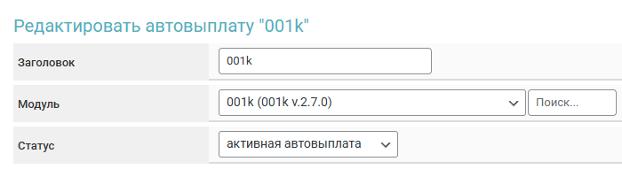<figcaption></figcaption></figure>

Заполните указанные авторизационные поля.

<figure>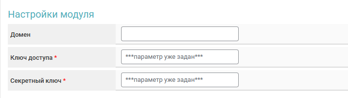<figcaption></figcaption></figure>

**Домен** — не заполняйте поле, оставьте его пустым.

**Ключ доступа** — "Ключ доступа" скопированный ранее в боте 001k.

**Секретный ключ** — "Секрет" скопированный ранее в боте 001k.

## Особые поля

<figure><figcaption></figcaption></figure> <figure><figcaption></figcaption></figure>

**Код валюты** (для выплаты)**:**

* **Доп. поля (Заявка)** — использование кода валюты из заявки (выберите **\[Получаете] Код валюты**)
* **Доп. поля (Валюты)** — использование [доп.поля валюты](https://premium.gitbook.io/main/osnovnye-nastroiki/valyuty-i-napravleniya-obmena/dopolnitelnye-polya#dopolnitelnye-polya-dlya-valyuty) "**Получаю**"
* **Доп. поля (Направления)** — использование [доп.поля направления обмена](https://premium.gitbook.io/main/osnovnye-nastroiki/valyuty-i-napravleniya-obmena/dopolnitelnye-polya#dopolnitelnye-polya-dlya-napravleniya-obmena)
* **Код валюты** — ручной выбор валюты выплаты

<figure><figcaption></figcaption></figure> <figure><figcaption></figcaption></figure>

**Сеть** (для криптовалют)**:**

* **Доп. поля (Валюты)** — использование [доп.поля валюты](https://premium.gitbook.io/main/osnovnye-nastroiki/valyuty-i-napravleniya-obmena/dopolnitelnye-polya#dopolnitelnye-polya-dlya-valyuty) "**Получаю**"
* **Доп. поля (Направления)** — использование [доп.поля направления обмена](https://premium.gitbook.io/main/osnovnye-nastroiki/valyuty-i-napravleniya-obmena/dopolnitelnye-polya#dopolnitelnye-polya-dlya-napravleniya-obmena)
* **Сеть** — ручной выбор сети

**Cron-файл -** [создайте задание](../../faq/kak-sozdat-zadanie-cron-na-servere.md) с такой ссылкой на сервер&#x435;**.**

## Продолжение настройки

Далее произведите настройку мерчанта следуя [общей инструкции по настройке](https://premium.gitbook.io/rukovodstvo-polzovatelya/osnovnye-nastroiki/merchanty-i-avtovyplaty/merchanty/obshie-nastroiki-merchantov). 
